# Core Package Data Flow Architecture - State Management

## Architecture Overview

**Purpose**: Documents the complete data flow and state management architecture of the BigCommerce Core Package.

**Architecture**: SDK-first state management with BigCommerce SDK, React Context for component coordination, and HOC patterns for state access.

## State Management Layers

### 1. Application State Layer

#### CheckoutApp State
**Purpose**: Application-level state and service initialization
**Architecture**: Class component with service management
**Source Code**: `packages/core/src/app/checkout/CheckoutApp.tsx`

**State Properties**:
- **checkoutService**: BigCommerce SDK service instance
- **embeddedStylesheet**: Embedded checkout styling
- **embeddedSupport**: Embedded checkout support
- **errorLogger**: Error logging service

#### OrderConfirmationApp State
**Purpose**: Order confirmation application-level state and service initialization
**Architecture**: Class component with service management
**Source Code**: `packages/core/src/app/order/OrderConfirmationApp.tsx`

**State Properties**:
- **checkoutService**: BigCommerce SDK service instance for order data
- **accountService**: Guest account creation service
- **embeddedStylesheet**: Embedded checkout styling
- **errorLogger**: Error logging service

#### CheckoutApp Initialization Flow
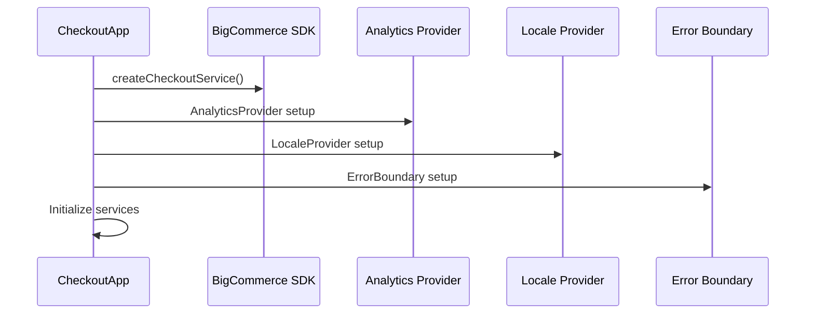

#### OrderConfirmationApp Initialization Flow
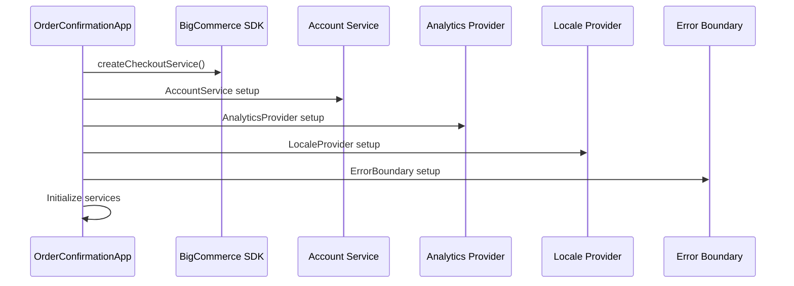

### 2. Global State Layer

#### CheckoutState Interface
**Purpose**: Global checkout state management
**Architecture**: Class component state with complex state coordination
**Source Code**: `packages/core/src/app/checkout/Checkout.tsx`

```typescript
interface CheckoutState {
    activeStepType?: CheckoutStepType;
    isBillingSameAsShipping: boolean;
    customerViewType?: CustomerViewType;
    defaultStepType?: CheckoutStepType;
    error?: Error;
    flashMessages?: FlashMessage[];
    isMultiShippingMode: boolean;
    isCartEmpty: boolean;
    isRedirecting: boolean;
    hasSelectedShippingOptions: boolean;
    isSubscribed: boolean;
    buttonConfigs: PaymentMethod[];
}
```

#### State Management Flow
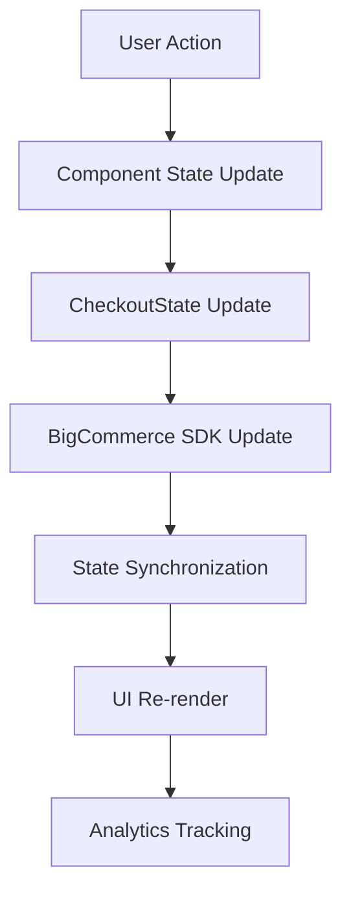

### 3. Context State Layer

#### BillingAndPayment Context
**Purpose**: Shared state for billing and payment components
**Architecture**: React Context with providers and consumers
**Source Code**: `packages/core/src/app/billing-and-payment/context/BillingAndPaymentContext.ts`

**Context Properties**:
- **isBillingAndPaymentCombined**: Boolean flag for combined billing and payment
- **isBillingReady**: Boolean flag for billing readiness
- **isPaymentReady**: Boolean flag for payment readiness
- **setBillingReady**: Function to set billing ready state
- **setPaymentReady**: Function to set payment ready state
- **submitBilling**: Optional billing submission handler
- **submitPayment**: Optional payment submission handler
- **setSubmitBilling**: Function to set billing submission handler
- **setSubmitPayment**: Function to set payment submission handler

#### Context State Flow
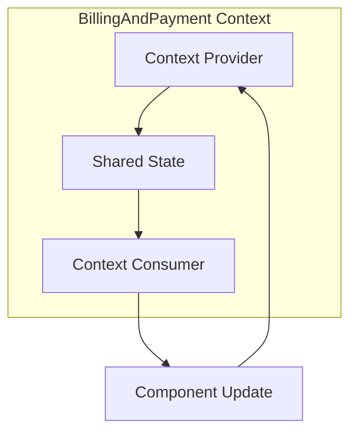

### 4. HOC State Management Layer

#### withCheckout HOC
**Purpose**: Primary state management pattern for accessing BigCommerce SDK state
**Architecture**: Higher-Order Component with SDK state injection
**Source Code**: `packages/core/src/app/checkout/withCheckout.tsx`

**HOC Properties**:
- **CheckoutContext**: BigCommerce SDK context injection
- **State Access**: Direct access to SDK state and methods
- **State Updates**: SDK state update methods
- **Error Handling**: SDK error handling integration

#### withCheckout State Flow
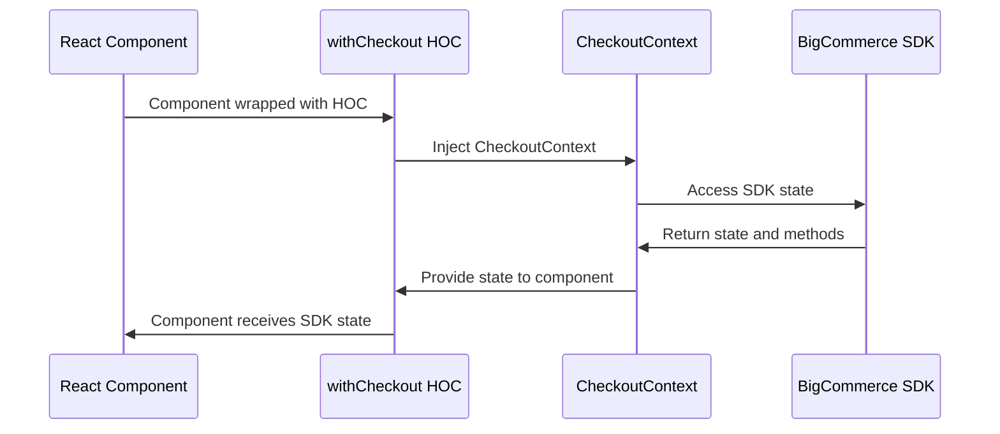

### 5. Component State Layer

#### Local Component State
**Purpose**: Component-specific state management
**Architecture**: React hooks and local state
**Source Code**: `packages/core/src/app/billing/BillingForm.tsx`, `packages/core/src/app/payment/PaymentForm.tsx`

**Actual Hook Usage**:
- **useState**: Local state management (e.g., `isResettingAddress`, `isAddressSelectedFromDropdown`)
- **useEffect**: Side effect management (form validation, API calls)
- **useCallback**: Function memoization (e.g., `handlePaymentMethodSelect`)
- **useMemo**: Value memoization for expensive calculations
- **memo**: Component memoization for performance optimization

#### Form State Management
**Purpose**: Form state management with Formik integration
**Architecture**: Formik with React state coordination
**Key Features**:
- **Form Data**: Form input data synchronization
- **Validation State**: Form validation state management
- **Error State**: Form error state handling
- **Submission State**: Form submission state management

#### Component State Flow
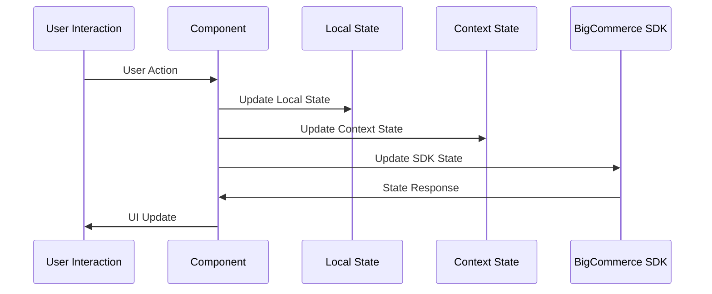

## Data Flow Architecture

### 1. Checkout Flow Data Architecture

#### Checkout Flow State Management
**Purpose**: Complete checkout process state management
**Architecture**: SDK-first with React component coordination
**Source Code**: `packages/core/src/app/checkout/Checkout.tsx`

**Checkout Flow Properties**:
- **Step Management**: CheckoutStepType enum management
- **Customer Management**: CustomerViewType enum management
- **State Coordination**: Complex state coordination between modules
- **Error Handling**: Comprehensive error handling and recovery

#### Checkout Flow Data Flow
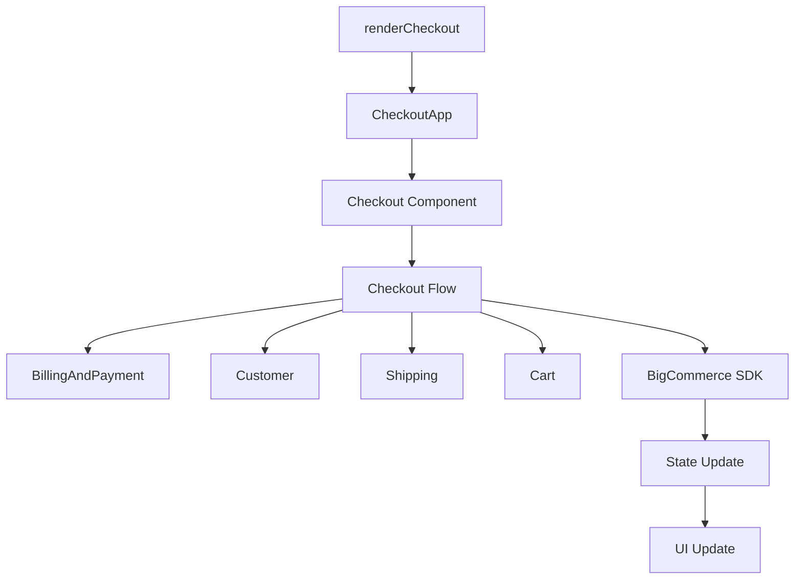

### 2. Order Confirmation Flow Data Architecture

#### Order Confirmation Flow State Management
**Purpose**: Order confirmation and post-purchase state management
**Architecture**: Independent flow with SDK state access
**Source Code**: `packages/core/src/app/order/OrderConfirmation.tsx`

**Order Confirmation Flow Properties**:
- **Order State**: OrderConfirmationState interface
- **Guest Account**: Guest account creation state
- **Order Summary**: Order details and pricing state
- **Thank You**: Post-purchase experience state

#### Order Confirmation Flow Data Flow
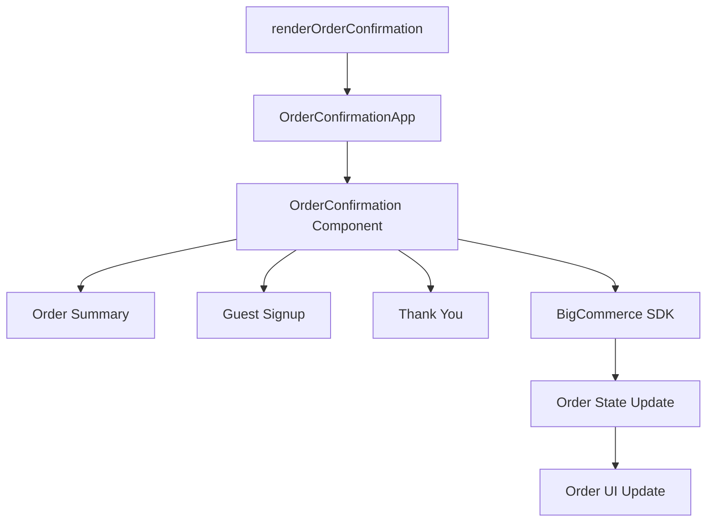

### 3. Top-Down Data Flow

#### Props and Context Flow
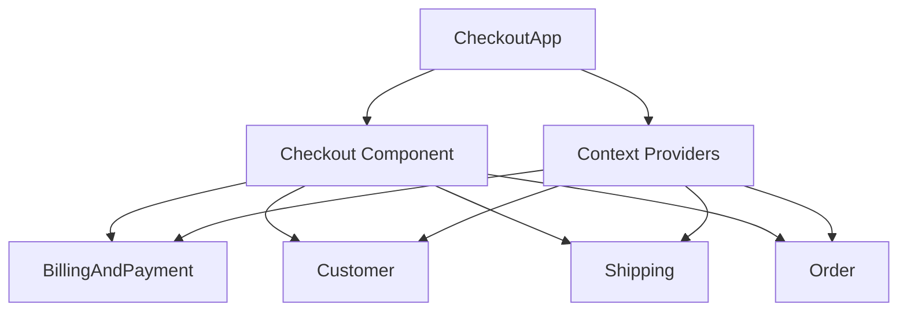

#### Data Flow Properties
- **Props**: Component prop data flow
- **Context**: Shared context data flow
- **Configuration**: Configuration data flow
- **Services**: Service data flow

### 2. Bottom-Up Data Flow

#### Event and Callback Flow
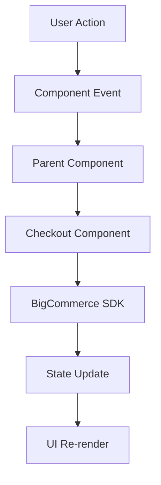

#### Event Flow Properties
- **User Events**: User interaction events
- **Form Events**: Form submission and validation events
- **Navigation Events**: Step navigation events
- **Error Events**: Error handling events

### 3. Cross-Module Data Flow

#### Inter-Module Communication
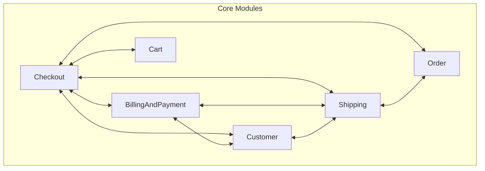

#### Communication Patterns
- **Direct Communication**: Direct component communication
- **Context Communication**: Context-based communication
- **Event Communication**: Event-driven communication
- **Service Communication**: Service-based communication

### 4. External Data Flow

#### BigCommerce SDK Integration
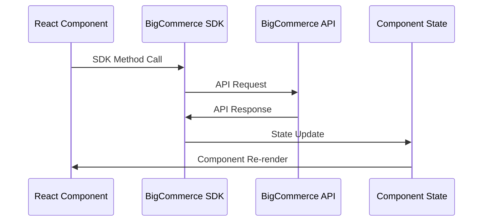

#### External Integration Flow
- **API Calls**: External API integration
- **Data Synchronization**: Data sync with external services
- **Error Handling**: External service error handling
- **State Persistence**: State persistence with external services

## State Synchronization

### 1. SDK State Synchronization

#### BigCommerce SDK State Management
**Purpose**: Synchronize React state with BigCommerce SDK state
**Architecture**: SDK service integration with React state
**Source Code**: `packages/core/src/app/checkout/withCheckout.tsx`

**Synchronization Flow**:
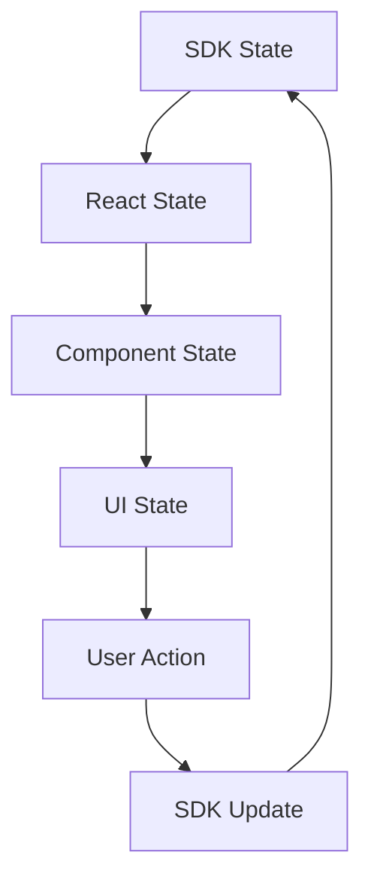

### 2. Form State Synchronization

#### Form State Management
**Purpose**: Synchronize form state across components
**Architecture**: Formik integration with React state
**Key Features**:
- **Form Data**: Form input data synchronization
- **Validation State**: Form validation state synchronization
- **Error State**: Form error state synchronization
- **Submission State**: Form submission state synchronization

#### Form State Flow
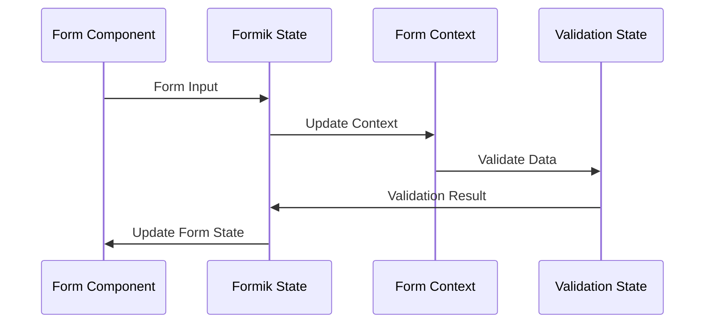

### 3. Cross-Component State Synchronization

#### Shared State Management
**Purpose**: Synchronize state across multiple components
**Architecture**: React Context with state management
**Key Features**:
- **Shared State**: State shared across components
- **State Updates**: Coordinated state updates
- **State Validation**: State validation and error handling
- **State Persistence**: State persistence and recovery

#### Cross-Component Flow
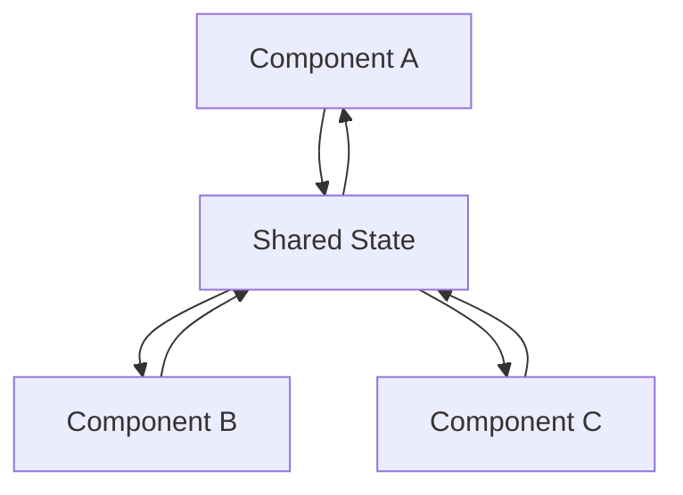

## Error Handling and Recovery

### 1. Error State Management

#### Error State Flow
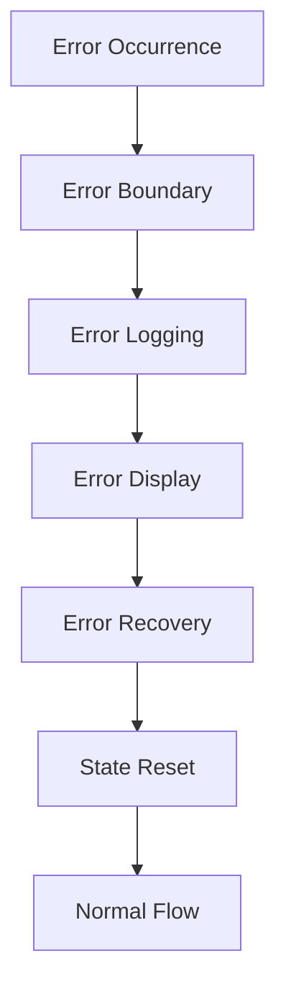

#### Error Handling Properties
- **Error Boundaries**: React error boundary implementation
- **Error Logging**: Error logging and monitoring with SentryErrorLogger
- **Error Display**: User-friendly error messages with ErrorModal
- **Error Recovery**: Error recovery mechanisms
- **Custom Errors**: CustomError and RequestError handling
- **Error Types**: Specific error type handling (CartChangedError, etc.)

### 2. State Recovery

#### State Recovery Flow
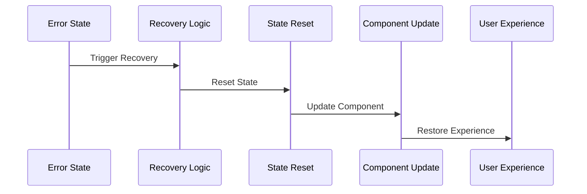

#### Recovery Mechanisms
- **State Reset**: Reset to previous valid state
- **Component Recovery**: Component-level recovery
- **Service Recovery**: External service recovery
- **User Recovery**: User-guided recovery

## Performance Optimization

### 1. State Optimization

#### Memoization Strategy
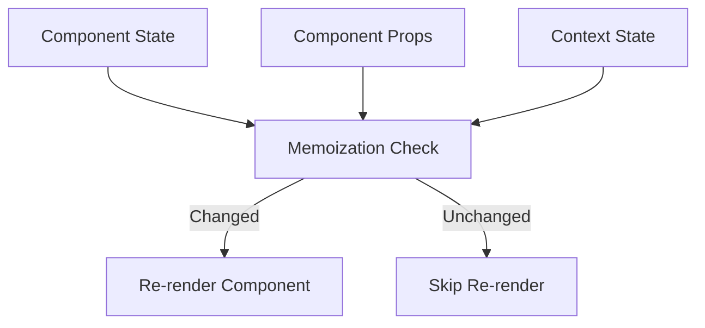

#### Optimization Techniques
- **React.memo()**: Component memoization (e.g., `PaymentForm` with `memo`)
- **useMemo()**: Value memoization for expensive calculations
- **useCallback()**: Function memoization (e.g., `handlePaymentMethodSelect`)
- **State Optimization**: State update optimization
- **Component Memoization**: Prevent unnecessary re-renders
- **Function Memoization**: Prevent function recreation on every render

### 2. Data Flow Optimization

#### Efficient Data Flow
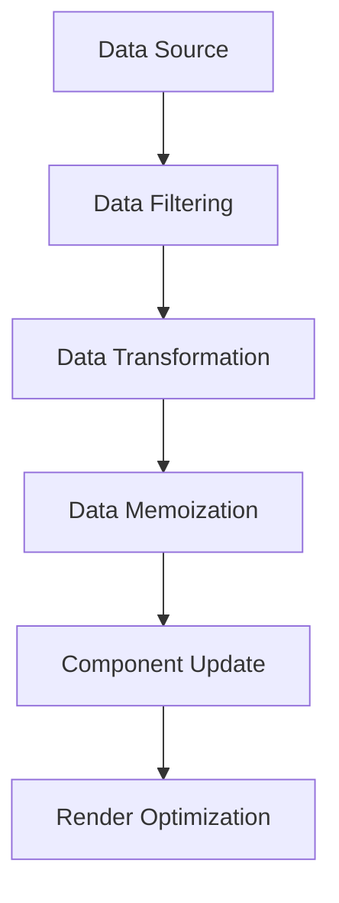

#### Flow Optimization
- **Data Filtering**: Filter unnecessary data
- **Data Transformation**: Optimize data transformation
- **Memoization**: Memoize expensive calculations
- **Render Optimization**: Optimize rendering performance

## Testing Strategy

### 1. State Testing

#### State Management Testing
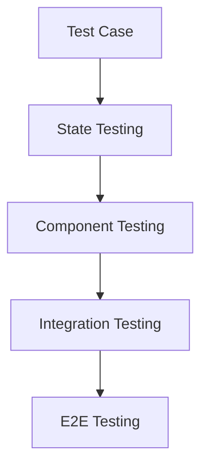

#### Testing Approaches
- **Unit Testing**: Individual state testing
- **Integration Testing**: State integration testing
- **Component Testing**: Component state testing
- **E2E Testing**: End-to-end state testing

### 2. Data Flow Testing

#### Flow Testing Strategy
```mermaid
sequenceDiagram
    participant Test as Test Case
    participant Component as Component
    participant State as State Management
    participant SDK as BigCommerce SDK
    participant UI as UI Update
    
    Test->>Component: Trigger Action
    Component->>State: Update State
    State->>SDK: Sync with SDK
    SDK->>State: Update Response
    State->>UI: Trigger Update
    Test->>UI: Verify Result
```

#### Flow Testing Properties
- **Data Flow Testing**: Test data flow between components
- **State Transition Testing**: Test state transitions
- **Integration Testing**: Test external integrations
- **Error Flow Testing**: Test error handling flows
