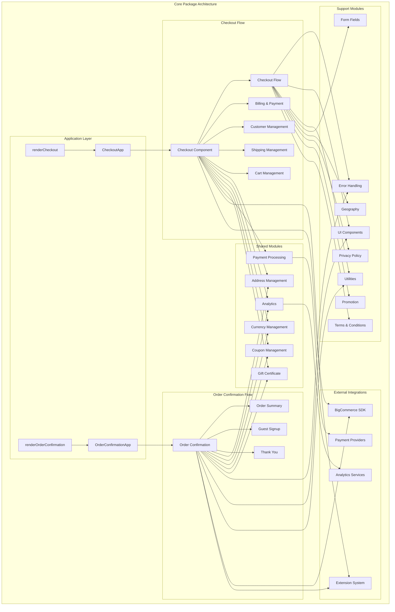

\# Core Package Architecture - Independent System

## Architecture Overview

**Purpose**: Documents the complete architecture of the BigCommerce Core Package as an independent, self-contained checkout system.

**Architecture**: Monolithic React application with modular component architecture, comprehensive state management, and extensive integration capabilities.

**Source Code References**:
- Main Entry Point: `packages/core/src/app/index.ts`
- Application Entry: `packages/core/src/app/checkout/CheckoutApp.tsx`
- Render Function: `packages/core/src/app/checkout/renderCheckout.tsx`
- Main Component: `packages/core/src/app/checkout/Checkout.tsx`

## System Architecture Diagram



## Core Package Structure

### 1. Application Layer (Entry Points)

#### Main Entry Point
**Purpose**: Primary entry point for the core package
**Architecture**: Simple export module with two main functions
**Source Code**: `packages/core/src/app/index.ts`

**Key Exports**:
- **renderCheckout**: Main checkout rendering function
- **renderOrderConfirmation**: Order confirmation rendering function
- **initializeLanguageService**: Language service initialization

#### CheckoutApp Component
**Purpose**: Main application container that initializes all services and providers
**Architecture**: Class component with service initialization and provider setup
**Source Code**: `packages/core/src/app/checkout/CheckoutApp.tsx`

**Key Responsibilities**:
- **Service Initialization**: Creates BigCommerce SDK service
- **Provider Setup**: Configures all context providers
- **Error Handling**: Sets up error logging and monitoring
- **Embedded Checkout**: Handles embedded checkout configuration

#### renderCheckout Function
**Purpose**: Entry point for rendering the checkout application
**Architecture**: Pure function that mounts React application
**Source Code**: `packages/core/src/app/checkout/renderCheckout.tsx`

**Key Responsibilities**:
- **DOM Mounting**: Mounts React application to DOM
- **Public Path Configuration**: Configures asset paths
- **Development Tools**: Sets up development debugging tools
- **Environment Configuration**: Handles environment-specific setup

### 2. Core Modules (Business Logic)

#### Address Management Module
**Purpose**: Comprehensive address handling, validation, and Google Autocomplete integration
**Architecture**: Complete address management system with form handling and validation
**Source Code**: `packages/core/src/app/address/`

**Key Features**:
- **Address Forms**: AddressForm and AddressSelect components
- **Address Validation**: Comprehensive validation with getAddressFormFieldsValidationSchema
- **Google Autocomplete**: Google Places integration for address autocomplete
- **Address Comparison**: isEqualAddress for address equality checking
- **Address Mapping**: mapAddressFromFormValues and mapAddressToFormValues
- **Address Types**: AddressType enum and validation
- **Static Address Display**: SingleLineStaticAddress and StaticAddress components

#### Analytics Module
**Purpose**: User behavior tracking and analytics integration
**Architecture**: HOC-based analytics system
**Source Code**: `packages/core/src/app/analytics/`

**Key Features**:
- **withAnalytics HOC**: Higher-order component for analytics tracking
- **Event Tracking**: User interaction and behavior tracking
- **Analytics Integration**: Integration with analytics services
- **Performance Tracking**: Performance and user experience tracking

#### Billing Module
**Purpose**: Billing address collection and form handling
**Architecture**: Form-based billing system with validation
**Source Code**: `packages/core/src/app/billing/`

**Key Features**:
- **Billing Forms**: BillingForm and billing address collection
- **Billing Validation**: getAcknowledgmentValidationSchema for billing validation
- **Billing Configuration**: Billing configuration and settings
- **External Links**: ExternalLink component for billing-related links
- **Terms and Privacy**: TermsPrivacyCheckbox for legal compliance
- **Course Acknowledgment**: CourseAcknowledgmentCheckbox for educational content
- **Non-Refundable Acknowledgment**: NonRefundableAcknowledgmentCheckbox for refund policies

#### Cart Management Module
**Purpose**: Shopping cart display, management, and redeemable handling
**Architecture**: Component system with cart state management
**Source Code**: `packages/core/src/app/cart/`

**Key Features**:
- **Cart Summary**: CartSummary and CartSummaryDrawer components
- **Redeemable Management**: AppliedRedeemable and Redeemable components
- **Cart Mapping**: mapToCartSummaryProps and mapToRedeemableProps
- **Edit Functionality**: EditLink for cart item editing
- **Empty Cart**: EmptyCartMessage for empty cart state
- **withRedeemable HOC**: Higher-order component for redeemable functionality

#### Coupon Management Module
**Purpose**: Coupon application and management
**Architecture**: Coupon handling system
**Source Code**: `packages/core/src/app/coupon/`

**Key Features**:
- **Applied Coupons**: AppliedCoupon component for displaying applied coupons
- **Coupon Validation**: Coupon validation and application
- **Coupon Management**: Coupon state management

#### Currency Management Module
**Purpose**: Multi-currency support and currency display
**Architecture**: Currency handling system
**Source Code**: `packages/core/src/app/currency/`

**Key Features**:
- **Shopper Currency**: ShopperCurrency component for customer currency
- **Store Currency**: StoreCurrency component for store currency
- **Currency Conversion**: Currency conversion and display
- **Currency Validation**: Currency validation and formatting

#### Customer Management Module
**Purpose**: Customer authentication, account creation, and management
**Architecture**: Multi-component system with various customer flows
**Source Code**: `packages/core/src/app/customer/`

**Key Features**:
- **Authentication**: LoginForm and EmailLoginForm for customer login
- **Account Creation**: CreateAccountForm and GuestForm for account creation
- **Customer Info**: CustomerInfo and Customer components for customer display
- **Email Validation**: EmailField and getEmailValidationSchema for email handling
- **Password Management**: PasswordField and getPasswordRequirements for password handling
- **Checkout Buttons**: CheckoutButton, CheckoutButtonContainer, and CheckoutButtonList
- **Wallet Buttons**: Custom wallet button integration
- **Subscribe Functionality**: SubscribeField and SubscribeSessionStorage
- **Validation Patterns**: validationPatterns for form validation
- **Checkout Suggestions**: Checkout suggestion system
- **Stripe Integration**: StripeGuestForm for Stripe-specific guest forms

#### Embedded Checkout Module
**Purpose**: Embedded checkout functionality and styling
**Architecture**: Embedded checkout system
**Source Code**: `packages/core/src/app/embeddedCheckout/`

**Key Features**:
- **Embedded Stylesheet**: Embedded checkout styling
- **Embedded Support**: Embedded checkout support functionality
- **Embedded Messaging**: Embedded checkout messaging
- **Embedded Configuration**: Embedded checkout configuration

#### Form Fields Module
**Purpose**: Form field management and validation
**Architecture**: Form field system
**Source Code**: `packages/core/src/app/formFields/`

**Key Features**:
- **Form Field Types**: Form field type definitions
- **Form Field Validation**: Form field validation logic
- **Form Field Rendering**: Form field rendering components

#### Geography Module
**Purpose**: Geographic data and country management
**Architecture**: Geography handling system
**Source Code**: `packages/core/src/app/geography/`

**Key Features**:
- **Country Management**: Country data and validation
- **Geographic Data**: Geographic information handling
- **Country Selection**: Country selection functionality

#### Gift Certificate Module
**Purpose**: Gift certificate handling and management
**Architecture**: Gift certificate system
**Source Code**: `packages/core/src/app/giftCertificate/`

**Key Features**:
- **Gift Certificate Display**: Gift certificate display components
- **Gift Certificate Validation**: Gift certificate validation
- **Gift Certificate Processing**: Gift certificate processing logic

#### Guest Signup Module
**Purpose**: Guest account creation and management
**Architecture**: Guest account creation system
**Source Code**: `packages/core/src/app/guestSignup/`

**Key Features**:
- **Account Creation**: Guest account creation forms
- **Password Requirements**: Password requirement handling
- **Account Service**: Account creation service
- **Success Alerts**: Account creation success notifications
- **Error Handling**: Account creation error handling

#### Order Comments Module
**Purpose**: Order comment handling
**Architecture**: Order comment system
**Source Code**: `packages/core/src/app/orderComments/`

**Key Features**:
- **Order Comments**: Order comment input and display
- **Comment Validation**: Order comment validation

#### Privacy Policy Module
**Purpose**: Privacy policy handling and display
**Architecture**: Privacy policy system
**Source Code**: `packages/core/src/app/privacyPolicy/`

**Key Features**:
- **Privacy Policy Display**: Privacy policy display components
- **Privacy Policy Validation**: Privacy policy acceptance validation

#### Promotion Module
**Purpose**: Promotion and discount handling
**Architecture**: Promotion system
**Source Code**: `packages/core/src/app/promotion/`

**Key Features**:
- **Promotion Display**: Promotion display components
- **Promotion Validation**: Promotion validation logic
- **Promotion Processing**: Promotion processing functionality

#### Terms and Conditions Module
**Purpose**: Terms and conditions handling
**Architecture**: Terms and conditions system
**Source Code**: `packages/core/src/app/termsConditions/`

**Key Features**:
- **Terms Display**: Terms and conditions display
- **Terms Validation**: Terms acceptance validation
- **Terms Processing**: Terms processing logic

### 3. Core Modules (Business Logic)

#### Checkout Flow Management
**Purpose**: Orchestrates the entire checkout process
**Architecture**: State-driven component with step management
**Source Code**: `packages/core/src/app/checkout/Checkout.tsx`

**Key Features**:
- **Step Progression**: Manages checkout step flow
- **State Management**: Global checkout state coordination
- **Navigation Logic**: Step navigation and validation
- **Integration Coordination**: Coordinates all module interactions

#### Billing and Payment Module
**Purpose**: Combined billing address and payment processing
**Architecture**: Functional component with context-based state
**Source Code**: `packages/core/src/app/billing-and-payment/BillingAndPayment.tsx`

**Key Features**:
- **Address Collection**: Billing address form handling
- **Payment Processing**: Payment method selection and processing
- **Form Validation**: Comprehensive form validation
- **Payment Integration**: Integration with payment providers

#### Customer Management Module
**Purpose**: Handles customer authentication and account management
**Architecture**: Multi-component system with various customer flows
**Source Code**: `packages/core/src/app/customer/`

**Key Features**:
- **Authentication**: Login and guest checkout flows
- **Account Creation**: Customer account creation
- **Profile Management**: Customer profile handling
- **Session Management**: Customer session handling

#### Shipping Management Module
**Purpose**: Handles shipping address and method selection
**Architecture**: Complex component system with multi-shipping support
**Source Code**: `packages/core/src/app/shipping/`

**Key Features**:
- **Address Management**: Shipping address collection
- **Method Selection**: Shipping method selection
- **Multi-Shipping**: Multiple address shipping support
- **Validation**: Shipping address and method validation

#### Order Confirmation Module
**Purpose**: Handles order confirmation, completion, and post-purchase account creation
**Architecture**: Complete order confirmation system with guest account creation
**Source Code**: `packages/core/src/app/order/`

**Key Features**:
- **Order Confirmation**: Order review and confirmation display
- **Order Details**: Comprehensive order details and summary
- **Guest Account Creation**: Post-purchase account creation for guest users
- **Order Status**: Order status tracking and display
- **Payment Instructions**: Payment method-specific instructions
- **Order Summary**: Detailed order summary with pricing breakdown
- **Thank You Page**: Post-purchase thank you experience
- **Print Functionality**: Order printing capabilities
- **Embedded Support**: Embedded checkout order confirmation

#### Cart Management Module
**Purpose**: Manages shopping cart display and updates
**Architecture**: Component system with cart state management
**Source Code**: `packages/core/src/app/cart/`

**Key Features**:
- **Cart Display**: Shopping cart summary
- **Item Management**: Cart item updates
- **Pricing**: Price calculations and display
- **Promotions**: Coupon and promotion handling

### 3. Order Confirmation System (Post-Purchase)

#### OrderConfirmationApp Component
**Purpose**: Main application container for order confirmation
**Architecture**: Class component with service initialization and guest account creation
**Source Code**: `packages/core/src/app/order/OrderConfirmationApp.tsx`

**Key Responsibilities**:
- **Service Initialization**: Creates BigCommerce SDK service for order data
- **Account Service**: Guest account creation service
- **Provider Setup**: Configures all context providers for order confirmation
- **Error Handling**: Sets up error logging and monitoring for order confirmation

#### OrderConfirmation Component
**Purpose**: Main order confirmation display and management
**Architecture**: Class component with order state management and guest account creation
**Source Code**: `packages/core/src/app/order/OrderConfirmation.tsx`

**Key Features**:
- **Order Display**: Complete order details and summary display
- **Guest Account Creation**: Post-purchase account creation for guest users
- **Order Status**: Order status tracking and display
- **Payment Instructions**: Payment method-specific instructions
- **Thank You Experience**: Post-purchase thank you page
- **Print Functionality**: Order printing capabilities

#### Order Confirmation Components
**Purpose**: Specialized components for order confirmation display
**Architecture**: Component system with order-specific functionality
**Key Components**:
- **OrderConfirmationSection**: Order confirmation section wrapper
- **OrderStatus**: Order status display component
- **ThankYouHeader**: Thank you page header
- **OrderSummary**: Detailed order summary with pricing
- **OrderSummaryItems**: Order items display
- **OrderSummarySubtotals**: Order subtotals and calculations
- **OrderSummaryTotal**: Order total display
- **OrderSummaryDiscount**: Discount display
- **OrderSummaryPrice**: Price formatting and display
- **PaymentsWithMandates**: Payment instructions with mandates
- **PrintLink**: Order printing functionality

#### Guest Account Creation
**Purpose**: Post-purchase account creation for guest users
**Architecture**: Form-based account creation system
**Source Code**: `packages/core/src/app/guestSignup/`

**Key Features**:
- **Account Creation Form**: Guest account creation form
- **Password Requirements**: Password validation and requirements
- **Account Creation Success**: Success notifications and alerts
- **Account Creation Errors**: Error handling for account creation failures
- **Account Service**: Account creation service integration

#### Order Confirmation Utilities
**Purpose**: Utility functions for order confirmation processing
**Architecture**: Utility function library for order operations
**Key Utilities**:
- **getPaymentInstructions**: Payment method-specific instructions
- **getItemsCount**: Order items count calculation
- **getLineItemsCount**: Line items count calculation
- **getOrderShippingCostAfterAutomaticDiscount**: Shipping cost calculation
- **getOrderSummaryItemImage**: Order item image processing
- **getStoreCreditAmount**: Store credit amount calculation
- **isOrderFee**: Order fee validation
- **removeBundledItems**: Bundled items processing
- **mapFromCustom**: Custom item mapping
- **mapFromDigital**: Digital item mapping
- **mapFromGiftCertificate**: Gift certificate mapping
- **mapFromPhysical**: Physical item mapping

### 4. Support Modules (Infrastructure)

#### Form Fields Module
**Purpose**: Form field management and validation
**Architecture**: Form field system
**Source Code**: `packages/core/src/app/formFields/`

**Key Features**:
- **Form Field Types**: Form field type definitions
- **Form Field Validation**: Form field validation logic
- **Form Field Rendering**: Form field rendering components

#### Geography Module
**Purpose**: Geographic data and country management
**Architecture**: Geography handling system
**Source Code**: `packages/core/src/app/geography/`

**Key Features**:
- **Country Management**: Country data and validation
- **Geographic Data**: Geographic information handling
- **Country Selection**: Country selection functionality

#### Privacy Policy Module
**Purpose**: Privacy policy handling and display
**Architecture**: Privacy policy system
**Source Code**: `packages/core/src/app/privacyPolicy/`

**Key Features**:
- **Privacy Policy Display**: Privacy policy display components
- **Privacy Policy Validation**: Privacy policy acceptance validation

#### Promotion Module
**Purpose**: Promotion and discount handling
**Architecture**: Promotion system
**Source Code**: `packages/core/src/app/promotion/`

**Key Features**:
- **Promotion Display**: Promotion display components
- **Promotion Validation**: Promotion validation logic
- **Promotion Processing**: Promotion processing functionality

#### Terms and Conditions Module
**Purpose**: Terms and conditions handling
**Architecture**: Terms and conditions system
**Source Code**: `packages/core/src/app/termsConditions/`

**Key Features**:
- **Terms Display**: Terms and conditions display
- **Terms Validation**: Terms acceptance validation
- **Terms Processing**: Terms processing logic

### 5. Support Modules (Infrastructure)

#### Payment Processing
**Purpose**: Payment method handling and processing
**Architecture**: Component system with payment integration
**Source Code**: `packages/core/src/app/payment/`

**Key Features**:
- **Payment Methods**: Payment method selection
- **Form Handling**: Payment form management
- **Validation**: Payment validation
- **Integration**: Payment provider integration

#### Analytics Integration
**Purpose**: User behavior tracking and analytics
**Architecture**: HOC and context-based analytics
**Source Code**: `packages/core/src/app/analytics/`

**Key Features**:
- **Event Tracking**: User interaction tracking
- **Analytics HOC**: Higher-order component for analytics
- **Data Collection**: Analytics data collection
- **Service Integration**: Analytics service integration

#### Error Handling
**Purpose**: Comprehensive error management and recovery
**Architecture**: Error boundary and logging system
**Source Code**: `packages/core/src/app/common/error/`

**Key Features**:
- **Error Boundaries**: React error boundaries
- **Error Logging**: Error logging and monitoring
- **Error Recovery**: Error recovery mechanisms
- **User Feedback**: User-friendly error messages

#### UI Components
**Purpose**: Shared UI components and styling
**Architecture**: Component library with SCSS styling
**Source Code**: `packages/core/src/app/ui/`

**Key Features**:
- **Reusable Components**: Shared UI components
- **Responsive Design**: Mobile and desktop support
- **Accessibility**: Accessibility features
- **Theming**: Styling and theming system

#### Common Utilities
**Purpose**: Common utility functions and helpers
**Architecture**: Comprehensive utility function library
**Source Code**: `packages/core/src/app/common/`

**Key Features**:
- **Bundler Utilities**: Public path configuration and bundler utilities
- **DOM Utilities**: DOM manipulation and query utilities
- **Error Handling**: Comprehensive error handling and logging
- **Form Utilities**: Form handling and validation utilities
- **Request Utilities**: HTTP request handling utilities
- **Resolver Utilities**: Data resolution and mapping utilities
- **Utility Functions**: Common utility functions and helpers
- **Checkout Footer**: Checkout footer component
- **Form Components**: Common form components and utilities

#### UI Components
**Purpose**: Shared UI components and styling
**Architecture**: Component library with SCSS styling
**Source Code**: `packages/core/src/app/ui/`

**Key Features**:
- **Reusable Components**: Shared UI components (110+ components)
- **Responsive Design**: Mobile and desktop support
- **Accessibility**: Accessibility features
- **Theming**: Styling and theming system
- **Form Components**: Form input and validation components
- **Layout Components**: Layout and container components
- **Interactive Components**: Interactive UI elements

## Data Flow Architecture

### 1. Checkout Flow (Primary Flow)
```
renderCheckout() 
→ CheckoutApp (Service Setup)
→ Provider Configuration
→ Checkout Component (Main App)
→ Checkout Flow Modules
→ User Interaction
→ Component State Update
→ BigCommerce SDK Update
→ State Synchronization
→ UI Re-render
→ Analytics Tracking
```

### 2. Order Confirmation Flow (Secondary Flow)
```
renderOrderConfirmation()
→ OrderConfirmationApp (Service Setup)
→ Provider Configuration
→ OrderConfirmation Component
→ Order Data Loading
→ Order Confirmation Display
→ Guest Account Creation (Optional)
→ Thank You Experience
→ Analytics Tracking
```

### 3. Shared Module Integration
```
Both Flows
→ Address Management
→ Analytics Integration
→ Currency Management
→ Coupon Management
→ Gift Certificate Management
→ Payment Processing
→ Error Handling
→ UI Components
→ Utilities
```

### 4. Error Handling Flow (Both Flows)
```
Error Occurrence
→ Error Boundary Catch
→ Error Logging
→ User Notification
→ Recovery Attempt
→ State Reset
```

## State Management Architecture

### 1. Global State (CheckoutState)
```typescript
interface CheckoutState {
    activeStepType?: CheckoutStepType;
    isBillingSameAsShipping: boolean;
    customerViewType?: CustomerViewType;
    defaultStepType?: CheckoutStepType;
    error?: Error;
    flashMessages?: FlashMessage[];
    isMultiShippingMode: boolean;
    isCartEmpty: boolean;
    isRedirecting: boolean;
    hasSelectedShippingOptions: boolean;
    isSubscribed: boolean;
    buttonConfigs: PaymentMethod[];
}
```

### 2. Order Confirmation State (OrderConfirmationState)
```typescript
interface OrderConfirmationState {
    error?: Error;
    hasSignedUp?: boolean;
    isSigningUp?: boolean;
}
```

### 3. Component State Management
- **Local State**: Component-specific state with useState/useReducer
- **Context State**: Shared state with React Context
- **SDK State**: BigCommerce SDK state management
- **Form State**: Form state with Formik
- **Order State**: Order confirmation state management
- **Guest Account State**: Guest account creation state

### 4. State Synchronization
- **SDK Integration**: State sync with BigCommerce SDK
- **Cross-Component**: State sharing between components
- **Persistence**: State persistence and recovery
- **Validation**: State validation and error handling

## Integration Architecture

### 1. Checkout Flow Integration
- **CheckoutApp**: Main checkout application container
- **renderCheckout**: Checkout rendering function
- **Checkout Component**: Main checkout orchestrator
- **Checkout Flow Modules**: Billing, Payment, Customer, Shipping, Cart
- **Shared Modules**: Address, Analytics, Currency, Coupon, Gift Certificate, Payment

### 2. Order Confirmation Flow Integration
- **OrderConfirmationApp**: Main order confirmation application container
- **renderOrderConfirmation**: Order confirmation rendering function
- **OrderConfirmation Component**: Main order confirmation orchestrator
- **Order Confirmation Modules**: Order Summary, Guest Signup, Thank You
- **Shared Modules**: Address, Analytics, Currency, Coupon, Gift Certificate

### 3. External Service Integration
- **BigCommerce SDK**: Core checkout and order confirmation functionality
- **Payment Providers**: Payment processing integration
- **Analytics Services**: User behavior tracking
- **Extension System**: Third-party extensions

### 4. Internal Package Integration
- **Analytics Package**: User behavior tracking
- **Extension Package**: Third-party extensions
- **Error Handling Package**: Error management
- **Locale Package**: Internationalization
- **UI Package**: Shared UI components
- **Utility Package**: Common utilities

### 5. API Integration
- **REST APIs**: HTTP API integration
- **WebSocket**: Real-time communication
- **GraphQL**: Query-based data fetching
- **Webhook**: Event-driven integration

## Performance Architecture

### 1. Code Splitting
- **Lazy Loading**: Component lazy loading with React.lazy()
- **Webpack Chunks**: Optimized bundle splitting
- **Dynamic Imports**: Dynamic module loading
- **Route-based Splitting**: Route-based code splitting

### 2. Caching Strategy
- **Component Caching**: React.memo() for component caching
- **Data Caching**: API response caching
- **Bundle Caching**: Webpack bundle caching
- **CDN Caching**: Static asset caching

### 3. Optimization Techniques
- **Memoization**: useMemo() and useCallback() hooks
- **Virtual Scrolling**: Large list optimization
- **Image Optimization**: Image loading optimization
- **Bundle Optimization**: Webpack optimization

## Security Architecture

### 1. Input Validation
- **Form Validation**: Yup schema validation
- **XSS Prevention**: DOMPurify sanitization
- **Data Sanitization**: Input sanitization
- **Type Safety**: TypeScript type checking

### 2. Authentication & Authorization
- **Session Management**: Secure session handling
- **Token Management**: JWT token handling
- **Permission Checking**: Role-based access control
- **CSRF Protection**: Cross-site request forgery protection

### 3. Data Protection
- **Encryption**: Data encryption in transit and at rest
- **Privacy**: User privacy protection
- **Compliance**: GDPR and privacy compliance
- **Audit Logging**: Security event logging

## Testing Architecture

### 1. Checkout Flow Testing
- **Checkout Component Testing**: Main checkout component testing
- **Checkout Flow Testing**: Complete checkout flow testing
- **Billing Testing**: Billing and payment testing
- **Customer Testing**: Customer authentication and management testing
- **Shipping Testing**: Shipping address and method testing
- **Cart Testing**: Cart management and redeemable testing

### 2. Order Confirmation Flow Testing
- **Order Confirmation Testing**: Order confirmation component testing
- **Order Summary Testing**: Order summary display testing
- **Guest Account Testing**: Guest account creation testing
- **Thank You Testing**: Thank you page testing

### 3. Shared Module Testing
- **Address Testing**: Address management testing
- **Analytics Testing**: Analytics integration testing
- **Currency Testing**: Currency management testing
- **Coupon Testing**: Coupon management testing
- **Gift Certificate Testing**: Gift certificate testing
- **Payment Testing**: Payment processing testing

### 4. End-to-End Testing
- **Checkout E2E**: Complete checkout flow testing
- **Order Confirmation E2E**: Complete order confirmation flow testing
- **Cross-Flow E2E**: Checkout to order confirmation flow testing
- **Cross-Browser**: Cross-browser compatibility testing
- **Performance Testing**: Performance and load testing

### 5. Testing Infrastructure
- **Jest**: Unit testing framework
- **React Testing Library**: React testing utilities
- **MSW**: API mocking with Mock Service Worker
- **Polly.js**: HTTP recording and replay

## Deployment Architecture

### 1. Build Process
- **Webpack**: Module bundling and optimization
- **TypeScript**: Type checking and compilation
- **SCSS**: Style compilation and optimization
- **Asset Optimization**: Image and asset optimization

### 2. Environment Configuration
- **Development**: Development environment setup
- **Staging**: Staging environment configuration
- **Production**: Production environment optimization
- **Feature Flags**: Feature toggle management

### 3. Monitoring & Analytics
- **Error Monitoring**: Sentry error monitoring
- **Performance Monitoring**: Performance tracking
- **User Analytics**: User behavior analytics
- **Business Metrics**: Business KPI tracking

## Maintenance & Evolution

### 1. Code Organization
- **Modular Architecture**: Modular component organization
- **Separation of Concerns**: Clear separation of responsibilities
- **Reusability**: Component and utility reusability
- **Maintainability**: Code maintainability and readability

### 2. Documentation
- **API Documentation**: Component and function documentation
- **Architecture Documentation**: System architecture documentation
- **User Guides**: User and developer guides
- **Change Logs**: Version and change documentation

### 3. Future Considerations
- **Scalability**: System scalability planning
- **Performance**: Performance optimization opportunities
- **Security**: Security enhancement opportunities
- **Feature Development**: New feature development planning
