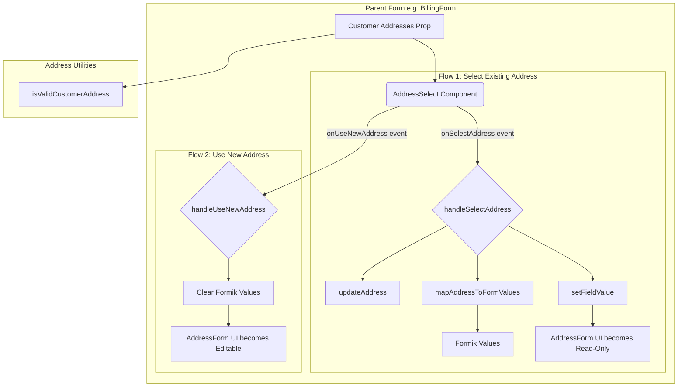

# Address Management System

## Core Responsibility & Design

The Address Management System is a collection of components and utilities responsible for the selection, validation, and mapping of customer addresses. It is designed to provide a seamless experience for logged-in customers, allowing them to select from their saved addresses for both shipping and billing purposes.

The system is primarily orchestrated by parent components (like `BillingForm.tsx` or `Shipping.tsx`) but relies on a set of specialized, reusable pieces from the `packages/core/src/app/address/` directory.

---

## System Workflow Diagram

The diagram below illustrates the two primary user flows: selecting an existing address and opting to create a new one.

---

## Key Components

### 1. `AddressSelect.tsx` (The UI Layer)
-   **Responsibility**: Renders a dropdown menu of a customer's saved addresses.
-   **Key Event Handlers**:
    -   `onSelectAddress`: The primary callback, triggered when a user chooses an address from the list.
    -   `onUseNewAddress`: The secondary callback, triggered when the user clicks the "Enter a new address" option.

### 2. `isValidCustomerAddress.ts` (The Validation Utility)
-   **Responsibility**: Verifies that a given `Address` object is both structurally valid (i.e., has all required fields for its country) and exists within the customer's list of saved addresses.

### 3. `mapAddressToFormValues.ts` (The Data Mapping Layer)
-   **Responsibility**: Translates an `Address` object from the backend into the `AddressFormValues` structure required by Formik, correctly handling both system fields and custom fields.

---

## Key Mechanisms & Flows

### Flow 1: Selecting an Existing Address
This is the primary success path for a returning customer.
1.  **Initialization**: The parent form (e.g., `BillingForm`) renders the `AddressSelect` component, passing its list of `addresses` and the `handleSelectAddress` function as the `onSelectAddress` prop.
2.  **User Interaction**: The user clicks the dropdown and selects a pre-populated address.
3.  **Callback Execution**: This triggers the `handleSelectAddress` function in the parent.
4.  **Orchestration**:
    -   The handler first calls `updateAddress` to sync the selection with the global checkout state.
    -   It then uses the `mapAddressToFormValues` utility to convert the selected address into Formik-compatible data.
    -   Finally, it uses Formik's `setFieldValue` method to programmatically populate the entire `AddressForm` with the selected data.

### Flow 2: Creating a New Address
This flow is initiated when the user decides not to use a saved address.
1.  **User Interaction**: The user clicks the "Enter a new address" option in the `AddressSelect` dropdown.
2.  **Callback Execution**: This triggers the `onUseNewAddress` prop, calling the `handleUseNewAddress` function in the parent.
3.  **Orchestration**: The `handleUseNewAddress` function typically resets the form, clears any selected address from the global state, and ensures the `AddressForm` fields are editable.

### Mechanism: Read-Only State Control
A key part of the user experience is preventing accidental edits to saved addresses. This is controlled by the parent component.
-   **State Management**: A local state variable (e.g., `isAddressSelectedFromDropdown` in `BillingForm.tsx`) is used to track the user's choice.
-   **Behavior**:
    -   When `handleSelectAddress` is called (Flow 1), this state is set to `true`.
    -   When `handleUseNewAddress` is called (Flow 2), this state is set to `false`.
-   **UI Impact**: This boolean state is used directly to control the `AddressForm`. When `true`, the form's fields are re-rendered with the `readonly` attribute, effectively locking them. When `false`, the fields are rendered as editable inputs.
