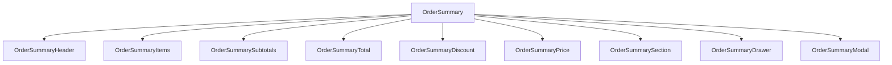

# OrderSummary Component - Core Package

## Component Overview

**Purpose**: Handles order summary display, item management, and total calculations for the BigCommerce order confirmation flow.

**Architecture**: Multi-component system with order summary display, item management, and total calculations.

**Source Code**: `packages/core/src/app/order/OrderSummary.tsx`

## Key Responsibilities

### 1. Order Summary Display
- **Order Items**: Displays ordered items with details and quantities
- **Order Totals**: Shows order totals, taxes, and discounts
- **Order Status**: Displays order status and tracking information
- **Order Details**: Shows order details and metadata

### 2. Item Management
- **Item Display**: Displays order items with product details
- **Item Quantities**: Shows item quantities and updates
- **Item Prices**: Displays item prices and totals
- **Item Status**: Shows item status and tracking

### 3. Total Calculations
- **Subtotals**: Calculates and displays order subtotals
- **Taxes**: Calculates and displays order taxes
- **Discounts**: Calculates and displays order discounts
- **Final Total**: Calculates and displays final order total

## Component Structure



## State Management

### OrderSummaryProps Interface
```typescript
export interface OrderSummaryProps {
    order: Order;
    isExpanded: boolean;
    isUpdating: boolean;
    onToggleExpanded(): void;
    onUpdateItem(itemId: string, quantity: number): void;
    onRemoveItem(itemId: string): void;
}
```

### Key State Properties
- **Order Data**: Order items, totals, and metadata
- **Display State**: Order summary display and expansion state
- **Update State**: Order update and loading state
- **Item State**: Order item state and management

## Integration Points

### Order Confirmation Flow Integration
- **Order Display**: Displays order summary in confirmation
- **Item Display**: Shows ordered items in confirmation
- **Total Display**: Displays order totals and calculations
- **Status Display**: Shows order status and tracking

### Shared Components Integration
- **Order Summary**: Order summary display components
- **Item Components**: Order item display components
- **Total Components**: Order total calculation components
- **Status Components**: Order status display components

### Order Management Integration
- **Order Service**: Order data loading and management
- **Item Service**: Order item management
- **Total Service**: Order total calculation
- **Status Service**: Order status management

## Key Features

### 1. Order Summary Display
- **Item List**: Displays order items with details
- **Quantity Display**: Shows item quantities and updates
- **Price Display**: Displays item prices and totals
- **Summary Totals**: Shows order subtotals, taxes, and totals

### 2. Item Management
- **Item Display**: Displays order items with product details
- **Item Quantities**: Shows item quantities and updates
- **Item Prices**: Displays item prices and totals
- **Item Status**: Shows item status and tracking

### 3. Total Calculations
- **Subtotal Calculation**: Calculates order subtotals
- **Tax Calculation**: Calculates order taxes
- **Discount Calculation**: Calculates order discounts
- **Final Total**: Calculates final order total

## Performance Considerations

### 1. Lazy Loading
- **Order Summary**: Order summary lazy loading
- **Item Display**: Item display lazy loading
- **Total Calculation**: Total calculation lazy loading

### 2. Caching
- **Order Data**: Order data caching for performance
- **Item Data**: Item data caching
- **Total Data**: Total calculation caching

### 3. Optimization
- **Summary Optimization**: Order summary rendering optimization
- **Item Optimization**: Item display optimization
- **Calculation Optimization**: Total calculation optimization

## Security Considerations

### 1. Data Validation
- **Order Validation**: Order data validation
- **Item Validation**: Order item validation
- **Total Validation**: Order total validation

### 2. Data Protection
- **Order Privacy**: Order data privacy protection
- **Item Privacy**: Item data privacy protection
- **Total Privacy**: Total data privacy protection

## Testing Strategy

### 1. Unit Tests
- **Component Tests**: Individual component testing
- **Utility Tests**: Order summary utility function testing
- **Calculation Tests**: Total calculation testing

### 2. Integration Tests
- **Order Integration**: Order summary integration testing
- **Item Integration**: Item display integration testing
- **Total Integration**: Total calculation integration testing

### 3. E2E Tests
- **Order Flow**: Complete order summary flow testing
- **Item Flow**: Order item flow testing
- **Total Flow**: Order total flow testing

## Common Issues

### 1. Display Issues
- **Summary Display**: Order summary display issues
- **Item Display**: Order item display issues
- **Total Calculation**: Order total calculation issues

### 2. Item Issues
- **Item Display**: Order item display issues
- **Item Quantities**: Item quantity display issues
- **Item Prices**: Item price display issues

### 3. Performance Issues
- **Summary Performance**: Order summary performance issues
- **Item Performance**: Order item performance issues
- **Calculation Performance**: Total calculation performance issues

## Future Considerations

### 1. Enhanced Features
- **Order Tracking**: Enhanced order tracking functionality
- **Item Recommendations**: Item recommendation functionality
- **Order Sharing**: Order sharing functionality

### 2. Integration Improvements
- **Order Integration**: Enhanced order summary integration
- **Item Integration**: Improved item display integration
- **Total Integration**: Enhanced total calculation integration

### 3. Performance Optimizations
- **Summary Performance**: Order summary performance optimization
- **Item Performance**: Order item performance optimization
- **Calculation Performance**: Total calculation performance optimization
