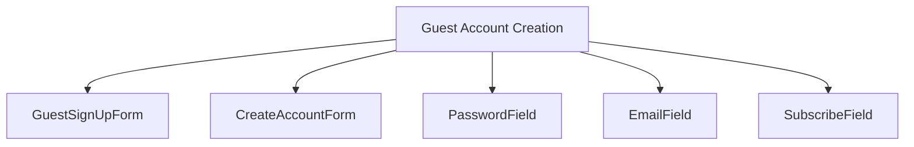
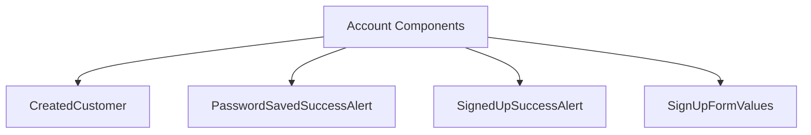

# Guest Account Creation Component - Core Package

## Component Overview

**Purpose**: Handles guest account creation after order completion, including account creation forms, password management, and account validation for the BigCommerce order confirmation flow.

**Architecture**: Multi-component system with account creation forms, password management, and account validation.

**Source Code**: `packages/core/src/app/order/` and `packages/core/src/app/guestSignup/`

## Key Responsibilities

### 1. Guest Account Creation
- **Account Forms**: Manages guest account creation forms
- **Account Validation**: Validates account creation requirements
- **Account Creation**: Handles guest account creation process
- **Account Success**: Manages successful account creation flow

### 2. Password Management
- **Password Creation**: Handles password creation and validation
- **Password Requirements**: Manages password requirement validation
- **Password Security**: Ensures password security and validation
- **Password Success**: Handles successful password creation

### 3. Account Validation
- **Email Validation**: Validates email address requirements
- **Password Validation**: Validates password requirements
- **Account Validation**: Validates account creation requirements
- **Success Validation**: Validates successful account creation

## Component Structure





## State Management

### GuestAccountCreationState Interface
```typescript
export interface GuestAccountCreationState {
    isSigningUp: boolean;
    hasSignedUp: boolean;
    error?: Error;
    formData: SignUpFormValues;
    validationErrors: ValidationErrors;
}
```

### Key State Properties
- **Account State**: Guest account creation state
- **Form State**: Account creation form state
- **Validation State**: Account validation state
- **Success State**: Account creation success state

## Integration Points

### Order Confirmation Flow Integration
- **Account Creation**: Creates guest accounts after order completion
- **Account Validation**: Validates guest account creation
- **Account Success**: Handles successful account creation
- **Account Management**: Manages guest account after creation

### Shared Components Integration
- **Customer Components**: Customer authentication components
- **Form Components**: Account creation form components
- **Validation Components**: Account validation components
- **Success Components**: Account creation success components

### Account Management Integration
- **Account Service**: Guest account creation service
- **Password Service**: Password management service
- **Validation Service**: Account validation service
- **Success Service**: Account creation success service

## Key Features

### 1. Account Creation Forms
- **Email Forms**: Guest email collection forms
- **Password Forms**: Guest password creation forms
- **Account Forms**: Complete guest account creation forms
- **Validation Forms**: Account validation forms

### 2. Password Management
- **Password Creation**: Guest password creation
- **Password Validation**: Password requirement validation
- **Password Security**: Password security measures
- **Password Success**: Password creation success handling

### 3. Account Validation
- **Email Validation**: Email address validation
- **Password Validation**: Password requirement validation
- **Account Validation**: Complete account validation
- **Success Validation**: Account creation success validation

## Performance Considerations

### 1. Lazy Loading
- **Account Forms**: Account creation form lazy loading
- **Password Forms**: Password creation form lazy loading
- **Validation Forms**: Account validation form lazy loading

### 2. Caching
- **Account Data**: Account creation data caching
- **Password Data**: Password data caching
- **Validation Data**: Account validation data caching

### 3. Optimization
- **Form Optimization**: Account creation form optimization
- **Password Optimization**: Password creation optimization
- **Validation Optimization**: Account validation optimization

## Security Considerations

### 1. Account Security
- **Password Security**: Password security and validation
- **Account Security**: Account creation security
- **Data Security**: Account data security

### 2. Data Protection
- **Account Privacy**: Account data privacy protection
- **Password Privacy**: Password data privacy protection
- **Form Privacy**: Form data privacy protection

## Testing Strategy

### 1. Unit Tests
- **Component Tests**: Individual component testing
- **Form Tests**: Account creation form testing
- **Validation Tests**: Account validation testing
- **Password Tests**: Password creation testing

### 2. Integration Tests
- **Account Integration**: Guest account integration testing
- **Password Integration**: Password management integration testing
- **Validation Integration**: Account validation integration testing

### 3. E2E Tests
- **Account Flow**: Complete guest account creation flow testing
- **Password Flow**: Password creation flow testing
- **Validation Flow**: Account validation flow testing

## Common Issues

### 1. Account Creation Issues
- **Form Issues**: Account creation form issues
- **Validation Issues**: Account validation issues
- **Creation Issues**: Account creation process issues

### 2. Password Issues
- **Password Creation**: Password creation issues
- **Password Validation**: Password validation issues
- **Password Security**: Password security issues

### 3. Validation Issues
- **Email Validation**: Email validation issues
- **Password Validation**: Password validation issues
- **Account Validation**: Account validation issues

## Future Considerations

### 1. Enhanced Features
- **Social Login**: Social media login integration
- **Two-Factor Authentication**: Two-factor authentication support
- **Account Recovery**: Enhanced account recovery functionality

### 2. Integration Improvements
- **Account Integration**: Enhanced guest account integration
- **Password Integration**: Improved password management integration
- **Validation Integration**: Enhanced account validation integration

### 3. Performance Optimizations
- **Account Performance**: Guest account creation performance optimization
- **Password Performance**: Password creation performance optimization
- **Validation Performance**: Account validation performance optimization
