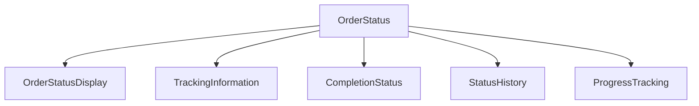

# OrderStatus Component - Core Package

## Component Overview

**Purpose**: Handles order status display, tracking information, and order completion status for the BigCommerce order confirmation flow.

**Architecture**: Component system with order status display, tracking information, and completion status management.

**Source Code**: `packages/core/src/app/order/OrderStatus.tsx`

## Key Responsibilities

### 1. Order Status Display
- **Status Information**: Displays current order status and progress
- **Tracking Information**: Shows order tracking and shipping information
- **Completion Status**: Displays order completion status
- **Status Updates**: Handles order status updates and changes

### 2. Order Tracking
- **Tracking Numbers**: Displays order tracking numbers
- **Shipping Information**: Shows shipping and delivery information
- **Status History**: Displays order status history
- **Progress Tracking**: Shows order progress and milestones

### 3. Order Completion
- **Completion Status**: Displays order completion status
- **Success Messages**: Shows order completion success messages
- **Next Steps**: Displays next steps and instructions
- **Order Summary**: Shows final order summary and details

## Component Structure



## State Management

### OrderStatusState Interface
```typescript
export interface OrderStatusState {
    order: Order;
    status: OrderStatus;
    trackingInfo: TrackingInfo;
    completionStatus: CompletionStatus;
    isUpdating: boolean;
    error?: Error;
}
```

### Key State Properties
- **Order Status**: Current order status and progress
- **Tracking Info**: Order tracking and shipping information
- **Completion Status**: Order completion status
- **Update State**: Order status update state

## Integration Points

### Order Confirmation Flow Integration
- **Status Display**: Displays order status in confirmation
- **Tracking Display**: Shows order tracking information
- **Completion Display**: Displays order completion status
- **Status Updates**: Handles order status updates

### Shared Components Integration
- **Status Components**: Order status display components
- **Tracking Components**: Order tracking components
- **Completion Components**: Order completion components
- **Progress Components**: Order progress components

### Order Management Integration
- **Order Service**: Order status management service
- **Tracking Service**: Order tracking service
- **Status Service**: Order status update service
- **Completion Service**: Order completion service

## Key Features

### 1. Order Status Display
- **Current Status**: Displays current order status
- **Status Progress**: Shows order status progress
- **Status History**: Displays order status history
- **Status Updates**: Handles order status updates

### 2. Order Tracking
- **Tracking Numbers**: Displays order tracking numbers
- **Shipping Info**: Shows shipping and delivery information
- **Progress Tracking**: Displays order progress and milestones
- **Tracking Updates**: Handles tracking information updates

### 3. Order Completion
- **Completion Status**: Displays order completion status
- **Success Messages**: Shows order completion success messages
- **Next Steps**: Displays next steps and instructions
- **Order Summary**: Shows final order summary and details

## Performance Considerations

### 1. Lazy Loading
- **Status Components**: Order status component lazy loading
- **Tracking Components**: Order tracking component lazy loading
- **Completion Components**: Order completion component lazy loading

### 2. Caching
- **Status Data**: Order status data caching
- **Tracking Data**: Order tracking data caching
- **Completion Data**: Order completion data caching

### 3. Optimization
- **Status Optimization**: Order status display optimization
- **Tracking Optimization**: Order tracking optimization
- **Completion Optimization**: Order completion optimization

## Security Considerations

### 1. Data Validation
- **Status Validation**: Order status data validation
- **Tracking Validation**: Order tracking data validation
- **Completion Validation**: Order completion data validation

### 2. Data Protection
- **Status Privacy**: Order status data privacy protection
- **Tracking Privacy**: Order tracking data privacy protection
- **Completion Privacy**: Order completion data privacy protection

## Testing Strategy

### 1. Unit Tests
- **Component Tests**: Individual component testing
- **Status Tests**: Order status display testing
- **Tracking Tests**: Order tracking testing
- **Completion Tests**: Order completion testing

### 2. Integration Tests
- **Status Integration**: Order status integration testing
- **Tracking Integration**: Order tracking integration testing
- **Completion Integration**: Order completion integration testing

### 3. E2E Tests
- **Status Flow**: Complete order status flow testing
- **Tracking Flow**: Order tracking flow testing
- **Completion Flow**: Order completion flow testing

## Common Issues

### 1. Status Display Issues
- **Status Display**: Order status display issues
- **Status Updates**: Order status update issues
- **Status History**: Order status history issues

### 2. Tracking Issues
- **Tracking Display**: Order tracking display issues
- **Tracking Updates**: Order tracking update issues
- **Tracking Info**: Order tracking information issues

### 3. Completion Issues
- **Completion Display**: Order completion display issues
- **Completion Status**: Order completion status issues
- **Completion Messages**: Order completion message issues

## Future Considerations

### 1. Enhanced Features
- **Real-time Updates**: Real-time order status updates
- **Advanced Tracking**: Enhanced order tracking functionality
- **Status Notifications**: Order status notification system

### 2. Integration Improvements
- **Status Integration**: Enhanced order status integration
- **Tracking Integration**: Improved order tracking integration
- **Completion Integration**: Enhanced order completion integration

### 3. Performance Optimizations
- **Status Performance**: Order status performance optimization
- **Tracking Performance**: Order tracking performance optimization
- **Completion Performance**: Order completion performance optimization
