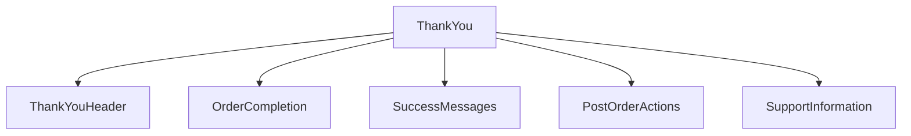

# ThankYou Component - Core Package

## Component Overview

**Purpose**: Handles thank you page display, order completion messages, and post-order actions for the BigCommerce order confirmation flow.

**Architecture**: Component system with thank you display, completion messages, and post-order action management.

**Source Code**: `packages/core/src/app/order/ThankYouHeader.tsx`

## Key Responsibilities

### 1. Thank You Display
- **Thank You Messages**: Displays thank you messages and greetings
- **Order Completion**: Shows order completion confirmation
- **Success Messages**: Displays order success messages
- **Completion Celebration**: Handles order completion celebration

### 2. Post-Order Actions
- **Account Creation**: Handles guest account creation after order
- **Order Tracking**: Provides order tracking information
- **Next Steps**: Displays next steps and instructions
- **Support Information**: Shows customer support information

### 3. Order Completion
- **Completion Status**: Displays order completion status
- **Success Confirmation**: Shows order success confirmation
- **Order Summary**: Displays final order summary
- **Completion Actions**: Handles post-order completion actions

## Component Structure



## State Management

### ThankYouState Interface
```typescript
export interface ThankYouState {
    order: Order;
    isCompleted: boolean;
    hasAccount: boolean;
    isCreatingAccount: boolean;
    error?: Error;
}
```

### Key State Properties
- **Order Data**: Completed order information
- **Completion State**: Order completion status
- **Account State**: Guest account creation state
- **Action State**: Post-order action state

## Integration Points

### Order Confirmation Flow Integration
- **Thank You Display**: Displays thank you messages in confirmation
- **Completion Display**: Shows order completion status
- **Success Display**: Displays order success messages
- **Action Display**: Shows post-order actions

### Shared Components Integration
- **Thank You Components**: Thank you display components
- **Completion Components**: Order completion components
- **Success Components**: Order success components
- **Action Components**: Post-order action components

### Order Management Integration
- **Order Service**: Order completion service
- **Account Service**: Guest account creation service
- **Support Service**: Customer support service
- **Action Service**: Post-order action service

## Key Features

### 1. Thank You Display
- **Thank You Messages**: Displays thank you messages and greetings
- **Order Completion**: Shows order completion confirmation
- **Success Messages**: Displays order success messages
- **Completion Celebration**: Handles order completion celebration

### 2. Post-Order Actions
- **Account Creation**: Handles guest account creation after order
- **Order Tracking**: Provides order tracking information
- **Next Steps**: Displays next steps and instructions
- **Support Information**: Shows customer support information

### 3. Order Completion
- **Completion Status**: Displays order completion status
- **Success Confirmation**: Shows order success confirmation
- **Order Summary**: Displays final order summary
- **Completion Actions**: Handles post-order completion actions

## Performance Considerations

### 1. Lazy Loading
- **Thank You Components**: Thank you component lazy loading
- **Completion Components**: Order completion component lazy loading
- **Action Components**: Post-order action component lazy loading

### 2. Caching
- **Thank You Data**: Thank you message data caching
- **Completion Data**: Order completion data caching
- **Action Data**: Post-order action data caching

### 3. Optimization
- **Thank You Optimization**: Thank you display optimization
- **Completion Optimization**: Order completion optimization
- **Action Optimization**: Post-order action optimization

## Security Considerations

### 1. Data Validation
- **Thank You Validation**: Thank you message data validation
- **Completion Validation**: Order completion data validation
- **Action Validation**: Post-order action data validation

### 2. Data Protection
- **Thank You Privacy**: Thank you message data privacy protection
- **Completion Privacy**: Order completion data privacy protection
- **Action Privacy**: Post-order action data privacy protection

## Testing Strategy

### 1. Unit Tests
- **Component Tests**: Individual component testing
- **Thank You Tests**: Thank you display testing
- **Completion Tests**: Order completion testing
- **Action Tests**: Post-order action testing

### 2. Integration Tests
- **Thank You Integration**: Thank you display integration testing
- **Completion Integration**: Order completion integration testing
- **Action Integration**: Post-order action integration testing

### 3. E2E Tests
- **Thank You Flow**: Complete thank you flow testing
- **Completion Flow**: Order completion flow testing
- **Action Flow**: Post-order action flow testing

## Common Issues

### 1. Thank You Display Issues
- **Thank You Messages**: Thank you message display issues
- **Completion Display**: Order completion display issues
- **Success Messages**: Order success message issues

### 2. Post-Order Action Issues
- **Account Creation**: Guest account creation issues
- **Order Tracking**: Order tracking information issues
- **Next Steps**: Next steps display issues

### 3. Completion Issues
- **Completion Status**: Order completion status issues
- **Success Confirmation**: Order success confirmation issues
- **Completion Actions**: Post-order completion action issues

## Future Considerations

### 1. Enhanced Features
- **Personalized Messages**: Personalized thank you messages
- **Enhanced Actions**: Enhanced post-order actions
- **Completion Rewards**: Order completion reward system

### 2. Integration Improvements
- **Thank You Integration**: Enhanced thank you display integration
- **Completion Integration**: Improved order completion integration
- **Action Integration**: Enhanced post-order action integration

### 3. Performance Optimizations
- **Thank You Performance**: Thank you display performance optimization
- **Completion Performance**: Order completion performance optimization
- **Action Performance**: Post-order action performance optimization
