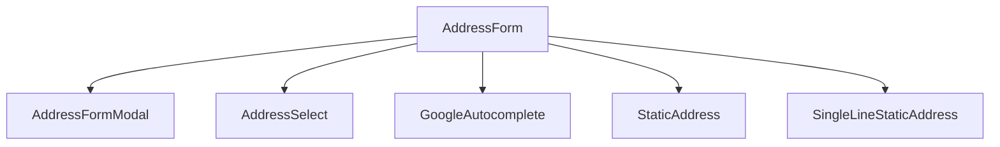
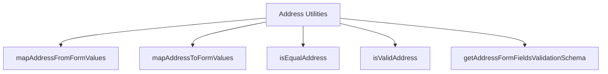

# Address Component - Shared Core Package

## Component Overview

**Purpose**: Shared address management functionality used by both checkout and order confirmation flows for address collection, validation, and display.

**Architecture**: Multi-component system with form handling, validation, and address utilities.

**Source Code**: `packages/core/src/app/address/`

## Key Responsibilities

### 1. Address Form Management
- **Address Forms**: Manages address form rendering and validation
- **Field Management**: Handles dynamic form fields based on country selection
- **Validation Logic**: Implements country-specific validation rules
- **Address Selection**: Handles saved address selection and new address creation

### 2. Address Utilities
- **Address Mapping**: Maps form data to API objects and vice versa
- **Address Validation**: Validates address data based on country-specific rules
- **Address Comparison**: Compares addresses for equality and changes
- **Address Formatting**: Formats addresses for display and API submission

### 3. Google Autocomplete Integration
- **Autocomplete**: Google Maps autocomplete integration for address suggestions
- **Address Selection**: Handles autocomplete address selection
- **Address Validation**: Validates autocomplete addresses

## Component Structure





## State Management

### AddressFormValues Interface
```typescript
export interface AddressFormValues {
    firstName: string;
    lastName: string;
    company: string;
    address1: string;
    address2: string;
    city: string;
    stateOrProvince: string;
    stateOrProvinceCode: string;
    countryCode: string;
    postalCode: string;
    phone: string;
    customFields: Array<FormField>;
}
```

### Key State Properties
- **Form Data**: Address form field values
- **Validation State**: Form validation status and errors
- **Country Selection**: Selected country for field configuration
- **Saved Addresses**: Customer saved addresses for selection

## Integration Points

### Checkout Flow Integration
- **Shipping Address**: Used in shipping step for address collection
- **Billing Address**: Used in billing step for address collection
- **Address Validation**: Validates addresses before checkout progression

### Order Confirmation Flow Integration
- **Order Display**: Displays order addresses in confirmation
- **Address Formatting**: Formats addresses for order display
- **Address Comparison**: Compares order addresses with customer addresses

### Shared Utilities
- **Address Mapping**: Maps between form and API address formats
- **Validation Schemas**: Provides country-specific validation rules
- **Address Comparison**: Compares addresses for changes and equality

## Key Features

### 1. Country-Specific Validation
- **Field Requirements**: Dynamic field requirements based on country
- **Validation Rules**: Country-specific validation rules and patterns
- **Postal Code Validation**: Country-specific postal code validation
- **State/Province Validation**: Country-specific state/province validation

### 2. Google Maps Integration
- **Autocomplete**: Google Maps autocomplete for address suggestions
- **Address Selection**: Handles autocomplete address selection
- **Address Validation**: Validates autocomplete addresses
- **Geocoding**: Address geocoding for validation

### 3. Address Management
- **Address Selection**: Saved address selection functionality
- **Address Creation**: New address creation and validation
- **Address Editing**: Address editing and update functionality
- **Address Deletion**: Address deletion and cleanup

## Performance Considerations

### 1. Lazy Loading
- **Google Maps**: Google Maps API lazy loading
- **Autocomplete**: Autocomplete functionality lazy loading
- **Validation**: Validation schemas lazy loading

### 2. Caching
- **Address Data**: Address data caching for performance
- **Validation Rules**: Validation rule caching
- **Country Data**: Country data caching

### 3. Optimization
- **Form Optimization**: Form rendering optimization
- **Validation Optimization**: Validation performance optimization
- **Address Comparison**: Address comparison optimization

## Security Considerations

### 1. Input Validation
- **XSS Prevention**: Cross-site scripting prevention
- **Input Sanitization**: Input data sanitization
- **Address Validation**: Address data validation

### 2. Data Protection
- **Address Privacy**: Address data privacy protection
- **Data Encryption**: Address data encryption
- **Secure Transmission**: Secure address data transmission

## Testing Strategy

### 1. Unit Tests
- **Component Tests**: Individual component testing
- **Utility Tests**: Address utility function testing
- **Validation Tests**: Address validation testing

### 2. Integration Tests
- **Form Integration**: Address form integration testing
- **Validation Integration**: Address validation integration testing
- **Google Maps Integration**: Google Maps integration testing

### 3. E2E Tests
- **Address Flow**: Complete address collection flow testing
- **Validation Flow**: Address validation flow testing
- **Autocomplete Flow**: Google Maps autocomplete flow testing

## Common Issues

### 1. Validation Issues
- **Country-Specific Rules**: Country-specific validation rule issues
- **Postal Code Validation**: Postal code validation issues
- **State/Province Validation**: State/province validation issues

### 2. Google Maps Issues
- **Autocomplete Failures**: Google Maps autocomplete failures
- **Address Selection**: Address selection issues
- **Geocoding Failures**: Address geocoding failures

### 3. Performance Issues
- **Form Rendering**: Address form rendering performance
- **Validation Performance**: Address validation performance
- **Google Maps Performance**: Google Maps API performance

## Future Considerations

### 1. Enhanced Features
- **Address Suggestions**: Enhanced address suggestion functionality
- **Address Validation**: Improved address validation
- **Address Formatting**: Enhanced address formatting

### 2. Integration Improvements
- **Google Maps**: Enhanced Google Maps integration
- **Validation**: Improved validation functionality
- **Address Management**: Enhanced address management

### 3. Performance Optimizations
- **Form Performance**: Address form performance optimization
- **Validation Performance**: Address validation performance optimization
- **Google Maps Performance**: Google Maps performance optimization
