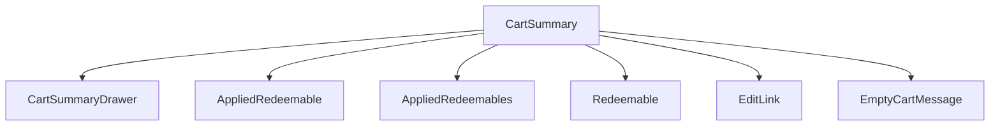
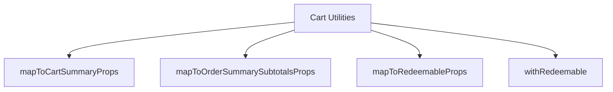

# Cart Component - Shared Core Package

## Component Overview

**Purpose**: Shared cart management functionality used by both checkout and order confirmation flows for cart display, item management, and summary calculations.

**Architecture**: Multi-component system with cart display, item management, and summary calculations.

**Source Code**: `packages/core/src/app/cart/`

## Key Responsibilities

### 1. Cart Display Management
- **Cart Summary**: Displays cart summary with items and totals
- **Item Display**: Shows cart items with details and quantities
- **Summary Calculations**: Calculates cart totals, taxes, and discounts
- **Cart Drawer**: Manages cart summary drawer functionality

### 2. Item Management
- **Item Display**: Displays cart items with product details
- **Quantity Management**: Handles item quantity updates
- **Item Removal**: Manages item removal from cart
- **Item Editing**: Handles item editing and updates

### 3. Redeemable Management
- **Coupon Application**: Handles coupon code application
- **Gift Certificate**: Manages gift certificate application
- **Store Credit**: Handles store credit application
- **Promotion Display**: Shows applied promotions and discounts

## Component Structure





## State Management

### CartSummaryProps Interface
```typescript
export interface CartSummaryProps {
    cart: Cart;
    isExpanded: boolean;
    isUpdating: boolean;
    onToggleExpanded(): void;
    onUpdateItem(itemId: string, quantity: number): void;
    onRemoveItem(itemId: string): void;
}
```

### Key State Properties
- **Cart Data**: Cart items, totals, and metadata
- **Display State**: Cart summary display and expansion state
- **Update State**: Cart update and loading state
- **Redeemable State**: Applied coupons, gift certificates, and store credit

## Integration Points

### Checkout Flow Integration
- **Cart Summary**: Displays cart summary during checkout
- **Item Updates**: Handles cart item updates during checkout
- **Redeemable Application**: Applies coupons and discounts during checkout
- **Cart Validation**: Validates cart before checkout completion

### Order Confirmation Flow Integration
- **Order Summary**: Displays order summary in confirmation
- **Item Display**: Shows ordered items in confirmation
- **Total Display**: Displays order totals and calculations
- **Redeemable Display**: Shows applied redeemables in order

### Shared Utilities
- **Cart Mapping**: Maps cart data to display props
- **Summary Calculations**: Calculates cart totals and subtotals
- **Redeemable Management**: Manages applied redeemables
- **Item Management**: Handles cart item operations

## Key Features

### 1. Cart Summary Display
- **Item List**: Displays cart items with details
- **Quantity Display**: Shows item quantities and updates
- **Price Display**: Displays item prices and totals
- **Summary Totals**: Shows cart subtotals, taxes, and totals

### 2. Redeemable Management
- **Coupon Application**: Applies coupon codes to cart
- **Gift Certificate**: Applies gift certificates to cart
- **Store Credit**: Applies store credit to cart
- **Promotion Display**: Shows applied promotions and discounts

### 3. Cart Operations
- **Item Updates**: Updates item quantities in cart
- **Item Removal**: Removes items from cart
- **Item Editing**: Edits item details in cart
- **Cart Validation**: Validates cart before checkout

## Performance Considerations

### 1. Lazy Loading
- **Cart Summary**: Cart summary lazy loading
- **Item Display**: Item display lazy loading
- **Redeemable Display**: Redeemable display lazy loading

### 2. Caching
- **Cart Data**: Cart data caching for performance
- **Summary Calculations**: Summary calculation caching
- **Redeemable Data**: Redeemable data caching

### 3. Optimization
- **Summary Optimization**: Cart summary rendering optimization
- **Item Optimization**: Item display optimization
- **Calculation Optimization**: Summary calculation optimization

## Security Considerations

### 1. Data Validation
- **Cart Validation**: Cart data validation
- **Item Validation**: Cart item validation
- **Redeemable Validation**: Redeemable validation

### 2. Data Protection
- **Cart Privacy**: Cart data privacy protection
- **Item Privacy**: Item data privacy protection
- **Redeemable Privacy**: Redeemable data privacy protection

## Testing Strategy

### 1. Unit Tests
- **Component Tests**: Individual component testing
- **Utility Tests**: Cart utility function testing
- **Calculation Tests**: Summary calculation testing

### 2. Integration Tests
- **Cart Integration**: Cart integration testing
- **Redeemable Integration**: Redeemable integration testing
- **Summary Integration**: Summary calculation integration testing

### 3. E2E Tests
- **Cart Flow**: Complete cart management flow testing
- **Redeemable Flow**: Redeemable application flow testing
- **Summary Flow**: Cart summary flow testing

## Common Issues

### 1. Display Issues
- **Summary Display**: Cart summary display issues
- **Item Display**: Cart item display issues
- **Total Calculation**: Cart total calculation issues

### 2. Redeemable Issues
- **Coupon Application**: Coupon application issues
- **Gift Certificate**: Gift certificate application issues
- **Store Credit**: Store credit application issues

### 3. Performance Issues
- **Summary Performance**: Cart summary performance issues
- **Item Performance**: Cart item performance issues
- **Calculation Performance**: Summary calculation performance issues

## Future Considerations

### 1. Enhanced Features
- **Cart Persistence**: Enhanced cart persistence functionality
- **Item Recommendations**: Item recommendation functionality
- **Cart Sharing**: Cart sharing functionality

### 2. Integration Improvements
- **Redeemable Integration**: Enhanced redeemable integration
- **Summary Integration**: Improved summary integration
- **Item Integration**: Enhanced item integration

### 3. Performance Optimizations
- **Summary Performance**: Cart summary performance optimization
- **Item Performance**: Cart item performance optimization
- **Calculation Performance**: Summary calculation performance optimization
