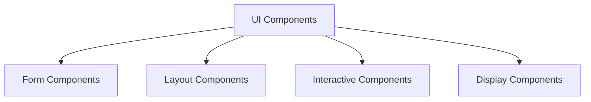
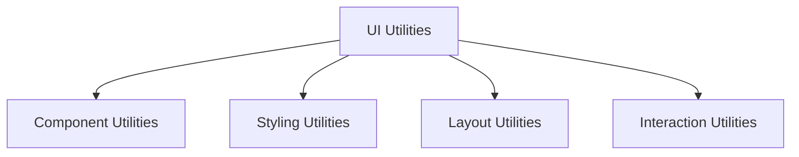
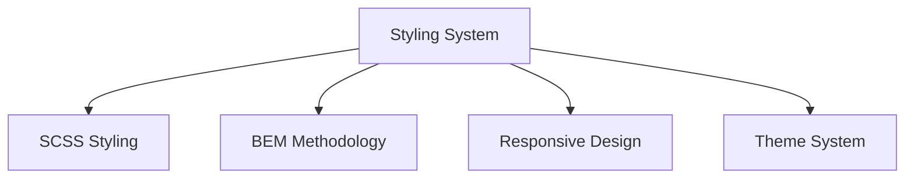

# UI Component - Shared Core Package

## Component Overview

**Purpose**: Shared UI components and utilities used by both checkout and order confirmation flows for consistent user interface, styling, and user experience.

**Architecture**: Comprehensive UI component library with shared components, utilities, and styling.

**Source Code**: `packages/core/src/app/ui/` and `packages/ui/`

## Key Responsibilities

### 1. UI Components
- **Form Components**: Form inputs, buttons, and form-related components
- **Layout Components**: Layout containers, grids, and structural components
- **Interactive Components**: Interactive elements, modals, and overlays
- **Display Components**: Display elements, text, and visual components

### 2. Styling System
- **SCSS Styling**: Global SCSS styling system
- **BEM Methodology**: Block, Element, Modifier naming convention
- **Responsive Design**: Mobile and desktop responsive design
- **Theme System**: Consistent theming and styling

### 3. UI Utilities
- **Component Utilities**: UI component utility functions
- **Styling Utilities**: Styling and CSS utility functions
- **Layout Utilities**: Layout and positioning utilities
- **Interaction Utilities**: User interaction utility functions

## Component Structure





## State Management

### UIComponentProps Interface
```typescript
export interface UIComponentProps {
    className?: string;
    style?: React.CSSProperties;
    children?: React.ReactNode;
    onClick?: () => void;
    disabled?: boolean;
    loading?: boolean;
}
```

### Key State Properties
- **Component State**: UI component state and properties
- **Styling State**: Component styling and theme state
- **Interaction State**: User interaction state
- **Loading State**: Component loading and disabled state

## Integration Points

### Checkout Flow Integration
- **Form Components**: Form inputs and validation components
- **Layout Components**: Checkout step layout and structure
- **Interactive Components**: Checkout interaction elements
- **Display Components**: Checkout display and summary components

### Order Confirmation Flow Integration
- **Display Components**: Order confirmation display components
- **Layout Components**: Order confirmation layout and structure
- **Interactive Components**: Order confirmation interaction elements
- **Form Components**: Order confirmation form components

### Shared Utilities
- **Component Utilities**: UI component utility functions
- **Styling Utilities**: Styling and CSS utility functions
- **Layout Utilities**: Layout and positioning utilities
- **Interaction Utilities**: User interaction utility functions

## Key Features

### 1. Form Components
- **Input Components**: Text inputs, selects, and form controls
- **Button Components**: Buttons, links, and interactive elements
- **Validation Components**: Form validation and error display
- **Form Layout**: Form layout and structure components

### 2. Layout Components
- **Container Components**: Layout containers and wrappers
- **Grid Components**: Grid layout and positioning
- **Flex Components**: Flexbox layout components
- **Responsive Components**: Responsive layout components

### 3. Interactive Components
- **Modal Components**: Modals, overlays, and dialogs
- **Dropdown Components**: Dropdowns, menus, and selectors
- **Navigation Components**: Navigation and breadcrumb components
- **Interactive Elements**: Interactive buttons and controls

## Performance Considerations

### 1. Lazy Loading
- **Component Lazy Loading**: UI component lazy loading
- **Style Lazy Loading**: CSS and styling lazy loading
- **Utility Lazy Loading**: UI utility lazy loading

### 2. Caching
- **Component Caching**: UI component caching
- **Style Caching**: CSS and styling caching
- **Utility Caching**: UI utility caching

### 3. Optimization
- **Component Optimization**: UI component rendering optimization
- **Style Optimization**: CSS and styling optimization
- **Utility Optimization**: UI utility performance optimization

## Security Considerations

### 1. Input Validation
- **Form Validation**: Form input validation
- **XSS Prevention**: Cross-site scripting prevention
- **Input Sanitization**: Input data sanitization

### 2. Data Protection
- **Component Privacy**: UI component data privacy
- **Style Privacy**: Styling data privacy
- **Interaction Privacy**: User interaction privacy

## Testing Strategy

### 1. Unit Tests
- **Component Tests**: Individual UI component testing
- **Utility Tests**: UI utility function testing
- **Style Tests**: CSS and styling testing
- **Interaction Tests**: User interaction testing

### 2. Integration Tests
- **Component Integration**: UI component integration testing
- **Style Integration**: Styling integration testing
- **Layout Integration**: Layout integration testing

### 3. E2E Tests
- **UI Flow**: Complete UI flow testing
- **Component Flow**: Component interaction flow testing
- **Style Flow**: Styling and theme flow testing

## Common Issues

### 1. Component Issues
- **Rendering Issues**: UI component rendering issues
- **Styling Issues**: CSS and styling issues
- **Interaction Issues**: User interaction issues

### 2. Performance Issues
- **Component Performance**: UI component performance issues
- **Style Performance**: CSS performance issues
- **Layout Performance**: Layout performance issues

### 3. Responsive Issues
- **Mobile Issues**: Mobile responsive design issues
- **Desktop Issues**: Desktop responsive design issues
- **Cross-browser Issues**: Cross-browser compatibility issues

## Future Considerations

### 1. Enhanced Features
- **Advanced Components**: Advanced UI component functionality
- **Theme System**: Enhanced theme system
- **Animation System**: UI animation system

### 2. Integration Improvements
- **Component Integration**: Enhanced component integration
- **Style Integration**: Improved styling integration
- **Layout Integration**: Enhanced layout integration

### 3. Performance Optimizations
- **Component Performance**: UI component performance optimization
- **Style Performance**: CSS performance optimization
- **Layout Performance**: Layout performance optimization
