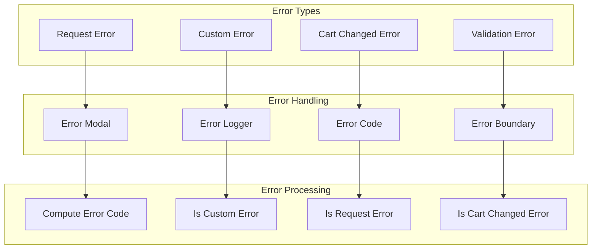

# Error Handling Patterns - System Patterns

## Architecture Overview

**Purpose**: Documents error handling patterns, practices, and strategies used across all packages in the BigCommerce checkout system.

**Architecture**: System-level documentation of error handling patterns, practices, and error handling strategies based on actual implementation.

**Source Code References**:
- ErrorModal: `packages/core/src/app/common/ErrorModal.tsx`
- ErrorLogger: `packages/error-handling-utils/src/ErrorLogger.ts`
- ErrorBoundary: `packages/error-handling-utils/src/ErrorBoundary.tsx`
- CustomError: `packages/core/src/app/common/errors/CustomError.ts`
- RequestError: `packages/core/src/app/common/errors/RequestError.ts`

## Error Handling Architecture

## Error Types

### Request Error
**BigCommerce SDK Errors:**
- **API Errors**: BigCommerce API request failures
- **Network Errors**: Network connectivity issues
- **Timeout Errors**: Request timeout errors
- **Authentication Errors**: Authentication failures

### Custom Error
**Application Errors:**
- **Validation Errors**: Form validation failures
- **Business Logic Errors**: Business rule violations
- **Configuration Errors**: Configuration issues
- **Integration Errors**: Third-party integration failures

### Cart Changed Error
**Cart State Errors:**
- **Cart Modified**: Cart was modified during checkout
- **Item Removed**: Items removed from cart
- **Price Changed**: Price changes detected
- **Availability Changed**: Item availability changes

### Validation Error
**Form Validation Errors:**
- **Field Validation**: Individual field validation failures
- **Form Validation**: Complete form validation failures
- **Business Rule Validation**: Business rule violations
- **Required Field Errors**: Missing required fields

## Error Handling Components

### Error Modal
**Error Display:**
- **Error Messages**: User-friendly error messages
- **Error Codes**: Technical error codes
- **Error Actions**: Error resolution actions
- **Error Dismissal**: Error dismissal options

### Error Logger
**Error Logging:**
- **Console Logger**: Console error logging
- **Sentry Logger**: Sentry error reporting
- **Error Context**: Error context information
- **Error Stack**: Error stack traces

### Error Code
**Error Classification:**
- **Error Types**: Error type classification
- **Error Severity**: Error severity levels
- **Error Categories**: Error category classification
- **Error Resolution**: Error resolution strategies

## Error Processing

### Error Detection
**Error Identification:**
- **Error Type Detection**: Automatic error type detection
- **Error Classification**: Error classification logic
- **Error Validation**: Error validation checks
- **Error Context**: Error context extraction

### Error Processing
**Error Handling:**
- **Error Transformation**: Error transformation logic
- **Error Enrichment**: Error context enrichment
- **Error Routing**: Error routing logic
- **Error Recovery**: Error recovery mechanisms

## Error Recovery Patterns

### Automatic Recovery
**Recovery Strategies:**
- **Retry Logic**: Automatic retry mechanisms
- **Fallback Strategies**: Fallback error handling
- **Graceful Degradation**: Graceful error handling
- **Error Masking**: Error masking for users

### User Recovery
**User Actions:**
- **Error Dismissal**: User error dismissal
- **Error Correction**: User error correction
- **Error Reporting**: User error reporting
- **Error Escalation**: Error escalation options

## Error Monitoring

### Error Tracking
**Error Monitoring:**
- **Error Metrics**: Error occurrence metrics
- **Error Trends**: Error trend analysis
- **Error Patterns**: Error pattern detection
- **Error Alerts**: Error alerting system

### Error Analysis
**Error Investigation:**
- **Error Root Cause**: Root cause analysis
- **Error Impact**: Error impact assessment
- **Error Prevention**: Error prevention strategies
- **Error Documentation**: Error documentation

## Error Prevention

### Input Validation
**Validation Strategies:**
- **Client-side Validation**: Client-side input validation
- **Server-side Validation**: Server-side validation
- **Business Rule Validation**: Business rule validation
- **Data Type Validation**: Data type validation

### Error Boundaries
**Error Containment:**
- **Component Boundaries**: Component error boundaries
- **Feature Boundaries**: Feature error boundaries
- **Page Boundaries**: Page error boundaries
- **Application Boundaries**: Application error boundaries

## Maintenance Notes

### Common Issues
- **Error Masking**: Preventing error masking
- **Error Propagation**: Managing error propagation
- **Error Context**: Maintaining error context
- **Error Performance**: Optimizing error handling performance

### Future Considerations
- **Enhanced Error Handling**: Improved error handling strategies
- **Better Error Messages**: More user-friendly error messages
- **Error Analytics**: Enhanced error analytics
- **Error Prevention**: Proactive error prevention
