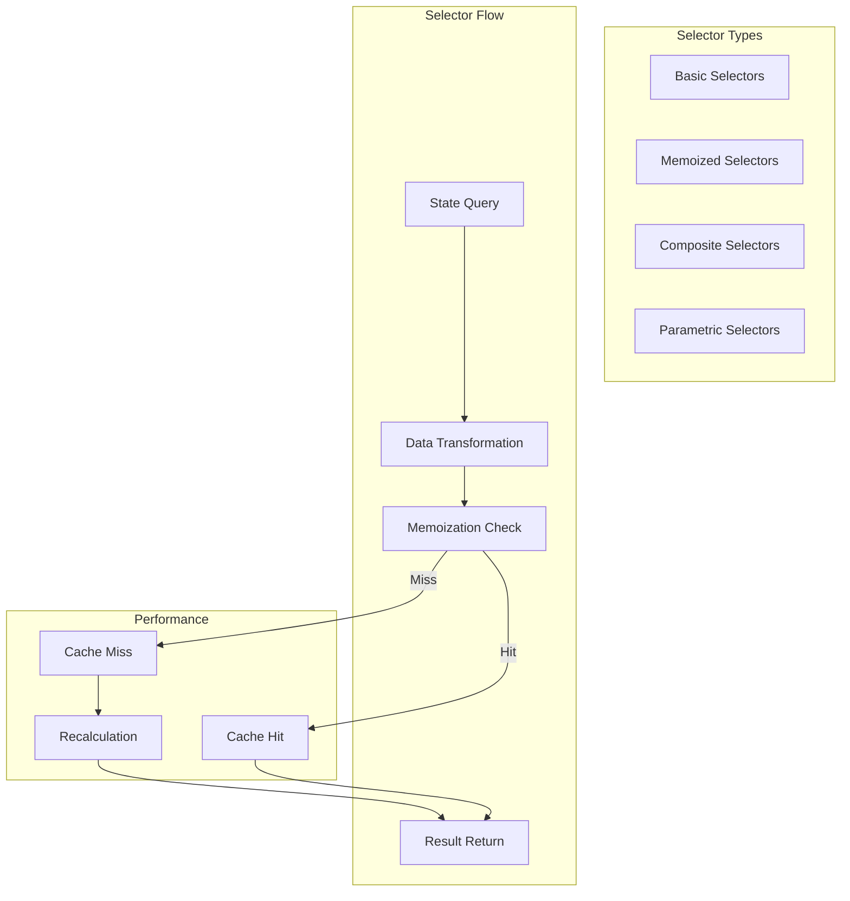

# State Management Patterns - System Patterns

## Architecture Overview

**Purpose**: Documents state management patterns, practices, and strategies used across all packages in the BigCommerce checkout system.

**Architecture**: System-level documentation of state management patterns, practices, and state management strategies.

**Source Code References**:
- CheckoutContext: `packages/core/src/app/checkout/CheckoutContext.tsx`
- withCheckout HOC: `packages/core/src/app/checkout/withCheckout.tsx`
- useCheckout hook: `packages/core/src/app/checkout/useCheckout.ts`
- CheckoutService: `packages/core/src/app/checkout/CheckoutService.ts`

## State Management Architecture

## Context Data Flow

## State Normalization Pattern

## Action Pattern

## Reducer Pattern

## Selector Pattern

## Middleware Pattern

## Local State Pattern

## State Synchronization Pattern

## Error State Pattern

## Performance Optimization Patterns

## Maintenance Notes

### Common Issues
- **State Complexity**: Managing complex state structures
- **Performance Issues**: Optimizing state management performance
- **State Synchronization**: Keeping state synchronized across components
- **Memory Leaks**: Preventing memory leaks in state management

### Future Considerations
- **New Patterns**: Adopting new state management patterns
- **Enhanced Performance**: Improved state management performance
- **Better Testing**: Enhanced state management testing
- **Best Practices**: Continued state management best practices evolution
