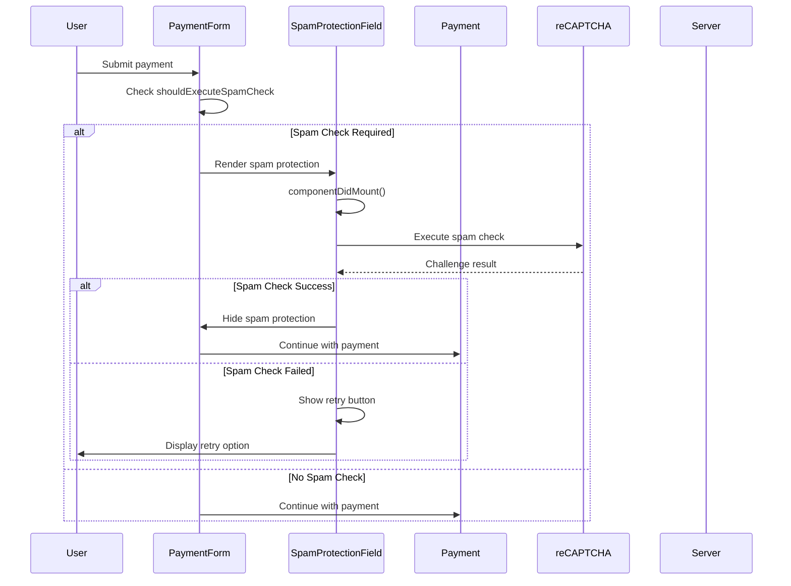

# Spam Protection System - Implementation Analysis

## Core Architecture

The spam protection system in the BigCommerce POA React Checkout implements reCAPTCHA-based protection to prevent automated submissions and spam attacks. The system includes threshold detection, retry mechanisms, and integration with the payment flow.

### Spam Protection Flow



## SpamProtectionField Component

### Props Interface

```typescript
export interface SpamProtectionProps {
    didExceedSpamLimit?: boolean;        // Spam limit exceeded flag
    onUnhandledError?(error: Error): void;  // Error handling callback
}

interface SpamProtectionState {
    shouldShowRetryButton: boolean;      // Retry button visibility
}
```

### Component Implementation

```typescript
class SpamProtectionField extends Component<
    SpamProtectionProps & WithCheckoutSpamProtectionProps,
    SpamProtectionState
> {
    state = {
        shouldShowRetryButton: false,
    };

    async componentDidMount() {
        const { didExceedSpamLimit } = this.props;

        if (didExceedSpamLimit) {
            return;
        }

        this.verify();
    }
```

**Initialization Strategy:**
- Checks if spam limit was exceeded
- Skips verification if limit exceeded
- Automatically starts verification on mount
- Manages retry button state

### Verification Process

```typescript
private async verify(): Promise<void> {
    const { executeSpamCheck, onUnhandledError = noop } = this.props;

    try {
        await executeSpamCheck();
    } catch (error) {
        this.setState({ shouldShowRetryButton: true });

        // Notify the parent component if the user experiences a problem other than cancelling the reCAPTCHA challenge.
        if (
            isErrorWithType(error) &&
            error.type !== 'spam_protection_challenge_not_completed'
        ) {
            onUnhandledError(error);
        }
    }
}
```

**Verification Strategy:**
- Executes spam check through SDK
- Handles verification errors gracefully
- Shows retry button on failure
- Filters out user cancellation errors
- Notifies parent of serious errors

### Retry Mechanism

```typescript
private handleRetry: (event: MouseEvent) => void = (event) => {
    event.preventDefault();
    this.setState({ shouldShowRetryButton: false });
    this.verify();
};
```

**Retry Strategy:**
- Prevents default form submission
- Hides retry button
- Restarts verification process
- Allows user to retry failed checks

### Rendering Logic

```typescript
render() {
    const { isExecutingSpamCheck } = this.props;

    return (
        <LoadingOverlay isLoading={isExecutingSpamCheck}>
            {this.renderContent()}
        </LoadingOverlay>
    );
}

private renderContent(): ReactNode {
    const { shouldShowRetryButton } = this.state;

    return (
        <div className="spamProtection">
            <div className="spamProtection-message">
                <TranslatedString id="payment.spam_protection_message" />
            </div>
            
            {shouldShowRetryButton && (
                <div className="spamProtection-retry">
                    <button
                        className="button button--primary"
                        onClick={this.handleRetry}
                        type="button"
                    >
                        <TranslatedString id="payment.spam_protection_retry" />
                    </button>
                </div>
            )}
        </div>
    );
}
```

**Rendering Strategy:**
- Shows loading overlay during execution
- Displays spam protection message
- Conditionally shows retry button
- Uses localized text for messages

## Payment Integration

### Spam Check Trigger

```typescript
// In PaymentForm.tsx
if (shouldExecuteSpamCheck) {
    return (
        <SpamProtectionField
            didExceedSpamLimit={didExceedSpamLimit}
            onUnhandledError={onUnhandledError}
        />
    );
}
```

**Trigger Strategy:**
- Checks if spam check should be executed
- Renders spam protection field instead of payment form
- Passes spam limit state
- Integrates error handling

### Spam Limit Handling

```typescript
// In Payment.tsx
if (
    status === 429 ||
    body.type === 'spam_protection_expired' ||
    body.type === 'spam_protection_failed'
) {
    this.setState({ didExceedSpamLimit: true });
    await loadCheckout();
}
```

**Limit Handling Strategy:**
- Detects spam protection errors
- Sets spam limit exceeded flag
- Reloads checkout to get latest spam check state
- Handles different error types

## Error Handling

### Error Types

```typescript
// Spam protection error types
if (
    status === 429 ||
    body.type === 'spam_protection_expired' ||
    body.type === 'spam_protection_failed'
) {
    // Handle spam protection errors
}

// User cancellation errors
if (
    isErrorWithType(error) &&
    error.type !== 'spam_protection_challenge_not_completed'
) {
    onUnhandledError(error);
}
```

**Error Type Strategy:**
- **429 Status**: Rate limiting error
- **spam_protection_expired**: Challenge expired
- **spam_protection_failed**: Challenge failed
- **spam_protection_challenge_not_completed**: User cancelled

### Error Recovery

```typescript
// Reload checkout to get latest spam check state
await loadCheckout();

// Show retry button for user-initiated retries
this.setState({ shouldShowRetryButton: true });
```

**Recovery Strategy:**
- Reloads checkout state after errors
- Provides user retry mechanism
- Maintains error context
- Allows graceful recovery

## Business Logic

### Spam Check Requirements

```typescript
// Spam check is required when:
// 1. shouldExecuteSpamCheck is true
// 2. didExceedSpamLimit is false
// 3. User attempts to submit payment
```

**Requirements Strategy:**
- Server determines if spam check is needed
- Based on user behavior and risk assessment
- Prevents automated submissions
- Protects against spam attacks

### Threshold Management

```typescript
// Spam limit exceeded when:
// 1. Too many failed attempts
// 2. Suspicious behavior detected
// 3. Rate limiting triggered
```

**Threshold Strategy:**
- Server-side threshold management
- Dynamic based on risk assessment
- Prevents brute force attacks
- Maintains user experience

### reCAPTCHA Integration

```typescript
// reCAPTCHA challenge types:
// 1. Invisible reCAPTCHA
// 2. Checkbox reCAPTCHA
// 3. Advanced risk analysis
```

**reCAPTCHA Strategy:**
- Uses Google reCAPTCHA service
- Invisible challenges when possible
- Fallback to visible challenges
- Advanced risk analysis

## Performance Optimizations

### 1. Conditional Rendering

```typescript
if (shouldExecuteSpamCheck) {
    return <SpamProtectionField />;
}
```

**Optimization Strategy:**
- Only renders when needed
- Prevents unnecessary component mounting
- Reduces bundle size impact
- Improves performance

### 2. State Management

```typescript
state = {
    shouldShowRetryButton: false,
};
```

**State Strategy:**
- Minimal state for performance
- Efficient state updates
- Proper state cleanup
- Error state management

### 3. Error Handling

```typescript
// Graceful error handling
try {
    await executeSpamCheck();
} catch (error) {
    // Handle errors without crashing
}
```

**Error Strategy:**
- Graceful error handling
- User-friendly error messages
- Retry mechanisms
- Error recovery

## Security Features

### 1. reCAPTCHA Protection

```typescript
// Server-side verification
await executeSpamCheck();
```

**Security Strategy:**
- Server-side verification
- Prevents client-side bypass
- Google reCAPTCHA integration
- Advanced risk analysis

### 2. Rate Limiting

```typescript
// 429 status code handling
if (status === 429) {
    // Handle rate limiting
}
```

**Rate Limiting Strategy:**
- Server-side rate limiting
- Prevents brute force attacks
- Graceful degradation
- User-friendly messages

### 3. Error Sanitization

```typescript
// Error type filtering
if (error.type !== 'spam_protection_challenge_not_completed') {
    onUnhandledError(error);
}
```

**Sanitization Strategy:**
- Filters sensitive error information
- Prevents information leakage
- User-friendly error messages
- Secure error handling

## Integration Points

The spam protection system integrates with:
- **BigCommerce SDK**: Spam check execution
- **reCAPTCHA**: Challenge verification
- **Payment Flow**: Payment form integration
- **Error Handling**: Centralized error management
- **Analytics**: Spam protection metrics

## Source Files

- **Main Implementation**: `packages/core/src/app/payment/SpamProtectionField.tsx`
- **Payment Integration**: `packages/core/src/app/payment/PaymentForm.tsx`
- **Error Handling**: `packages/core/src/app/payment/Payment.tsx`
- **Test File**: `packages/core/src/app/payment/SpamProtectionField.test.tsx`
- **Styling**: `packages/core/src/scss/components/checkout/spamProtection/`
