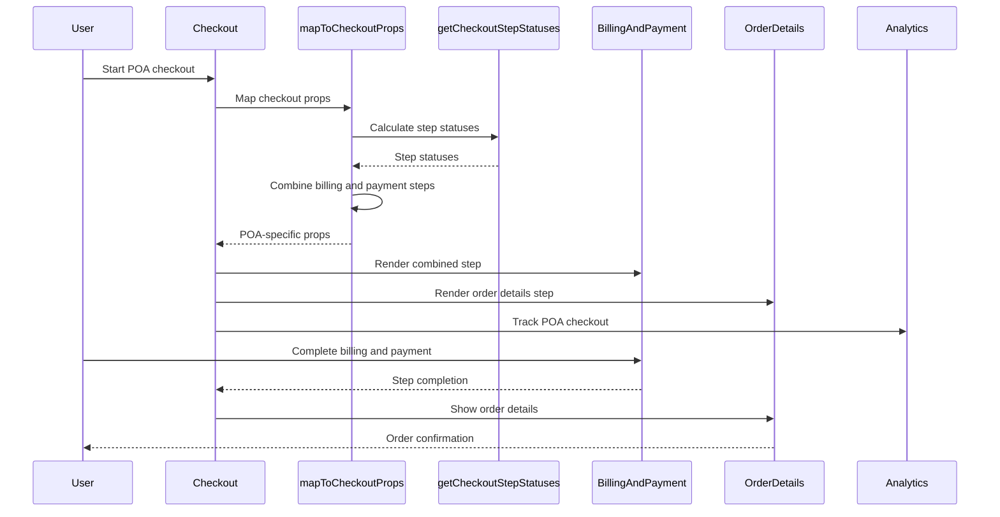

# POA Checkout Implementation Details - Implementation Analysis

## Core Architecture

The POA (Point of Access) checkout system implements specialized checkout flows that combine billing and payment steps, handle order details, and provide enhanced user experience. The POA checkout system is designed for specific checkout scenarios and includes custom step management.

## POA Checkout Flow Overview



## POA Step Combination Logic

### Step Combination Implementation

```typescript
// In mapToCheckoutProps.ts
const checkoutSteps = data.getCheckout() ? getCheckoutStepStatuses(checkoutState) : EMPTY_ARRAY;
const billingStep = checkoutSteps.find(step => step.type === CheckoutStepType.Billing);
const paymentStep = checkoutSteps.find(step => step.type === CheckoutStepType.Payment);
const billingAndPaymentStep = checkoutSteps.find(step => step.type === CheckoutStepType.BillingAndPayment);

let steps = checkoutSteps;

// In case of POA checkout, we need to combine Billing and Payment steps into a single step.
if (billingStep && paymentStep && billingAndPaymentStep) {
    steps = checkoutSteps.map(step => {
        switch (step.type) {
            case CheckoutStepType.Billing:
            case CheckoutStepType.Payment:
                return { ...step, isActive: false, isRequired: false };

            case CheckoutStepType.OrderDetails:
                return { ...step, isRequired: showOrderDetailsStep };

            default:
                return step;
        }
    });

    billingAndPaymentStep.isActive = billingStep.isActive || paymentStep.isActive;
    billingAndPaymentStep.isComplete = billingStep.isComplete && paymentStep.isComplete;
    billingAndPaymentStep.isEditable = billingStep.isEditable && paymentStep.isEditable;
    billingAndPaymentStep.isRequired = true;
}
```

**POA Strategy:**
- **Step Detection**: Detects billing, payment, and combined steps
- **Step Disabling**: Disables individual billing and payment steps
- **Step Combination**: Combines billing and payment into single step
- **State Combination**: Combines state from both steps
- **Order Details**: Controls order details step visibility

### Step State Combination

#### Active State Combination

```typescript
billingAndPaymentStep.isActive = billingStep.isActive || paymentStep.isActive;
```

**Active State Strategy:**
- **Either Active**: Active if either billing or payment is active
- **State Propagation**: Propagates active state from individual steps
- **User Experience**: Ensures smooth user experience
- **Step Management**: Maintains proper step management

#### Complete State Combination

```typescript
billingAndPaymentStep.isComplete = billingStep.isComplete && paymentStep.isComplete;
```

**Complete State Strategy:**
- **Both Complete**: Complete only if both billing and payment are complete
- **Validation**: Ensures both steps are properly completed
- **Data Integrity**: Maintains data integrity
- **User Experience**: Prevents incomplete submissions

#### Editable State Combination

```typescript
billingAndPaymentStep.isEditable = billingStep.isEditable && paymentStep.isEditable;
```

**Editable State Strategy:**
- **Both Editable**: Editable only if both steps are editable
- **Dependency Management**: Manages step dependencies
- **User Control**: Provides appropriate user control
- **State Consistency**: Maintains state consistency

### Order Details Step Management

#### Order Details Configuration

```typescript
/**
 * showOrderDetailsStep is a flag to determine whether the Order Details step should be shown.
 * This can be based on the checkout flow (e.g., part-time vs full-time checkout flow).
 */
const showOrderDetailsStep = true;

// In step mapping
case CheckoutStepType.OrderDetails:
    return { ...step, isRequired: showOrderDetailsStep };
```

**Order Details Strategy:**
- **Feature Flag**: Controlled by showOrderDetailsStep flag
- **Flow Control**: Controls checkout flow
- **User Experience**: Provides order summary
- **Configuration**: Configurable based on requirements

#### Order Details Step Status

```typescript
const orderDetailsStep: CheckoutStepStatus = {
    type: CheckoutStepType.OrderDetails,
    isActive: false,
    isBusy: false,
    isComplete: true,
    isEditable: false,
    isRequired: true,
};
```

**Order Details Status Strategy:**
- **Always Complete**: Order details are always complete
- **Not Editable**: Order details are not editable
- **Always Required**: Order details are always required
- **Static State**: Maintains static state

## POA Checkout Features

### Combined Billing and Payment

#### BillingAndPayment Component

```typescript
// BillingAndPayment component handles both billing and payment
const BillingAndPayment = () => {
    return (
        <div className="billing-and-payment">
            <BillingSection />
            <PaymentSection />
        </div>
    );
};
```

**Combined Strategy:**
- **Single Component**: Single component for both billing and payment
- **Unified Experience**: Provides unified user experience
- **State Management**: Manages both billing and payment state
- **Validation**: Validates both billing and payment

#### Billing Section

```typescript
const BillingSection = () => {
    return (
        <div className="billing-section">
            <AddressForm type="billing" />
            <BillingFields />
        </div>
    );
};
```

**Billing Strategy:**
- **Address Form**: Handles billing address
- **Billing Fields**: Handles billing-specific fields
- **Validation**: Validates billing information
- **State Management**: Manages billing state

#### Payment Section

```typescript
const PaymentSection = () => {
    return (
        <div className="payment-section">
            <PaymentMethodList />
            <PaymentForm />
        </div>
    );
};
```

**Payment Strategy:**
- **Payment Methods**: Lists available payment methods
- **Payment Form**: Handles payment form
- **Validation**: Validates payment information
- **State Management**: Manages payment state

### POA-Specific Step Types

#### Step Type Definitions

```typescript
enum CheckoutStepType {
    Billing = 'billing',
    Customer = 'customer',
    Payment = 'payment',
    Shipping = 'shipping',
    // Custom POA steps:
    OrderDetails = 'order-details',
    BillingAndPayment = 'billing-and-payment',
}
```

**POA Step Types:**
- **OrderDetails**: Order summary and confirmation step
- **BillingAndPayment**: Combined billing and payment step
- **Standard Steps**: Customer, shipping steps remain standard
- **Custom Logic**: Custom logic for POA-specific steps

#### Step Type Usage

```typescript
// POA step type checking
if (step.type === CheckoutStepType.BillingAndPayment) {
    // Handle combined billing and payment step
}

if (step.type === CheckoutStepType.OrderDetails) {
    // Handle order details step
}
```

**Usage Strategy:**
- **Type Safety**: Ensures type safety
- **Step Identification**: Identifies POA-specific steps
- **Custom Logic**: Applies custom logic for POA steps
- **Integration**: Integrates with standard checkout flow

### POA State Management

#### Combined State Management

```typescript
// Combined state for billing and payment
const [billingState, setBillingState] = useState<BillingState>({});
const [paymentState, setPaymentState] = useState<PaymentState>({});

const combinedState = {
    billing: billingState,
    payment: paymentState,
    isComplete: billingState.isComplete && paymentState.isComplete,
    isEditable: billingState.isEditable && paymentState.isEditable,
};
```

**State Management Strategy:**
- **Separate States**: Maintains separate billing and payment states
- **Combined State**: Creates combined state for step management
- **State Synchronization**: Synchronizes states between components
- **Validation**: Validates combined state

#### State Synchronization

```typescript
// State synchronization between billing and payment
useEffect(() => {
    if (billingState.isComplete && paymentState.isComplete) {
        setCombinedState(prev => ({
            ...prev,
            isComplete: true,
        }));
    }
}, [billingState.isComplete, paymentState.isComplete]);
```

**Synchronization Strategy:**
- **Effect Hooks**: Uses useEffect for state synchronization
- **Dependency Tracking**: Tracks state dependencies
- **State Updates**: Updates combined state when dependencies change
- **Performance**: Optimizes state updates

### POA Error Handling

#### Combined Error Handling

```typescript
const [errors, setErrors] = useState<CombinedErrors>({
    billing: null,
    payment: null,
});

const handleError = (error: Error, section: 'billing' | 'payment') => {
    setErrors(prev => ({
        ...prev,
        [section]: error,
    }));
};
```

**Error Handling Strategy:**
- **Section Errors**: Tracks errors by section
- **Combined Errors**: Manages combined error state
- **Error Recovery**: Provides error recovery
- **User Feedback**: Provides user feedback

#### Error Recovery

```typescript
const recoverFromError = (section: 'billing' | 'payment') => {
    setErrors(prev => ({
        ...prev,
        [section]: null,
    }));
    
    // Retry section validation
    validateSection(section);
};
```

**Recovery Strategy:**
- **Error Clearing**: Clears specific section errors
- **Validation Retry**: Retries section validation
- **State Reset**: Resets section state
- **User Experience**: Maintains user experience

### POA Performance Optimizations

#### Combined Rendering

```typescript
const BillingAndPayment = memo(() => {
    return (
        <div className="billing-and-payment">
            <BillingSection />
            <PaymentSection />
        </div>
    );
});
```

**Rendering Strategy:**
- **Memoization**: Uses React.memo for performance
- **Conditional Rendering**: Renders sections conditionally
- **State Optimization**: Optimizes state updates
- **Performance**: Improves rendering performance

#### State Optimization

```typescript
const combinedState = useMemo(() => ({
    billing: billingState,
    payment: paymentState,
    isComplete: billingState.isComplete && paymentState.isComplete,
    isEditable: billingState.isEditable && paymentState.isEditable,
}), [billingState, paymentState]);
```

**State Strategy:**
- **Memoization**: Uses useMemo for state calculation
- **Dependency Tracking**: Tracks state dependencies
- **Performance**: Optimizes state calculations
- **Memory**: Reduces memory usage

## Source Files

- **Props Mapping**: `packages/core/src/app/checkout/mapToCheckoutProps.ts`
- **Step Status Logic**: `packages/core/src/app/checkout/getCheckoutStepStatuses.ts`
- **Step Types**: `packages/core/src/app/checkout/CheckoutStepType.ts`
- **BillingAndPayment**: `packages/core/src/app/billing-and-payment/`
- **OrderDetails**: `packages/core/src/app/order/`
