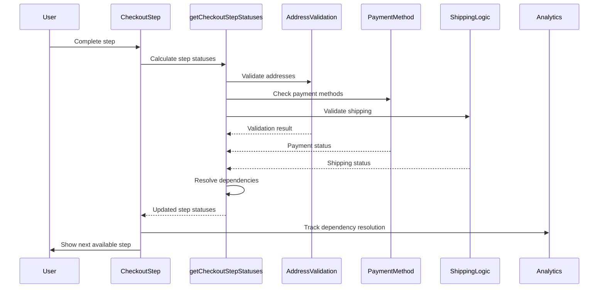

# Step Dependency Resolution Logic - Implementation Analysis

## Core Architecture

The checkout system implements sophisticated step dependency resolution that ensures proper step progression, validates dependencies, and maintains data integrity. The dependency system handles complex business rules, payment method requirements, and user flow validation.

## Dependency Resolution Flow Overview



## Step Dependency Logic

### Dependency Resolution Implementation

```typescript
const getCheckoutStepStatuses = createSelector(
    getCustomerStepStatus,
    getShippingStepStatus,
    getBillingStepStatus,
    getPaymentStepStatus,
    getOrderSubmitStatus,
    (customerStep, shippingStep, billingStep, paymentStep, orderStatus) => {
        const isSubmittingOrder = orderStatus;

        const steps = compact([customerStep, shippingStep, billingStep, paymentStep]);

        const orderDetailsStep: CheckoutStepStatus = {
            type: CheckoutStepType.OrderDetails,
            isActive: false,
            isBusy: false,
            isComplete: true,
            isEditable: false,
            isRequired: true,
        };

        /**
         * Combines the billing and payment steps into a single step status.
         */
        const billingAndPaymentStep: CheckoutStepStatus = {
            type: CheckoutStepType.BillingAndPayment,
            isActive: false,
            isBusy: false,
            isComplete: billingStep.isComplete && paymentStep.isComplete,
            isEditable: billingStep.isEditable && paymentStep.isEditable,
            isRequired: billingStep.isRequired || paymentStep.isRequired,
        };

        const defaultActiveStep =
            steps.find((step) => !step.isComplete && step.isRequired) || billingAndPaymentStep;

        return [...steps, orderDetailsStep, billingAndPaymentStep].map((step, index) => {
            const isPrevStepComplete = steps
                .slice(0, index)
                .every((prevStep) => prevStep.isComplete || !prevStep.isRequired);

            return {
                ...step,
                isActive: defaultActiveStep.type === step.type,
                isBusy: false,
                isEditable: isPrevStepComplete && step.isEditable && !isSubmittingOrder,
            };
        });
    },
);
```

**Dependency Strategy:**
- **Previous Step Validation**: Ensures previous steps are complete
- **Required Step Check**: Only validates required steps
- **Editability Control**: Controls step editability based on dependencies
- **Submission State**: Disables editing during order submission
- **Step Combination**: Handles combined steps (billing and payment)

### Customer Step Dependencies

#### Customer Step Validation

```typescript
const getCustomerStepStatus = createSelector(
    ({ data }: CheckoutSelectors) => data.getCheckout(),
    ({ data }: CheckoutSelectors) => data.getCustomer(),
    ({ data }: CheckoutSelectors) => data.getBillingAddress(),
    ({ data }: CheckoutSelectors) => data.getConfig(),
    ({ data }: CheckoutSelectors) => data.getCart(),
    ({ data }: CheckoutSelectors) => data.getPaymentProviderCustomer(),
    (checkout, customer, billingAddress, config, cart, paymentProviderCustomer) => {
        const hasEmail = !!(
            (customer && customer.email) ||
            (billingAddress && billingAddress.email)
        );
        const isUsingWallet =
            checkout && checkout.payments
                ? checkout.payments.some(
                    (payment: CheckoutPayment) => SUPPORTED_METHODS.indexOf(payment.providerId) >= 0,
                  )
                : false;
        const isGuest = !!(customer && customer.isGuest);
        const isComplete = hasEmail || isUsingWallet;
        const isEditable = isComplete && !isUsingWallet && isGuest;

        return {
            type: CheckoutStepType.Customer,
            isActive: false,
            isComplete,
            isEditable,
            isRequired: true,
        };
    },
);
```

**Customer Dependencies:**
- **Email Requirement**: Requires email address
- **Wallet Integration**: Handles wallet payment methods
- **Guest Checkout**: Manages guest vs logged-in customers
- **Editability**: Only editable for guest customers not using wallets

#### Stripe Link Dependencies

```typescript
const getStripeLinkAndCheckoutPageIsReloaded = (
    isUsingWallet: boolean,
    hasEmail: boolean,
    isGuest: boolean,
    shouldUseStripeLinkByMinimumAmount: boolean,
    providerWithCustomCheckout?: string | null,
) => {
    return !isUsingWallet && 
           providerWithCustomCheckout === PaymentMethodId.StripeUPE && 
           hasEmail && 
           isGuest && 
           shouldUseStripeLinkByMinimumAmount;
}
```

**Stripe Link Dependencies:**
- **Wallet Check**: Not using wallet payment
- **Provider Check**: Using Stripe UPE provider
- **Email Check**: Has email address
- **Guest Check**: Is guest customer
- **Amount Check**: Meets minimum amount requirement

### Shipping Step Dependencies

#### Shipping Step Validation

```typescript
const getShippingStepStatus = createSelector(
    ({ data }: CheckoutSelectors) => data.getShippingAddress(),
    ({ data }: CheckoutSelectors) => data.getConsignments(),
    ({ data }: CheckoutSelectors) => data.getCart(),
    ({ data }: CheckoutSelectors) => {
        const shippingAddress = data.getShippingAddress();
        return shippingAddress
            ? data.getShippingAddressFields(shippingAddress.countryCode)
            : EMPTY_ARRAY;
    },
    ({ data }: CheckoutSelectors) => data.getConfig(),
    (shippingAddress, consignments, cart, shippingAddressFields, config) => {
        const hasAddress = shippingAddress
            ? isValidAddress(shippingAddress, shippingAddressFields)
            : false;
        const hasOptions = consignments ? hasSelectedShippingOptions(consignments) : false;
        const hasUnassignedItems =
            cart && consignments ? hasUnassignedLineItems(consignments, cart.lineItems) : true;
        const isComplete = hasAddress && hasOptions && !hasUnassignedItems;
        const isRequired = itemsRequireShipping(cart, config);

        return {
            type: CheckoutStepType.Shipping,
            isActive: false,
            isComplete,
            isEditable: isComplete && isRequired && !isCustomShippingSelected,
            isRequired,
        };
    },
);
```

**Shipping Dependencies:**
- **Address Validation**: Validates shipping address
- **Shipping Options**: Checks for selected shipping options
- **Unassigned Items**: Ensures all items are assigned
- **Shipping Requirements**: Determines if shipping is required
- **Custom Shipping**: Handles custom shipping options

#### Multi-Shipping Dependencies

```typescript
// Multi-shipping dependency check
const hasMultiShippingEnabled =
    data.getConfig()?.checkoutSettings.hasMultiShippingEnabled;
const isMultiShippingMode =
    !!cart &&
    !!consignments &&
    hasMultiShippingEnabled &&
    isUsingMultiShipping(consignments, cart.lineItems);
```

**Multi-Shipping Dependencies:**
- **Feature Flag**: Controlled by hasMultiShippingEnabled
- **Cart Check**: Requires cart and consignments
- **Mode Check**: Checks if using multi-shipping
- **Item Assignment**: Ensures proper item assignment

### Billing Step Dependencies

#### Billing Step Validation

```typescript
const getBillingStepStatus = createSelector(
    ({ data }: CheckoutSelectors) => data.getCheckout(),
    ({ data }: CheckoutSelectors) => data.getBillingAddress(),
    ({ data }: CheckoutSelectors) => {
        const billingAddress = data.getBillingAddress();
        return billingAddress
            ? data.getBillingAddressFields(billingAddress.countryCode)
            : EMPTY_ARRAY;
    },
    ({ data }: CheckoutSelectors) => data.getConfig(),
    (checkout, billingAddress, billingAddressFields, config) => {
        const hasAddress = billingAddress
            ? isValidAddress(billingAddress, billingAddressFields)
            : false;
        const isUsingWallet =
            checkout && checkout.payments
                ? checkout.payments.some(
                      (payment) => SUPPORTED_METHODS.indexOf(payment.providerId) >= 0,
                  )
                : false;
        const isComplete = hasAddress || isUsingWallet;

        return {
            type: CheckoutStepType.Billing,
            isActive: false,
            isComplete,
            isEditable: isComplete && !isUsingWallet,
            isRequired: true,
        };
    },
);
```

**Billing Dependencies:**
- **Address Validation**: Validates billing address
- **Wallet Integration**: Handles wallet payment methods
- **Editability**: Controls editability based on payment method
- **Requirements**: Always required

#### Payment Method Dependencies

##### Amazon Pay Dependencies

```typescript
const isUsingAmazonPay =
    checkout && checkout.payments
        ? checkout.payments.some((payment) => payment.providerId === 'amazonpay')
        : false;

if (isUsingAmazonPay) {
    const billingAddressCustomFields = billingAddressFields.filter(
        ({ custom }: { custom: boolean }) => custom,
    );
    const hasCustomFields = billingAddressCustomFields.length > 0;
    const isAmazonPayBillingStepComplete =
        billingAddress && hasCustomFields
            ? isValidAddress(billingAddress, billingAddressCustomFields)
            : true;

    return {
        type: CheckoutStepType.Billing,
        isActive: false,
        isComplete: isAmazonPayBillingStepComplete,
        isEditable: isAmazonPayBillingStepComplete && hasCustomFields,
        isRequired: true,
    };
}
```

**Amazon Pay Dependencies:**
- **Provider Detection**: Detects Amazon Pay provider
- **Custom Fields**: Only validates custom fields
- **Field Requirements**: Requires custom fields for validation
- **Editability**: Only editable if custom fields present

##### Google Pay Dependencies

```typescript
const isGooglePayBillingAddressEditingEnabled = isExperimentEnabled(
    config?.checkoutSettings,
    'STRIPE-546.allow_billing_address_editing_for_all_Google_Pay_providers',
);
const isUsingGooglePay =
    isGooglePayBillingAddressEditingEnabled && (checkout && checkout.payments
        ? checkout.payments.some((payment) => (payment?.providerId || '').startsWith('googlepay'))
        : false);

if (isUsingGooglePay) {
    return {
        type: CheckoutStepType.Billing,
        isActive: false,
        isComplete: hasAddress,
        isEditable: hasAddress,
        isRequired: true,
    };
}
```

**Google Pay Dependencies:**
- **Feature Flag**: Controlled by experiment flag
- **Provider Detection**: Detects Google Pay providers
- **Standard Validation**: Uses standard address validation
- **Editability**: Editable when address is complete

##### PayPal Dependencies

```typescript
const isUsingPaypal =
    checkout && checkout.payments
        ? checkout.payments.some(
            (payment) =>
                [
                    'braintreepaypal',
                    'braintreepaypalcredit',
                    'braintreevenmo',
                    'paypalcommerce',
                    'paypalcommercecredit',
                    'paypalcommercevenmo'
                ]
                    .includes(payment.providerId))
        : false;

if (isUsingPaypal) {
    return {
        type: CheckoutStepType.Billing,
        isActive: false,
        isComplete: hasAddress,
        isEditable: hasAddress,
        isRequired: true,
    };
}
```

**PayPal Dependencies:**
- **Provider Detection**: Detects various PayPal providers
- **Standard Validation**: Uses standard address validation
- **Editability**: Editable when address is complete
- **Provider List**: Maintains list of supported providers

### Payment Step Dependencies

#### Payment Step Validation

```typescript
const getPaymentStepStatus = createSelector(
    ({ data }: CheckoutSelectors) => data.getOrder(),
    (order) => {
        const isComplete = order ? order.isComplete : false;

        return {
            type: CheckoutStepType.Payment,
            isActive: false,
            isComplete,
            isEditable: isComplete,
            isRequired: true,
        };
    },
);
```

**Payment Dependencies:**
- **Order Completion**: Based on order completion status
- **Editability**: Editable when order is complete
- **Requirements**: Always required
- **State Management**: Manages payment state

### Dependency Resolution Rules

#### Sequential Dependencies

```typescript
const isPrevStepComplete = steps
    .slice(0, index)
    .every((prevStep) => prevStep.isComplete || !prevStep.isRequired);
```

**Sequential Strategy:**
- **Previous Steps**: Ensures all previous steps are complete
- **Required Steps**: Only validates required steps
- **Step Order**: Maintains proper step order
- **Validation**: Validates step dependencies

#### Conditional Dependencies

```typescript
// Conditional dependency based on payment method
if (isUsingAmazonPay) {
    // Amazon Pay specific dependencies
} else if (isUsingGooglePay) {
    // Google Pay specific dependencies
} else if (isUsingPaypal) {
    // PayPal specific dependencies
} else {
    // Standard dependencies
}
```

**Conditional Strategy:**
- **Payment Method**: Different dependencies for different payment methods
- **Feature Flags**: Dependencies based on feature flags
- **Configuration**: Dependencies based on configuration
- **Business Rules**: Dependencies based on business rules

#### Cross-Step Dependencies

```typescript
// Cross-step dependency example
const billingAndPaymentStep: CheckoutStepStatus = {
    type: CheckoutStepType.BillingAndPayment,
    isActive: false,
    isBusy: false,
    isComplete: billingStep.isComplete && paymentStep.isComplete,
    isEditable: billingStep.isEditable && paymentStep.isEditable,
    isRequired: billingStep.isRequired || paymentStep.isRequired,
};
```

**Cross-Step Strategy:**
- **Step Combination**: Combines multiple steps
- **State Synchronization**: Synchronizes state between steps
- **Dependency Management**: Manages dependencies between steps
- **Validation**: Validates combined step state

### Dependency Error Handling

#### Validation Errors

```typescript
try {
    const stepStatus = getCheckoutStepStatuses(checkoutState);
    // Process step status
} catch (error) {
    console.error('Dependency resolution error:', error);
    // Fallback to default state
}
```

**Error Handling Strategy:**
- **Try-Catch**: Wraps dependency resolution in try-catch
- **Error Logging**: Logs dependency resolution errors
- **Fallback State**: Provides fallback state
- **User Notification**: Notifies user of errors

#### Dependency Recovery

```typescript
const recoverFromDependencyError = (stepType: CheckoutStepType) => {
    // Clear step state
    clearStepState(stepType);
    
    // Recalculate dependencies
    const newStepStatus = getCheckoutStepStatuses(checkoutState);
    
    // Update step status
    updateStepStatus(newStepStatus);
};
```

**Recovery Strategy:**
- **State Clearing**: Clears problematic step state
- **Recalculation**: Recalculates dependencies
- **State Update**: Updates step status
- **User Experience**: Maintains user experience

## Source Files

- **Step Status Logic**: `packages/core/src/app/checkout/getCheckoutStepStatuses.ts`
- **Props Mapping**: `packages/core/src/app/checkout/mapToCheckoutProps.ts`
- **Address Validation**: `packages/core/src/app/address/`
- **Payment Methods**: `packages/core/src/app/payment/`
- **Shipping Logic**: `packages/core/src/app/shipping/`
