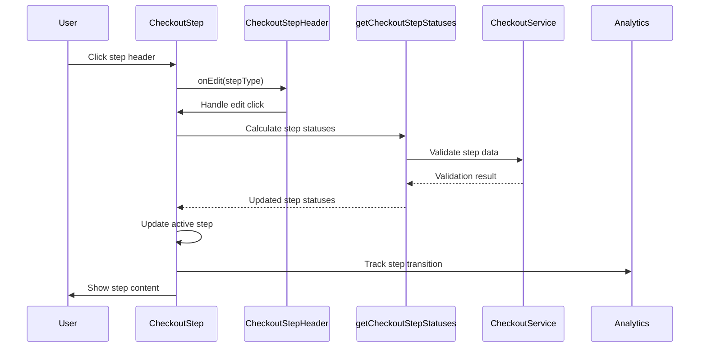

# Step Transition Flows - Implementation Analysis

## Core Architecture

The checkout system implements sophisticated step transition flows that manage the progression through checkout steps, handle dependencies, validate transitions, and provide error recovery. These flows ensure a smooth user experience while maintaining data integrity.

## Step Transition Flow Overview



## Step Transition Logic

### Step Activation Flow

```typescript
// In CheckoutStep component
componentDidUpdate(prevProps: Readonly<CheckoutStepProps>): void {
    const { isActive } = this.props;

    if (isActive && isActive !== prevProps.isActive) {
        this.focusStep();
    }
}

private focusStep(): void {
    const delay = isMobileView() ? 0 : this.getTransitionDelay();

    this.setState({ isClosed: false });

    this.timeoutRef = window.setTimeout(() => {
        const input = this.getChildInput();
        const position = this.getScrollPosition();
        const { type, onExpanded = noop } = this.props;

        if (input) {
            input.focus();
        }

        if (position !== undefined && !isNaN(position)) {
            window.scrollTo(0, position);
        }

        onExpanded(type);

        this.timeoutRef = undefined;
    }, delay);
}
```

**Step Activation Strategy:**
- **Lifecycle Management**: Uses componentDidUpdate for activation
- **Focus Management**: Automatically focuses step when activated
- **Scroll Positioning**: Positions step optimally in viewport
- **Animation Timing**: Handles animation delays
- **Mobile Optimization**: Different behavior for mobile devices

### Step Dependencies

```typescript
// In getCheckoutStepStatuses
const getCheckoutStepStatuses = createSelector(
    getCustomerStepStatus,
    getShippingStepStatus,
    getBillingStepStatus,
    getPaymentStepStatus,
    getOrderSubmitStatus,
    (customerStep, shippingStep, billingStep, paymentStep, orderStatus) => {
        const steps = compact([customerStep, shippingStep, billingStep, paymentStep]);

        return [...steps, orderDetailsStep, billingAndPaymentStep].map((step, index) => {
            const isPrevStepComplete = steps
                .slice(0, index)
                .every((prevStep) => prevStep.isComplete || !prevStep.isRequired);

            return {
                ...step,
                isActive: defaultActiveStep.type === step.type,
                isBusy: false,
                isEditable: isPrevStepComplete && step.isEditable && !isSubmittingOrder,
            };
        });
    },
);
```

**Dependency Strategy:**
- **Previous Step Validation**: Ensures previous steps are complete
- **Required Step Check**: Only validates required steps
- **Editability Control**: Controls step editability based on dependencies
- **Submission State**: Disables editing during order submission

### Step Validation

#### Customer Step Validation

```typescript
const getCustomerStepStatus = createSelector(
    ({ data }: CheckoutSelectors) => data.getCheckout(),
    ({ data }: CheckoutSelectors) => data.getCustomer(),
    ({ data }: CheckoutSelectors) => data.getBillingAddress(),
    ({ data }: CheckoutSelectors) => data.getConfig(),
    ({ data }: CheckoutSelectors) => data.getCart(),
    ({ data }: CheckoutSelectors) => data.getPaymentProviderCustomer(),
    (checkout, customer, billingAddress, config, cart, paymentProviderCustomer) => {
        const hasEmail = !!(
            (customer && customer.email) ||
            (billingAddress && billingAddress.email)
        );
        const isUsingWallet =
            checkout && checkout.payments
                ? checkout.payments.some(
                    (payment: CheckoutPayment) => SUPPORTED_METHODS.indexOf(payment.providerId) >= 0,
                  )
                : false;
        const isGuest = !!(customer && customer.isGuest);
        const isComplete = hasEmail || isUsingWallet;
        const isEditable = isComplete && !isUsingWallet && isGuest;

        return {
            type: CheckoutStepType.Customer,
            isActive: false,
            isComplete,
            isEditable,
            isRequired: true,
        };
    },
);
```

**Customer Step Strategy:**
- **Email Validation**: Checks for email in customer or billing address
- **Wallet Integration**: Handles wallet payment methods
- **Guest Checkout**: Manages guest vs logged-in customers
- **Editability**: Only editable for guest customers not using wallets

#### Shipping Step Validation

```typescript
const getShippingStepStatus = createSelector(
    ({ data }: CheckoutSelectors) => data.getShippingAddress(),
    ({ data }: CheckoutSelectors) => data.getConsignments(),
    ({ data }: CheckoutSelectors) => data.getCart(),
    ({ data }: CheckoutSelectors) => {
        const shippingAddress = data.getShippingAddress();
        return shippingAddress
            ? data.getShippingAddressFields(shippingAddress.countryCode)
            : EMPTY_ARRAY;
    },
    ({ data }: CheckoutSelectors) => data.getConfig(),
    (shippingAddress, consignments, cart, shippingAddressFields, config) => {
        const hasAddress = shippingAddress
            ? isValidAddress(shippingAddress, shippingAddressFields)
            : false;
        const hasOptions = consignments ? hasSelectedShippingOptions(consignments) : false;
        const hasUnassignedItems =
            cart && consignments ? hasUnassignedLineItems(consignments, cart.lineItems) : true;
        const isComplete = hasAddress && hasOptions && !hasUnassignedItems;
        const isRequired = itemsRequireShipping(cart, config);

        return {
            type: CheckoutStepType.Shipping,
            isActive: false,
            isComplete,
            isEditable: isComplete && isRequired && !isCustomShippingSelected,
            isRequired,
        };
    },
);
```

**Shipping Step Strategy:**
- **Address Validation**: Validates shipping address
- **Shipping Options**: Checks for selected shipping options
- **Unassigned Items**: Ensures all items are assigned
- **Custom Shipping**: Handles custom shipping options

### Step Transition Edge Cases

#### Cart Change Detection

```typescript
// In mapToCheckoutProps
const submitOrderError = errors.getSubmitOrderError() as CustomError;

return {
    // ... other props
    hasCartChanged: submitOrderError && submitOrderError.type === 'cart_changed',
    // ... other props
};
```

**Cart Change Strategy:**
- **Error Detection**: Detects cart change errors
- **State Management**: Manages cart change state
- **User Notification**: Notifies user of cart changes
- **Recovery**: Provides cart change recovery

#### Payment Method Conflicts

```typescript
// In getBillingStepStatus
const isUsingAmazonPay =
    checkout && checkout.payments
        ? checkout.payments.some((payment) => payment.providerId === 'amazonpay')
        : false;

if (isUsingAmazonPay) {
    const billingAddressCustomFields = billingAddressFields.filter(
        ({ custom }: { custom: boolean }) => custom,
    );
    const hasCustomFields = billingAddressCustomFields.length > 0;
    const isAmazonPayBillingStepComplete =
        billingAddress && hasCustomFields
            ? isValidAddress(billingAddress, billingAddressCustomFields)
            : true;

    return {
        type: CheckoutStepType.Billing,
        isActive: false,
        isComplete: isAmazonPayBillingStepComplete,
        isEditable: isAmazonPayBillingStepComplete && hasCustomFields,
        isRequired: true,
    };
}
```

**Payment Method Strategy:**
- **Provider Detection**: Detects specific payment methods
- **Custom Validation**: Applies custom validation rules
- **Field Requirements**: Handles custom field requirements
- **Editability Control**: Controls editability based on payment method

#### Multi-Shipping Conflicts

```typescript
// In Shipping component
const cartHasPromotionalItems = hasPromotionalItems(cart);

if (cartHasPromotionalItems && isMultiShippingMode) {
    this.setState({ isMultiShippingUnavailableModalOpen: true });
}
```

**Multi-Shipping Strategy:**
- **Conflict Detection**: Detects promotional item conflicts
- **Modal Display**: Shows conflict modal
- **Mode Switching**: Forces single shipping mode
- **User Notification**: Notifies user of conflicts

### Step Transition Error Handling

#### Validation Errors

```typescript
// Error handling in step validation
try {
    const stepStatus = getCheckoutStepStatuses(checkoutState);
    // Process step status
} catch (error) {
    // Handle validation errors
    console.error('Step validation error:', error);
    // Fallback to default state
}
```

**Error Handling Strategy:**
- **Try-Catch**: Wraps validation in try-catch
- **Error Logging**: Logs validation errors
- **Fallback State**: Provides fallback state
- **User Notification**: Notifies user of errors

#### Network Errors

```typescript
// Network error handling
const handleStepTransition = async (stepType: CheckoutStepType) => {
    try {
        await checkoutService.loadCheckout();
        // Update step status
    } catch (error) {
        // Handle network errors
        onUnhandledError(error);
    }
};
```

**Network Error Strategy:**
- **Async Handling**: Handles async operations
- **Error Propagation**: Propagates errors to parent
- **User Feedback**: Provides user feedback
- **Recovery**: Attempts error recovery

### Step Transition Performance

#### Reselect Optimization

```typescript
const getCheckoutStepStatuses = createSelector(
    getCustomerStepStatus,
    getShippingStepStatus,
    getBillingStepStatus,
    getPaymentStepStatus,
    getOrderSubmitStatus,
    (customerStep, shippingStep, billingStep, paymentStep, orderStatus) => {
        // Complex step status calculation
    },
);
```

**Performance Strategy:**
- **Memoization**: Uses Reselect for memoization
- **Input Selectors**: Only recomputes when inputs change
- **Result Caching**: Caches results until inputs change
- **Efficient Updates**: Prevents unnecessary recalculations

#### Animation Optimization

```typescript
private getTransitionDelay(): number {
    if (this.timeoutDelay !== undefined) {
        return this.timeoutDelay;
    }

    // Cache the result to avoid unnecessary reflow
    this.timeoutDelay =
        parseFloat(
            this.contentRef.current
                ? getComputedStyle(this.contentRef.current).transitionDuration
                : '0s',
        ) * 1000;

    return this.timeoutDelay;
}
```

**Animation Strategy:**
- **Delay Caching**: Caches transition delays
- **Reflow Avoidance**: Avoids unnecessary reflows
- **Performance**: Optimizes animation performance
- **Smooth Transitions**: Ensures smooth transitions

### Step Transition Analytics

#### Transition Tracking

```typescript
// Analytics tracking
const handleStepTransition = (stepType: CheckoutStepType) => {
    analyticsTracker.checkoutStepView(stepType);
    // Handle transition
};
```

**Analytics Strategy:**
- **Event Tracking**: Tracks step transitions
- **User Behavior**: Monitors user behavior
- **Conversion Tracking**: Tracks conversion rates
- **Performance Metrics**: Measures transition performance

#### Error Tracking

```typescript
// Error tracking
const handleStepError = (error: Error, stepType: CheckoutStepType) => {
    analyticsTracker.checkoutStepError(stepType, error);
    // Handle error
};
```

**Error Tracking Strategy:**
- **Error Events**: Tracks step errors
- **Error Context**: Provides error context
- **User Impact**: Measures user impact
- **Recovery Tracking**: Tracks recovery success

## Source Files

- **Step Transition Logic**: `packages/core/src/app/checkout/CheckoutStep.tsx`
- **Step Status Calculation**: `packages/core/src/app/checkout/getCheckoutStepStatuses.ts`
- **Props Mapping**: `packages/core/src/app/checkout/mapToCheckoutProps.ts`
- **Step Header**: `packages/core/src/app/checkout/CheckoutStepHeader.tsx`
