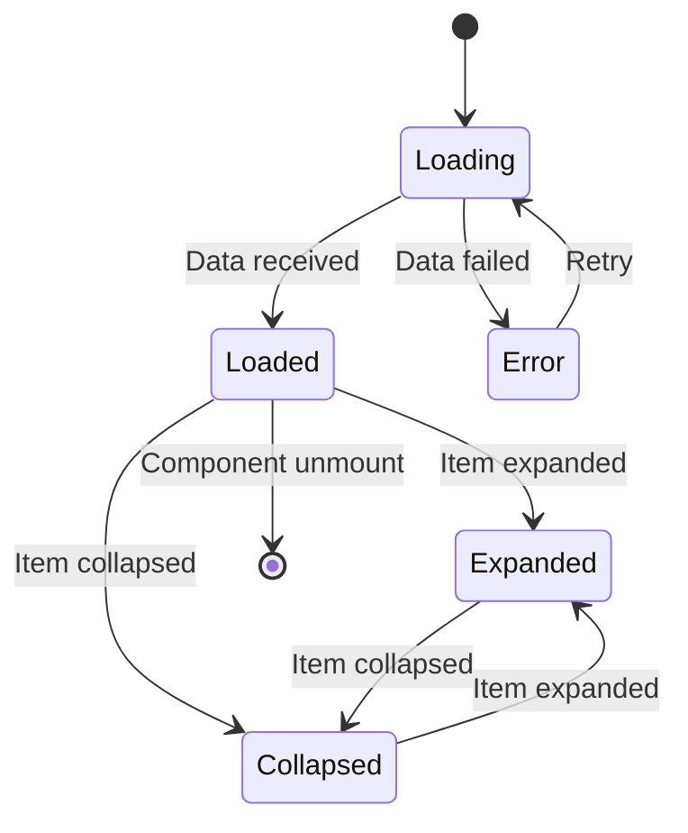

# OrderSummary Component

## Overview
The `OrderSummary` component displays a comprehensive summary of the order, including line items, pricing breakdown, taxes, and totals. It serves as the central display for order information in the confirmation flow.

## Component Purpose
- **Primary Role**: Display order line items and pricing information
- **Pricing Breakdown**: Show subtotals, taxes, and final total
- **Line Item Display**: Render individual order items with details
- **Currency Handling**: Support multiple currency displays
- **Extension Integration**: Allow checkout extensions to add content

## Props Interface

### OrderSummaryProps
```typescript
interface OrderSummaryProps {
    lineItems: LineItemMap;                                // Order line items from BigCommerce
    total: number;                                         // Total order amount
    headerLink: ReactNode;                                 // Header navigation link
    storeCurrency: StoreCurrency;                          // Store's base currency
    shopperCurrency: ShopperCurrency;                      // Shopper's preferred currency
    additionalLineItems?: ReactNode;                        // Additional line items to display
}
```

## Real Implementation Examples

### Basic Order Summary
```typescript
import React from 'react';
import { OrderSummary } from '@bigcommerce/checkout/order';
import { useAnalytics } from '@bigcommerce/checkout/analytics';

const BasicOrderSummary: React.FC<{ order: Order }> = ({ order }) => {
    const analytics = useAnalytics();

    const handleItemClick = (itemId: string) => {
        analytics.track('order_summary_item_clicked', {
            itemId,
            orderId: order.id
        });
    };

    return (
        <OrderSummary
            lineItems={order.lineItems}
            total={order.total}
            headerLink={<a href="/cart">Edit Cart</a>}
            storeCurrency={order.storeCurrency}
            shopperCurrency={order.shopperCurrency}
            onItemClick={handleItemClick}
        />
    );
};
```

### Advanced Order Summary with Custom Styling
```typescript
import React, { useState, useMemo, useCallback } from 'react';
import { OrderSummary } from '@bigcommerce/checkout/order';
import { useAnalytics, usePerformanceMonitoring } from '@bigcommerce/checkout/analytics';

interface CustomOrderSummaryProps {
    order: Order;
    theme?: 'light' | 'dark' | 'compact';
    showItemDetails?: boolean;
    showTaxBreakdown?: boolean;
    showDiscounts?: boolean;
    customStyles?: Record<string, string>;
}

const CustomOrderSummary: React.FC<CustomOrderSummaryProps> = ({
    order,
    theme = 'light',
    showItemDetails = true,
    showTaxBreakdown = true,
    showDiscounts = true,
    customStyles = {}
}) => {
    const analytics = useAnalytics();
    const performance = usePerformanceMonitoring();
    const [expandedItems, setExpandedItems] = useState<Set<string>>(new Set());

    // Memoize processed line items
    const processedLineItems = useMemo(() => {
        const startTime = performance.now();
        
        const items = removeBundledItems(order.lineItems);
        const processed = items.map(item => ({
            ...item,
            displayPrice: formatPrice(item.price, order.shopperCurrency),
            displayTotal: formatPrice(item.total, order.shopperCurrency)
        }));
        
        const processingTime = performance.now() - startTime;
        performance.track('order_summary_processing_time', {
            duration: processingTime,
            itemCount: items.length
        });
        
        return processed;
    }, [order.lineItems, order.shopperCurrency]);

    // Memoize pricing calculations
    const pricingBreakdown = useMemo(() => {
        const subtotal = processedLineItems.reduce((sum, item) => sum + item.total, 0);
        const taxTotal = order.taxes?.reduce((sum, tax) => sum + tax.amount, 0) || 0;
        const discountTotal = order.discounts?.reduce((sum, discount) => sum + discount.amount, 0) || 0;
        const finalTotal = subtotal + taxTotal - discountTotal;

        return {
            subtotal,
            taxTotal,
            discountTotal,
            finalTotal,
            itemCount: processedLineItems.length
        };
    }, [processedLineItems, order.taxes, order.discounts]);

    const handleItemToggle = useCallback((itemId: string) => {
        setExpandedItems(prev => {
            const newSet = new Set(prev);
            if (newSet.has(itemId)) {
                newSet.delete(itemId);
            } else {
                newSet.add(itemId);
            }
            return newSet;
        });

        analytics.track('order_summary_item_toggle', {
            itemId,
            orderId: order.id
        });
    }, [order.id]);

    const handleItemClick = useCallback((itemId: string) => {
        analytics.track('order_summary_item_clicked', {
            itemId,
            orderId: order.id
        });
    }, [order.id]);

    const customHeaderLink = (
        <div className="custom-header-link">
            <a href="/cart" className="edit-cart-link">
                <span className="icon">✏️</span>
                Edit Cart ({pricingBreakdown.itemCount} items)
            </a>
        </div>
    );

    const additionalLineItems = showDiscounts && order.discounts?.length > 0 ? (
        <div className="discounts-section">
            <h4>Applied Discounts</h4>
            {order.discounts.map(discount => (
                <div key={discount.id} className="discount-item">
                    <span>{discount.name}</span>
                    <span>-{formatPrice(discount.amount, order.shopperCurrency)}</span>
                </div>
            ))}
        </div>
    ) : null;

    return (
        <div className={`custom-order-summary ${theme}`} style={customStyles}>
            <OrderSummary
                lineItems={order.lineItems}
                total={pricingBreakdown.finalTotal}
                headerLink={customHeaderLink}
                storeCurrency={order.storeCurrency}
                shopperCurrency={order.shopperCurrency}
                additionalLineItems={additionalLineItems}
                onItemClick={handleItemClick}
                onItemToggle={handleItemToggle}
                expandedItems={expandedItems}
                showItemDetails={showItemDetails}
                showTaxBreakdown={showTaxBreakdown}
            />
            
            {/* Performance metrics display (development only) */}
            {process.env.NODE_ENV === 'development' && (
                <div className="performance-metrics">
                    <small>
                        Items: {pricingBreakdown.itemCount} | 
                        Processing time: {performance.now().toFixed(2)}ms
                    </small>
                </div>
            )}
        </div>
    );
};
```

## Performance Optimization Examples

### 1. Virtual Scrolling for Large Orders
```typescript
import React, { useMemo } from 'react';
import { FixedSizeList as List } from 'react-window';
import { OrderSummary } from '@bigcommerce/checkout/order';

const VirtualizedOrderSummary: React.FC<{ order: Order }> = ({ order }) => {
    const lineItems = useMemo(() => 
        Object.values(order.lineItems).flat(), [order.lineItems]
    );

    const Row = ({ index, style }: { index: number; style: React.CSSProperties }) => {
        const item = lineItems[index];
        
        return (
            <div style={style} className="order-summary-item">
                <div className="item-image">
                    
                </div>
                <div className="item-details">
                    <h4>{item.name}</h4>
                    <p>Quantity: {item.quantity}</p>
                    <p>Price: {formatPrice(item.price, order.shopperCurrency)}</p>
                </div>
                <div className="item-total">
                    {formatPrice(item.total, order.shopperCurrency)}
                </div>
            </div>
        );
    };

    return (
        <div className="virtualized-order-summary">
            <OrderSummary
                lineItems={order.lineItems}
                total={order.total}
                headerLink={<a href="/cart">Edit Cart</a>}
                storeCurrency={order.storeCurrency}
                shopperCurrency={order.shopperCurrency}
                renderLineItems={() => (
                    <List
                        height={400}
                        itemCount={lineItems.length}
                        itemSize={80}
                        width="100%"
                    >
                        {Row}
                    </List>
                )}
            />
        </div>
    );
};
```

### 2. Lazy Loading Item Images
```typescript
import React, { useState, useRef, useEffect } from 'react';

const LazyImage: React.FC<{ src: string; alt: string; className?: string }> = ({
    src,
    alt,
    className
}) => {
    const [isLoaded, setIsLoaded] = useState(false);
    const [isInView, setIsInView] = useState(false);
    const imgRef = useRef<HTMLImageElement>(null);

    useEffect(() => {
        const observer = new IntersectionObserver(
            ([entry]) => {
                if (entry.isIntersecting) {
                    setIsInView(true);
                    observer.disconnect();
                }
            },
            { threshold: 0.1 }
        );

        if (imgRef.current) {
            observer.observe(imgRef.current);
        }

        return () => observer.disconnect();
    }, []);

    return (
        <div ref={imgRef} className={`lazy-image-container ${className}`}>
            {!isLoaded && isInView && (
                <div className="image-placeholder">
                    <div className="loading-spinner" />
                </div>
            )}
            {isInView && (
                 setIsLoaded(true)}
                    loading="lazy"
                />
            )}
        </div>
    );
};

const OrderSummaryWithLazyImages: React.FC<{ order: Order }> = ({ order }) => {
    return (
        <OrderSummary
            lineItems={order.lineItems}
            total={order.total}
            headerLink={<a href="/cart">Edit Cart</a>}
            storeCurrency={order.storeCurrency}
            shopperCurrency={order.shopperCurrency}
            renderItemImage={(item) => (
                <LazyImage
                    src={item.imageUrl}
                    alt={item.name}
                    className="order-item-image"
                />
            )}
        />
    );
};
```

### 3. Memoized Price Calculations
```typescript
import React, { useMemo, useCallback } from 'react';

const OrderSummaryWithMemoizedPricing: React.FC<{ order: Order }> = ({ order }) => {
    // Memoize price calculations
    const pricingData = useMemo(() => {
        const items = Object.values(order.lineItems).flat();
        
        const subtotal = items.reduce((sum, item) => sum + item.total, 0);
        const taxTotal = order.taxes?.reduce((sum, tax) => sum + tax.amount, 0) || 0;
        const discountTotal = order.discounts?.reduce((sum, discount) => sum + discount.amount, 0) || 0;
        const shippingTotal = order.shipping?.cost || 0;
        const finalTotal = subtotal + taxTotal + shippingTotal - discountTotal;

        return {
            subtotal,
            taxTotal,
            discountTotal,
            shippingTotal,
            finalTotal,
            itemCount: items.length,
            formattedSubtotal: formatPrice(subtotal, order.shopperCurrency),
            formattedTaxTotal: formatPrice(taxTotal, order.shopperCurrency),
            formattedDiscountTotal: formatPrice(discountTotal, order.shopperCurrency),
            formattedShippingTotal: formatPrice(shippingTotal, order.shopperCurrency),
            formattedFinalTotal: formatPrice(finalTotal, order.shopperCurrency)
        };
    }, [order.lineItems, order.taxes, order.discounts, order.shipping, order.shopperCurrency]);

    // Memoize line item processing
    const processedLineItems = useMemo(() => {
        return Object.values(order.lineItems)
            .flat()
            .map(item => ({
                ...item,
                displayPrice: formatPrice(item.price, order.shopperCurrency),
                displayTotal: formatPrice(item.total, order.shopperCurrency),
                displayQuantity: `${item.quantity} × ${formatPrice(item.price, order.shopperCurrency)}`
            }));
    }, [order.lineItems, order.shopperCurrency]);

    const handleItemClick = useCallback((itemId: string) => {
        analytics.track('order_summary_item_clicked', {
            itemId,
            orderId: order.id
        });
    }, [order.id]);

    return (
        <OrderSummary
            lineItems={order.lineItems}
            total={pricingData.finalTotal}
            headerLink={<a href="/cart">Edit Cart ({pricingData.itemCount} items)</a>}
            storeCurrency={order.storeCurrency}
            shopperCurrency={order.shopperCurrency}
            pricingData={pricingData}
            processedLineItems={processedLineItems}
            onItemClick={handleItemClick}
        />
    );
};
```

## Visual Component States

### Order Summary State Diagram


### Pricing Breakdown Visualization
```
┌─────────────────────────────────────────────────────────────┐
│                    Order Summary                            │
├─────────────────────────────────────────────────────────────┤
│  Item 1: Product Name                    $29.99 × 2  $59.98 │
│  Item 2: Another Product                 $19.99 × 1  $19.99 │
│  Item 3: Third Product                   $45.00 × 1  $45.00 │
├─────────────────────────────────────────────────────────────┤
│  Subtotal:                                          $124.97 │
│  Shipping:                                            $5.99 │
│  Tax:                                                 $9.75 │
│  Discount:                                           -$10.00 │
├─────────────────────────────────────────────────────────────┤
│  Total:                                             $130.71 │
└─────────────────────────────────────────────────────────────┘
```

## Integration Examples

### 1. Analytics Integration
```typescript
import { useAnalytics } from '@bigcommerce/checkout/analytics';

const OrderSummaryWithAnalytics: React.FC<OrderSummaryProps> = (props) => {
    const analytics = useAnalytics();

    const enhancedProps = {
        ...props,
        onItemClick: (itemId: string, item: LineItem) => {
            analytics.track('order_summary_item_clicked', {
                itemId,
                itemName: item.name,
                itemPrice: item.price,
                itemQuantity: item.quantity,
                orderId: props.orderId
            });
        },
        onItemExpand: (itemId: string) => {
            analytics.track('order_summary_item_expanded', {
                itemId,
                orderId: props.orderId
            });
        },
        onPriceBreakdownView: (breakdown: PricingBreakdown) => {
            analytics.track('order_summary_pricing_viewed', {
                subtotal: breakdown.subtotal,
                taxTotal: breakdown.taxTotal,
                discountTotal: breakdown.discountTotal,
                finalTotal: breakdown.finalTotal,
                orderId: props.orderId
            });
        }
    };

    return <OrderSummary {...enhancedProps} />;
};
```

### 2. Extension Integration
```typescript
import React from 'react';
import { Extension } from '@bigcommerce/checkout/checkout-extension';

const OrderSummaryWithExtensions: React.FC<OrderSummaryProps> = (props) => {
    return (
        <div className="order-summary-with-extensions">
            <OrderSummary {...props} />
            
            {/* Extension points */}
            <Extension region="OrderSummaryAfterItems" />
            <Extension region="OrderSummaryBeforeTotals" />
            <Extension region="OrderSummaryAfterTotals" />
            
            {/* Custom extension content */}
            <div className="custom-extension-content">
                <Extension region="OrderSummaryCustom" />
            </div>
        </div>
    );
};
```

## Testing Examples

### Unit Test Example
```typescript
import React from 'react';
import { render, screen, fireEvent } from '@testing-library/react';
import { OrderSummary } from './OrderSummary';

describe('OrderSummary Component', () => {
    const mockLineItems = {
        physical: [
            {
                id: 'item_1',
                name: 'Test Product',
                quantity: 2,
                price: 29.99,
                total: 59.98,
                imageUrl: '/test-image.jpg'
            }
        ]
    };

    const mockProps = {
        lineItems: mockLineItems,
        total: 59.98,
        headerLink: <a href="/cart">Edit Cart</a>,
        storeCurrency: { code: 'USD' },
        shopperCurrency: { code: 'USD' }
    };

    it('renders order summary with line items', () => {
        render(<OrderSummary {...mockProps} />);
        
        expect(screen.getByText('Test Product')).toBeInTheDocument();
        expect(screen.getByText('$59.98')).toBeInTheDocument();
        expect(screen.getByText('Quantity: 2')).toBeInTheDocument();
    });

    it('handles item click events', () => {
        const handleItemClick = jest.fn();
        
        render(
            <OrderSummary
                {...mockProps}
                onItemClick={handleItemClick}
            />
        );

        const item = screen.getByText('Test Product');
        fireEvent.click(item);

        expect(handleItemClick).toHaveBeenCalledWith('item_1');
    });

    it('displays pricing breakdown correctly', () => {
        const propsWithTaxes = {
            ...mockProps,
            taxes: [{ name: 'Sales Tax', amount: 4.99 }],
            discounts: [{ name: 'Promo Code', amount: 5.00 }]
        };

        render(<OrderSummary {...propsWithTaxes} />);

        expect(screen.getByText('Subtotal: $59.98')).toBeInTheDocument();
        expect(screen.getByText('Tax: $4.99')).toBeInTheDocument();
        expect(screen.getByText('Discount: -$5.00')).toBeInTheDocument();
        expect(screen.getByText('Total: $59.97')).toBeInTheDocument();
    });
});
```

### Integration Test Example
```typescript
import { render, screen, waitFor } from '@testing-library/react';
import { OrderSummary } from './OrderSummary';
import { ExtensionProvider } from '@bigcommerce/checkout/checkout-extension';

describe('OrderSummary Integration', () => {
    it('integrates with extensions correctly', async () => {
        const mockExtension = {
            id: 'test-extension',
            render: () => <div data-testid="extension-content">Extension Content</div>
        };

        render(
            <ExtensionProvider extensions={[mockExtension]}>
                <OrderSummary
                    lineItems={mockLineItems}
                    total={59.98}
                    headerLink={<a href="/cart">Edit Cart</a>}
                    storeCurrency={{ code: 'USD' }}
                    shopperCurrency={{ code: 'USD' }}
                />
            </ExtensionProvider>
        );

        await waitFor(() => {
            expect(screen.getByTestId('extension-content')).toBeInTheDocument();
        });
    });
});
```

## Performance Monitoring

### Performance Metrics
```typescript
import { useEffect, useRef } from 'react';
import { usePerformanceMonitoring } from '@bigcommerce/checkout/analytics';

const OrderSummaryWithPerformanceMonitoring: React.FC<OrderSummaryProps> = (props) => {
    const performance = usePerformanceMonitoring();
    const renderStartTime = useRef<number>(0);

    useEffect(() => {
        renderStartTime.current = performance.now();
        
        return () => {
            const renderDuration = performance.now() - renderStartTime.current;
            
            performance.track('order_summary_render_time', {
                duration: renderDuration,
                itemCount: Object.values(props.lineItems).flat().length,
                orderTotal: props.total
            });
        };
    }, [props.lineItems, props.total]);

    // Track item processing performance
    const trackItemProcessing = useCallback((items: LineItem[]) => {
        const startTime = performance.now();
        
        const processed = items.map(item => ({
            ...item,
            displayPrice: formatPrice(item.price, props.shopperCurrency),
            displayTotal: formatPrice(item.total, props.shopperCurrency)
        }));
        
        const processingTime = performance.now() - startTime;
        
        performance.track('order_summary_item_processing', {
            duration: processingTime,
            itemCount: items.length
        });
        
        return processed;
    }, [props.shopperCurrency]);

    return (
        <OrderSummary
            {...props}
            onItemProcessing={trackItemProcessing}
        />
    );
};
```

## Common Issues and Solutions

### 1. Large Order Performance
```typescript
// ❌ Bad: Rendering all items at once
const OrderSummary = ({ lineItems }) => {
    return (
        <div>
            {Object.values(lineItems).flat().map(item => (
                <OrderSummaryItem key={item.id} item={item} />
            ))}
        </div>
    );
};

// ✅ Good: Virtual scrolling for large orders
const OrderSummary = ({ lineItems }) => {
    const items = Object.values(lineItems).flat();
    
    if (items.length > 50) {
        return (
            <VirtualizedOrderSummary
                items={items}
                height={400}
                itemSize={80}
            />
        );
    }
    
    return (
        <div>
            {items.map(item => (
                <OrderSummaryItem key={item.id} item={item} />
            ))}
        </div>
    );
};
```

### 2. Currency Conversion Issues
```typescript
// ❌ Bad: No currency validation
const formatPrice = (amount: number, currency: string) => {
    return new Intl.NumberFormat('en-US', {
        style: 'currency',
        currency
    }).format(amount);
};

// ✅ Good: With currency validation and fallbacks
const formatPrice = (amount: number, currency: StoreCurrency) => {
    try {
        // Validate currency code
        if (!currency?.code || !Intl.supportedValuesOf('currency').includes(currency.code)) {
            throw new Error(`Unsupported currency: ${currency?.code}`);
        }
        
        return new Intl.NumberFormat('en-US', {
            style: 'currency',
            currency: currency.code,
            minimumFractionDigits: 2,
            maximumFractionDigits: 2
        }).format(amount);
    } catch (error) {
        console.warn('Currency formatting failed:', error);
        // Fallback to basic formatting
        return `${currency?.code || 'USD'} ${amount.toFixed(2)}`;
    }
};
```

### 3. Memory Leaks with Event Listeners
```typescript
// ❌ Bad: Event listeners not cleaned up
useEffect(() => {
    const handleResize = () => {
        // Update layout
    };
    
    window.addEventListener('resize', handleResize);
}, []);

// ✅ Good: Proper cleanup
useEffect(() => {
    const handleResize = () => {
        // Update layout
    };
    
    window.addEventListener('resize', handleResize);
    
    return () => {
        window.removeEventListener('resize', handleResize);
    };
}, []);
```

This enhanced documentation provides comprehensive real-world examples, performance optimizations, visual diagrams, and practical solutions that developers can immediately implement in their projects.
