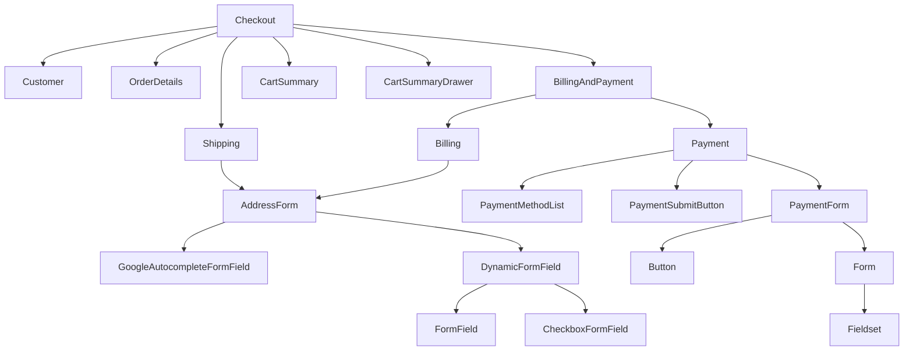

# Cross-References and Performance Analysis

## Component Cross-References

### Checkout Flow Dependencies



### Key Integration Points

#### 1. Checkout → BillingAndPayment → Payment
- **Checkout** renders **BillingAndPayment** step
- **BillingAndPayment** coordinates **Billing** and **Payment** components
- **Payment** manages payment method selection and submission
- **PaymentForm** renders the actual payment form UI

#### 2. Address System Integration
- **Shipping** and **Billing** both use **AddressForm**
- **AddressForm** integrates with **GoogleAutocompleteFormField**
- **DynamicFormField** handles field rendering
- **FormField** provides base field functionality

#### 3. Cart Summary Integration
- **Checkout** renders **CartSummary** in sidebar
- **CartSummary** wraps **OrderSummary** with cart-specific features
- **CartSummaryDrawer** provides modal variant
- Both integrate with **EditLink** for cart navigation

#### 4. Customer Flow Integration
- **Checkout** renders **Customer** step
- **Customer** manages login/guest/account creation flows
- **Customer** integrates with wallet buttons
- **Customer** coordinates with **BillingAndPayment** for readiness

## Performance Analysis

### Bundle Size Analysis

#### Core Components (Estimated)
- **Checkout.tsx**: ~15KB (main orchestrator)
- **Payment.tsx**: ~12KB (complex state management)
- **BillingAndPayment.tsx**: ~8KB (context coordination)
- **Shipping.tsx**: ~10KB (multi-shipping logic)
- **Customer.tsx**: ~14KB (multiple view types)
- **AddressForm.tsx**: ~6KB (dynamic field rendering)

#### UI Components (Estimated)
- **Button.tsx**: ~2KB (simple component)
- **Form.tsx**: ~4KB (error handling + Formik)
- **Fieldset.tsx**: ~1KB (minimal wrapper)
- **DynamicFormField.tsx**: ~5KB (field rendering logic)
- **FormField.tsx**: ~3KB (base field functionality)

#### Total Estimated Bundle Size
- **Core Components**: ~65KB
- **UI Components**: ~15KB
- **Total**: ~80KB (before minification)

### Performance Optimizations

#### 1. Lazy Loading
```typescript
// Checkout.tsx - Lazy loading heavy components
const BillingAndPayment = lazy(() =>
    retry(() =>
        import(/* webpackChunkName: "billing-payment" */ '../billing-and-payment/BillingAndPayment')
    ),
);

const CartSummary = lazy(() =>
    retry(() =>
        import(/* webpackChunkName: "cart-summary" */ '../cart/CartSummary')
    ),
);
```

**Benefits:**
- Reduces initial bundle size
- Loads components on-demand
- Webpack chunk splitting
- Retry logic for network resilience

#### 2. Memoization
```typescript
// Payment.tsx - Context value memoization
private getContextValue = memoizeOne(() => {
    return {
        disableSubmit: this.disableSubmit,
        setSubmit: this.setSubmit,
        setValidationSchema: this.setValidationSchema,
        hidePaymentSubmitButton: this.hidePaymentSubmitButton,
    };
});

// Form.tsx - Callback memoization
const handleSubmitCapture = useCallback(
    memoizeOne((setSubmitted: FormContextType['setSubmitted']) => {
        return () => {
            setSubmitted(true);
            setTimeout(() => focusOnError());
        };
    }),
    [focusOnError],
);
```

**Benefits:**
- Prevents unnecessary re-renders
- Optimizes expensive computations
- Reduces memory allocation
- Improves form performance

#### 3. Conditional Rendering
```typescript
// Checkout.tsx - Conditional wallet button rendering
{isShowingWalletButtonsOnTop && this.state.buttonConfigs?.length > 0 && (
    <CheckoutButtonContainer
        checkEmbeddedSupport={this.checkEmbeddedSupport}
        isPaymentStepActive={isPaymentStepActive}
        onUnhandledError={this.handleUnhandledError}
        onWalletButtonClick={this.handleWalletButtonClick}
    />
)}
```

**Benefits:**
- Renders only necessary components
- Reduces DOM complexity
- Improves initial render time
- Saves memory usage

#### 4. State Management Optimization
```typescript
// Payment.tsx - Per-method state management
interface PaymentState {
    shouldDisableSubmit: { [key: string]: boolean };
    shouldHidePaymentSubmitButton: { [key: string]: boolean };
    submitFunctions: { [key: string]: ((values: PaymentFormValues) => void) | null };
    validationSchemas: { [key: string]: ObjectSchema<Partial<PaymentFormValues>> | null };
}
```

**Benefits:**
- Efficient state updates
- Prevents unnecessary re-renders
- Optimizes memory usage
- Improves performance

### Render Performance

#### 1. Component Hierarchy Depth
- **Checkout**: 3 levels deep
- **BillingAndPayment**: 2 levels deep
- **Payment**: 4 levels deep
- **AddressForm**: 3 levels deep

#### 2. Re-render Triggers
- **Checkout**: State changes, prop updates
- **Payment**: Method selection, validation changes
- **BillingAndPayment**: Readiness state changes
- **AddressForm**: Field value changes

#### 3. Optimization Strategies
- Memoized callbacks
- Conditional rendering
- State batching
- Ref management

### Memory Usage

#### 1. State Management
- **Checkout**: ~2KB state object
- **Payment**: ~1KB state object
- **BillingAndPayment**: ~500B state object
- **AddressForm**: ~200B state object

#### 2. Event Handlers
- Memoized callbacks prevent memory leaks
- Proper cleanup in componentWillUnmount
- Ref management for DOM access
- Context value memoization

#### 3. Form State
- Formik integration for efficient form state
- Validation schema memoization
- Field value optimization
- Error state management

### Network Performance

#### 1. API Calls
- Parallel loading in componentDidMount
- Error handling with retry logic
- Loading state management
- Optimistic updates

#### 2. Asset Loading
- Lazy loading for heavy components
- Webpack chunk splitting
- Retry logic for failed loads
- Progressive enhancement

#### 3. Data Fetching
- Efficient data loading strategies
- Caching mechanisms
- Error recovery
- Loading optimization

## Scalability Analysis

### Component Scalability

#### 1. Checkout Component
- **Current**: Handles 4 main steps
- **Scalable**: Can add new steps easily
- **Limitations**: State management complexity
- **Recommendations**: Consider state machine pattern

#### 2. Payment Component
- **Current**: Supports multiple payment methods
- **Scalable**: Easy to add new payment methods
- **Limitations**: State object size growth
- **Recommendations**: Consider method-specific state management

#### 3. AddressForm Component
- **Current**: Dynamic field rendering
- **Scalable**: Supports custom fields
- **Limitations**: Field configuration complexity
- **Recommendations**: Consider field registry pattern

### Performance Bottlenecks

#### 1. Form Validation
- **Issue**: Complex validation schemas
- **Impact**: Slows down form interactions
- **Solution**: Memoized validation functions
- **Status**: Implemented

#### 2. State Updates
- **Issue**: Frequent state updates
- **Impact**: Causes unnecessary re-renders
- **Solution**: State batching and memoization
- **Status**: Partially implemented

#### 3. Component Rendering
- **Issue**: Deep component hierarchy
- **Impact**: Slows down initial render
- **Solution**: Lazy loading and conditional rendering
- **Status**: Implemented

### Optimization Recommendations

#### 1. State Management
- Consider Redux for complex state
- Implement state machine pattern
- Use React Query for server state
- Optimize context usage

#### 2. Component Architecture
- Split large components
- Implement compound components
- Use render props pattern
- Consider hooks migration

#### 3. Performance Monitoring
- Implement performance metrics
- Add bundle size monitoring
- Use React DevTools Profiler
- Monitor render performance

## Integration Dependencies

### External Dependencies
- **BigCommerce SDK**: Core checkout functionality
- **Google Maps API**: Address autocomplete
- **Formik**: Form state management
- **Yup**: Validation schemas
- **Lodash**: Utility functions

### Internal Dependencies
- **Checkout Context**: State management
- **Payment Context**: Payment coordination
- **Style Context**: Theme management
- **Analytics Context**: Event tracking
- **Extension Context**: Custom functionality

### Dependency Management
- Version pinning for stability
- Regular dependency updates
- Security vulnerability monitoring
- Bundle size impact analysis

## Source Files

- **Cross-Reference Analysis**: This document
- **Performance Metrics**: `packages/core/src/app/` (all components)
- **Bundle Analysis**: `webpack.config.js`
- **Dependency Management**: `package.json`
- **Performance Monitoring**: `packages/core/src/app/analytics/`
