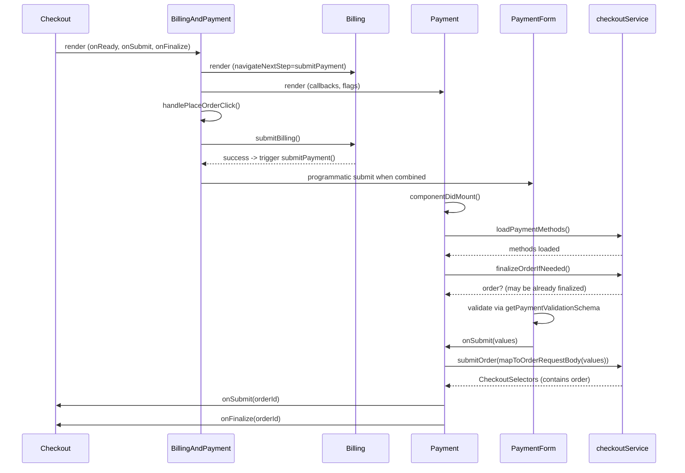

# Payments Flow

## Overview
This document describes the end-to-end payment flow across checkout steps, focusing on how `BillingAndPayment`, `Payment`, and `PaymentForm` collaborate to submit an order.

## Sequence

## Key Responsibilities
- `BillingAndPayment`: couples Billing and Payment UX, exposes a single "Place Order" action; wires readiness via context.
- `Payment`: loads methods, handles spam thresholds, finalization, modal errors, and orchestrates `submitOrder`.
- `PaymentForm`: renders methods, store credit, terms, spam, and submits sanitized `PaymentFormValues`.

## Error Handling
- Cart changed: surfaced via `onCartChangedError` for host remediation.
- Provider/validation errors: mapped to localized messages; may trigger reloads or redirects based on headers.
- Spam protection: toggles `didExceedSpamLimit` and reloads checkout when necessary.

## Multi-shipping and Embedded
- Multi-shipping filters incompatible methods.
- Embedded flows check `checkEmbeddedSupport` and can raise an embedded support modal.

## Analytics Hooks
- `clickPayButton`, `paymentComplete`, `paymentRejected`, and `selectedPaymentMethod` emitted from `Payment`.

