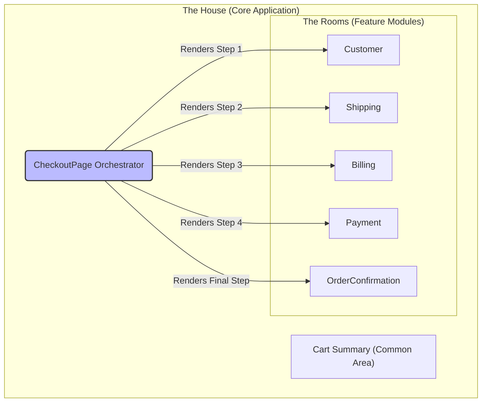

---
**Title:** The Principal Architectural Schema (The "Building Structure")
**Purpose:** To define the foundational architectural structure of the application, serving as the "floor plan" upon which all other systems are built.
**Audience:** All Developers, Architects
**Maintenance:** Update only if a major feature module is added, removed, or fundamentally changed.
---

# The Principal Architectural Schema (The "Building Structure")

This document defines the highest level of architectural abstraction for the `checkout-js` application. Before we can understand the "wiring" (like State Management or Error Handling), we must first understand the "building structure" itself. This guide, and the documentation suite it governs, follows the **"Blueprint-First Documentation"** approach.

## 1. The Architectural Metaphor: A House and its Rooms

From an engineering perspective, the application is structured like a house:

*   **The House:** Represents the entire `core` application package, the boundary for the main user-facing experience.
*   **The Rooms:** Are the primary, self-contained **feature modules** within the `core` package. Each room encapsulates a major piece of checkout functionality and has clear boundaries.
*   **The Hallway:** Is the central **`CheckoutPage` orchestrator**. It doesn't contain business logic itself, but it controls the flow, sequencing which "room" is presented to the user at which time.

## 2. Architectural Rationale: Why These Rooms?

This architectural decomposition is not arbitrary. The "rooms" are defined based on the core principle of **Separation of Concerns**, where each module has a single, well-defined responsibility.

Critically, this separation is aligned directly with the **distinct, sequential steps of the user's checkout journey**. This makes the architecture intuitive to reason about, as the code structure mirrors the user's experience. This document and its terminology now serve as the foundational blueprint for all subsequent "wiring diagrams."

## 3. The "Rooms" (Core Feature Modules)

The application is composed of the following primary feature modules:

| Module / "Room"     | Architectural Responsibility                                     |
| ------------------- | ---------------------------------------------------------------- |
| `Customer`          | Handles guest/login forms and customer information capture.      |
| `Shipping`          | Manages shipping address form and shipping option selection.     |
| `Billing`           | Manages the billing address form.                                |
| `Payment`           | Manages payment method selection and final submission logic.     |
| `OrderConfirmation` | Displays the final order summary after a successful checkout.    |
| `Cart`              | Provides the persistent cart summary, a common area visible from most other rooms. |

## 4. The "Floor Plan" (Structural Diagram)

The following diagram illustrates the structural layout of the application. It shows how the central `CheckoutPage` orchestrator renders and controls the flow between the primary feature modules.

