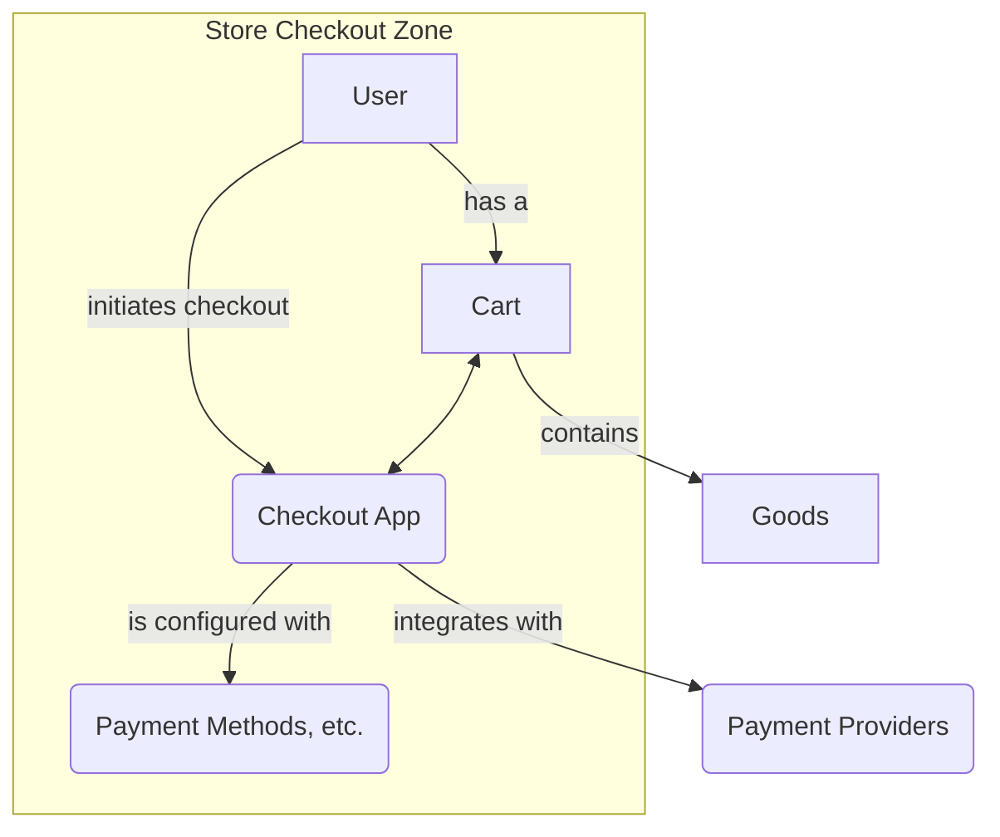
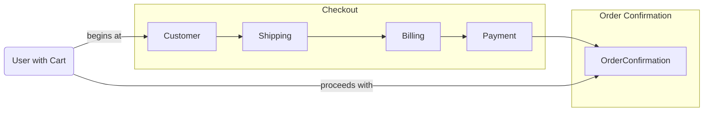

---
**Title:** The Architectural Narrative
**Purpose:** To provide a comprehensive, high-level introduction to the checkout architecture, its core entities, and the principles that govern it.
---

# The Architectural Narrative

The Checkout journey begins when a **User** enters the **Store Checkout Zone**, the self-contained application for the entire checkout process.

The following diagram illustrates the high-level relationship between these core entities at the start of the checkout.

## The Initial Context

The User arrives with a **Cart** full of products. This initial state—the User's context, the Cart's contents, and the Zone's rules—forms the foundation for the journey ahead.

### The User

The User is the entity initiating the checkout. They possess characteristics that define their identity and capabilities.

*   **Identity State:** The user is either **Known** (an authenticated, registered customer) or **Unknown** (a guest). This is the primary characteristic that determines the starting point of the journey.
*   **Saved Data (for Known users):** A Known user brings with them a portfolio of previously saved data, including shipping addresses, billing addresses, and vaulted payment instruments. An Unknown user has an empty portfolio.

### The Cart

The Cart is the collection of goods being purchased. Its characteristics are known from the beginning and dictate which "steps" are required.

*   **Composition:** The cart's composition is a critical characteristic, falling into one of three states: **Physical**, `Digital`, or **Mixed**. This directly controls whether the `Shipping` step is a required step.
*   **State:** The cart can be **Empty** or **Not Empty**. An empty cart is an invalid state, and the orchestrator contains explicit logic to handle this condition, preventing the normal checkout flow from proceeding.

### The Store Checkout Zone

The Store Checkout Zone represents the set of rules and capabilities configured by the merchant, defining the available paths and tools for the checkout.

*   **Available Services:** The zone's configuration defines the portfolio of available services, most notably the **Payment Methods** (e.g., Stripe, PayPal, Apple Pay) and **Shipping Options** that will be offered to the user.
*   **Enabled Features:** The environment includes a set of feature flags that alter the journey's rules, such as **Multi-Shipping Enabled**, **Guest Checkout Enabled**, and **Billing Same as Shipping Enabled**.

### Key Architectural Implications

*   **The Store Checkout Zone as the Central Authority:** The `Store Checkout Zone` is the central authority for the checkout. It dictates the rules (via `Settings`), integrates with external **Payment Providers**, and is the ultimate source of truth for validating the state of the `Cart`.
*   **Configuration-Driven Checkout:** The `Settings` entity (Payment Methods, Shipping Options, feature flags) is distinct from the `Store Checkout Zone`'s core operations. This illustrates a highly configurable system where the rules of the checkout journey are injected by the environment, not hardcoded into the application logic.
*   **The Cart as the Source of Truth:** The `Cart` is the persistent, authoritative source of truth for the contents and state of the transaction. The `Checkout Zone` and its `Steps` read from the `Cart` at key moments to make decisions (e.g., to determine if the `Shipping` step is required), but they do not engage in a "continuous synchronization" with it.

## The Checkout Journey

The Zone is a space designed for a seamless, logical progression through a series of checkout **Steps**. The following diagram illustrates the conceptual, "maximal" journey, showing all possible steps in their standard sequence. The next document, "The Checkout Flow," details the specific rules and conditional branches that allow steps to be bypassed.

This journey — of a User with a Cart being guided through a series of Steps—is the key to understanding our architecture.
