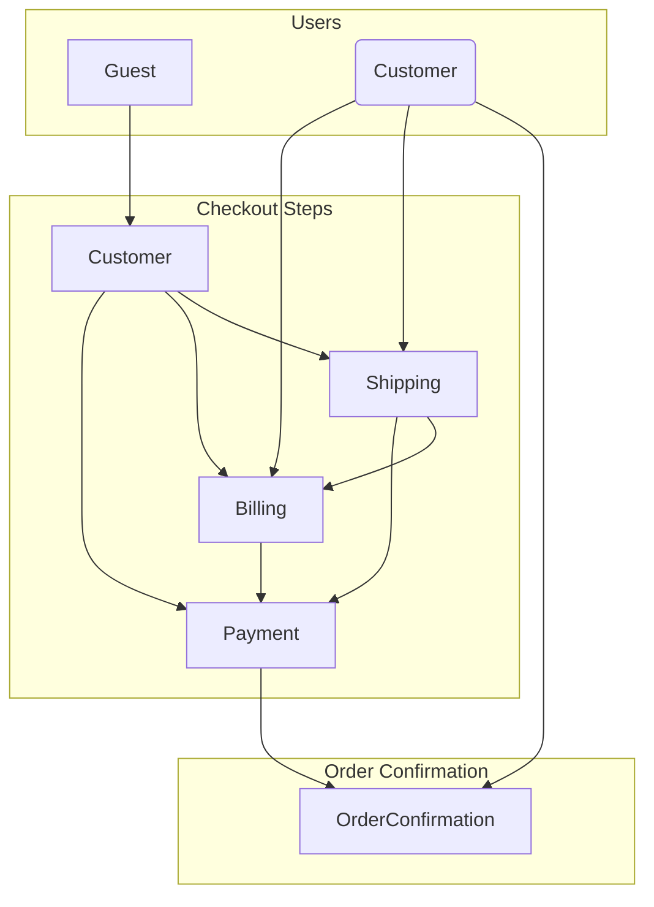
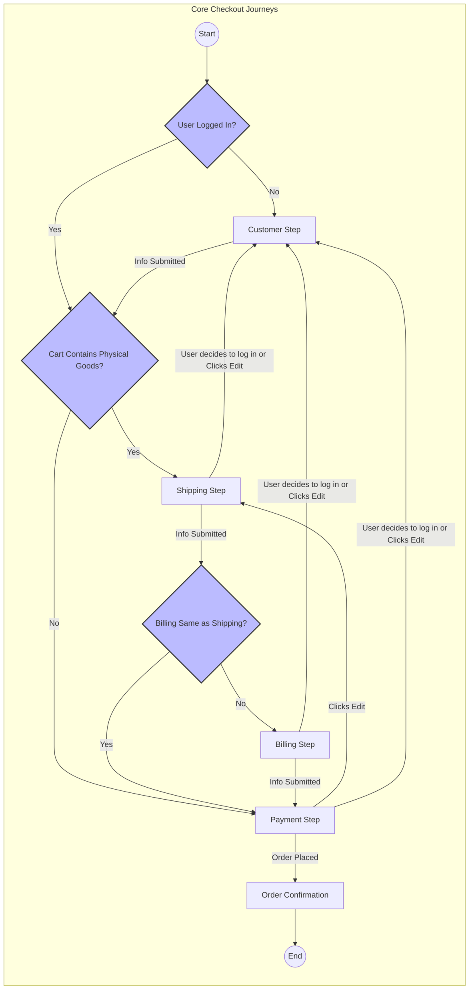

# The Checkout Flow: Journeys & Orchestration

This document provides a complete map of the checkout flow within the Store Checkout Zone. It is structured in two parts:

1.  **The Map of Possibilities:** This section shows all valid, user-driven state transitions. It answers the question: "From any given step, where *can* the user navigate?"
2.  **The Rules of the Road:** This section details the orchestrated business logic and conditional branches that guide a user along the "happy paths." It answers the question: "Given the user's context, where *will* the system send them next?"

## 1. The Map of Possibilities (User State Transitions)

The following diagram models the two primary user types—`Guest` and `Customer`—as distinct actors and shows all valid, user-initiated transitions between the checkout steps. Its purpose is to show what is *possible*, not why a particular path is chosen in a specific scenario.

## 2. The Rules of the Road (Orchestrated Journeys)

While a user can navigate between many steps, the application's orchestration logic guides them through a series of **Core Checkout Journeys**. These are the primary "happy paths" a user follows to complete a purchase, including the major architectural branches created by business logic.

### Branch 1 (Entry Point): Guest vs. Registered User
The first branch occurs at the very beginning of the journey and is based on the user's authentication state.

*   **If the user is a Guest,** their journey begins at the **`Customer` Step** to capture their identity.
*   **If the user is Registered and logged-in,** they bypass the `Customer` Step and their journey begins at the **`Shipping` Step**.

### Branch 2 (Mid-Journey): Physical vs. Digital Goods
The second major branch occurs after the user has been identified and is based on the contents of their cart.

*   **If the cart contains any Physical Goods,** the user must proceed through the **`Shipping` Step** to provide a delivery address.
*   **If the cart contains only Digital Goods,** the user bypasses the `Shipping` Step entirely and proceeds directly to the **`Payment` Step**.

### Branch 3 (Post-Shipping): Billing Address
The third branch occurs after the user completes the `Shipping` Step.

*   **If the user indicates their Billing Address is the same as their Shipping Address,** they bypass the **`Billing` Step** and proceed directly to the **`Payment` Step**.
*   **If the billing address is different,** the user must complete the **`Billing` Step** before payment.

### Branch 4 (In-Step Fork): Multi-Shipping
A major fork can occur *within* the `Shipping` Step itself if the user has multiple physical goods.

*   **Standard Shipping:** The user provides a single address for all items.
*   **Multi-Shipping:** The user can assign different shipping addresses to different items in their cart. This significantly changes the UI and logic within the `Shipping` Step.

### Combined Journey State Diagram

The following `graph` diagram is the definitive, high-level map of the orchestrated checkout flow. It visualizes all of the major conditional branches and shows all possible "happy paths" through the application's steps.

