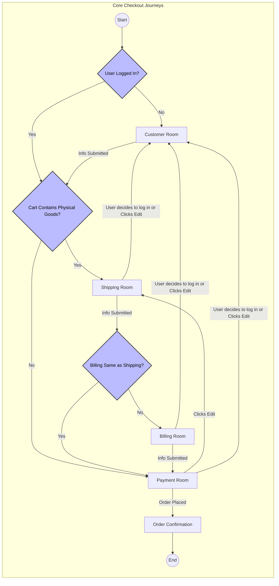

---
**Title:** The Checkout Journey (The "Happy Path")
**Purpose:** To provide the narrative context for the Principal Architectural Schema by detailing the primary user flow.
**Audience:** All Developers, Product Managers, QA
**Maintenance:** Update only if the core checkout flow changes.
---

# The Checkout Journey (The "Happy Path")

## 1. Introduction

This document provides the essential narrative context for the `01-principal-architectural-schema.md`. While the schema shows the static "floor plan," this guide describes the **Core Checkout Journeys**—the primary "happy paths" a user follows to complete a purchase, including the major architectural branches created by business logic.

Understanding these core flows and their major branches is key to understanding the application's conditional orchestration logic.

## 2. The Core Checkout Journeys & Their Major Branches

The checkout journey is not a single path, but a flow with two primary conditional branches that determine the sequence of "rooms" a user will visit.

### Branch 1 (Entry Point): Guest vs. Registered User

The first branch occurs at the very beginning of the journey and is based on the user's authentication state.

*   **If the user is a Guest,** their journey begins at the **`Customer` Room** to capture their identity.
*   **If the user is Registered and logged-in,** they bypass the `Customer` Room and their journey begins at the **`Shipping` Room**.

### Branch 2 (Mid-Journey): Physical vs. Digital Goods

The second major branch occurs after the user has been identified and is based on the contents of their cart.

*   **If the cart contains any Physical Goods,** the user must proceed through the **`Shipping` Room** to provide a delivery address.
*   **If the cart contains only Digital Goods,** the user bypasses the `Shipping` Room entirely and proceeds directly to the **`Payment` Room**.

### Branch 3 (Post-Shipping): Billing Address
The third branch occurs after the user completes the `Shipping` Room.

*   **If the user indicates their Billing Address is the same as their Shipping Address,** they bypass the **`Billing` Room** and proceed directly to the **`Payment` Room**.
*   **If the billing address is different,** the user must complete the **`Billing` Room** before payment.

### Branch 4 (In-Step Fork): Multi-Shipping
A major fork can occur *within* the `Shipping` Room itself if the user has multiple physical goods.

*   **Standard Shipping:** The user provides a single address for all items.
*   **Multi-Shipping:** The user can assign different shipping addresses to different items in their cart. This significantly changes the UI and logic within the `Shipping` Room.

## 3. Combined Journey State Diagram

The following `graph` diagram is the definitive, high-level map of the checkout flow. It visualizes all of the major conditional branches and shows all possible "happy paths" through the application's "rooms."

