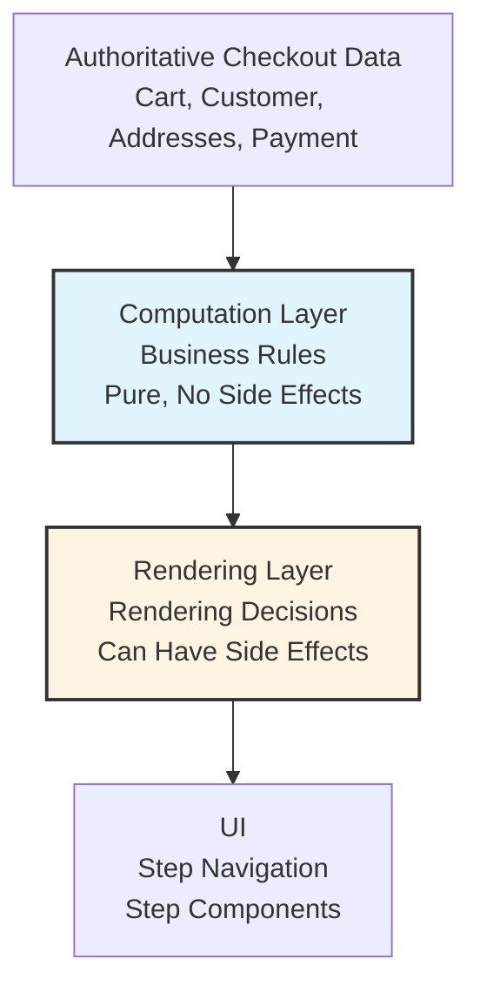

# The Step Progression Rules: Architectural Patterns for Flow Control

This document explains *how* the system determines checkout step progression to enable flow control. While `02-the-checkout-flow.md` describes *what* paths users can take, this document focuses on the architectural patterns that make step progression determination possible.

## 1. The Derived State Pattern

Step progression information is **computed** from authoritative checkout data (cart, customer, addresses, payment methods) whenever needed, rather than stored as separate state.

**Why this pattern:**
- **Eliminates synchronization issues:** Computed information always reflects current data
- **Enables state restoration:** After page reload, progression can be recomputed from persisted data
- **Single source of truth:** Checkout data is authoritative; progression is a derived view

**The computation is pure:** No side effects, produces the same output for the same input. This makes it predictable and testable.

**Separation from presentation:** The computation layer is architecturally separate from the UI rendering layer. The UI consumes computed information but does not participate in computation.

## 2. The Business Rules Architecture

All business rules determining step progression are **centralized** in one architectural layer and **isolated by step type** (Customer, Shipping, Billing, Payment).

**Centralization:** Rules are easy to locate, modify, and test. When a rule changes, there's a single authoritative location.

**Isolation by step:** Changes to one step's rules don't affect other steps, enabling parallel development and reducing regression risk.

**The four dimensions of step state:**

The system computes four dimensions for each step:

- **Completion:** Whether the step has sufficient data to be considered finished. A complete step has all required information filled in.
- **Requirement:** Whether the step must be completed for checkout to proceed. Required steps cannot be skipped.
- **Editability:** Whether a completed step can be modified. Editable steps allow users to go back and change information.
- **Activation:** Which step is currently the user's focus. Only one step is active at a time, determining what content is displayed.

**The decisions made:**

**Completion decisions:**
- Customer step: Complete if email exists OR wallet payment is selected (see `03a-the-customer-step.md` for details)
- Shipping step: Complete if shipping address exists AND shipping options selected AND all items assigned (see `03b-the-shipping-step.md` for details)
- Billing step: Complete if billing address exists OR wallet payment is selected (see `03c-the-billing-step.md` for details)
- Payment step: Complete if order is complete (see `03d-the-payment-step.md` for details)

**Requirement decisions:**
- Customer step: Always required
- Shipping step: Required only if cart contains physical goods that need shipping (see `03b-the-shipping-step.md` for details)
- Billing step: Always required (see `03c-the-billing-step.md` for details)
- Payment step: Always required (see `03d-the-payment-step.md` for details)

**Editability decisions:**
- A step is editable only if: (1) the step itself is complete, (2) all previous required steps are complete, (3) order is not being submitted
- Customer step: Editable only for guest users not using wallet payments (see `03a-the-customer-step.md` for details)
- Wallet payments: Steps become non-editable once wallet is selected

**Activation decisions:**
- Active step is the first incomplete required step
- If all required steps are complete, the last step becomes active

**Global checkout-level rules:**

Beyond step-specific rules, there are business rules that apply globally to the checkout flow:

- **Step visibility:** Only required steps are rendered in the UI. Non-required steps are filtered out before rendering.
- **Empty cart handling:** If the cart becomes empty during checkout, the checkout flow is replaced with an empty cart message.
- **Error recovery:** When certain errors occur, the system navigates back to the appropriate step:
  - Cart changed error → navigate to Shipping step
  - Shipping option expired → navigate back to Shipping step if user has moved past it
- **Navigation:** After a step completes, the system navigates to the next incomplete required step (based on computed step statuses).

These global rules govern checkout flow behavior, while step-specific rules govern individual step state.

## 3. The Conditional Logic Architecture

Step progression rules vary based on context (payment methods, user types, cart composition, feature flags). The architectural decision is to **co-locate conditional logic with business rules**, not scatter it in the UI layer.

**Co-location benefits:**
- All step progression logic is in one place
- Variations are explicit and discoverable
- Easier testing and maintenance

**Variation categories:**
- **Payment methods:** Different data requirements and UX constraints (e.g., wallet payments auto-complete steps)
- **User context:** Guest vs. registered users have different starting points
- **Cart composition:** Physical vs. digital goods determine step requirements
- **Feature flags:** Experimental features can alter step progression rules

**Trade-off:** Co-locating conditional logic creates a more complex rules layer, but maintains separation of concerns—the UI doesn't need to know about payment method specifics or feature flags.

## 4. System Boundaries

The architecture maintains a clear boundary between **computation** (determines step progression) and **rendering** (uses that information to display UI).

**Computation layer responsibilities:**
- Computes step progression from checkout data
- Applies business rules
- Pure (no side effects, doesn't modify state, doesn't interact with UI)

**Rendering layer responsibilities:**
- Consumes computed step progression information
- Makes rendering decisions (which step to show, which to hide)
- Controls UI rendering
- Does not participate in computation

**The boundary contract:**
- **Data flow:** Unidirectional from computation to rendering
- **Responsibility separation:** Computation determines "what is true"; rendering decides "what to display"
- **Purity:** Computation is pure; rendering can have side effects (UI updates)

**Why this boundary matters:**
- Independent testing (computation can be tested with mock data; rendering with mock computed information)
- Independent evolution (changes to rules don't require UI changes; UI changes don't require rule changes)
- Predictable behavior (same checkout data always produces same step progression)

**Architectural Principle:** System boundaries are architectural decisions. The separation between computation and rendering enables maintainability, testability, and predictable system behavior.
