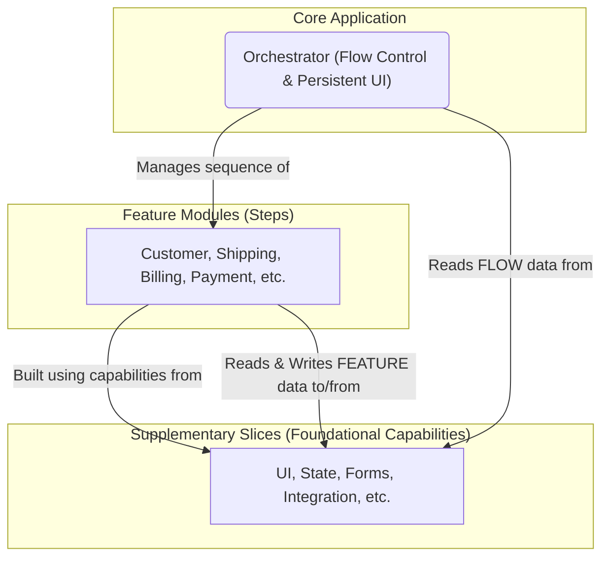

# The Architectural Structure: Core & Supplementary Slices

The `checkout-js` application is architected with a clear separation of concerns between its **Core Application**—the central business logic and persistent UI that governs the checkout flow—and its **Supplementary Slices**—the foundational, horizontal capabilities that support it.

This "Core & Supplementary" model is the key to understanding the codebase. The Core Application defines *what* the checkout process is and how it is framed, while the Supplementary Slices provide the tools for *how* it is built and executed.

## 1. High-Level Structural Diagram

The following diagram illustrates this architectural separation. It is built upon the **Hybrid Data Flow** model, where both the Core Application and the Feature Modules establish their own, independent connections to the Supplementary Slices for different purposes.

## 2. The Architectural Layers

The architecture is composed of three distinct layers, each with a specific responsibility.

### 1. The Core Application (Flow Control & Persistent UI)

The Core Application is a hybrid layer responsible for the central business logic and the persistent UI of the checkout journey.

*   **Its Responsibility:** It consists of a central orchestrator with two primary purposes. First, it manages the **sequence** of user-facing steps, determining which **Feature Module** is active. Second, it renders the **persistent UI** of the page, such as the header, footer, and cart summary. It reads only the high-level state required for these tasks.

### 2. The Feature Modules (The Steps)

The Feature Modules are the discrete, user-facing steps of the checkout process.

*   **Their Responsibility:** Each module (e.g., `Customer`, `Shipping`, `Billing`, `Payment`) is responsible for handling the UI, state, and user interaction for a single step in the journey. They are the primary consumers of the foundational capabilities provided by the **Supplementary Slices**, establishing their own direct connections to them.

### 3. The Supplementary Slices (Foundational Capabilities)

The Supplementary Slices are the dedicated, horizontal systems that provide foundational, reusable capabilities used by both the Core Application and the Feature Modules to build the user experience.

*   **State Management Slice:** Provides a single source of truth for all shared application data.
*   **Forms & Validation Slice:** Provides a standardized system for managing user input and validation.
*   **UI & Component Slice:** Provides the reusable visual building blocks of the user interface.
*   **Internationalization (I18n) Slice:** Manages language translations for all user-facing text.
*   **Error Handling & Logging Slice:** Provides a centralized system for catching, logging, and displaying application errors.
*   **Integration & Extensibility Slice:** Provides a decoupled "plugin" architecture for external systems like payment providers.
