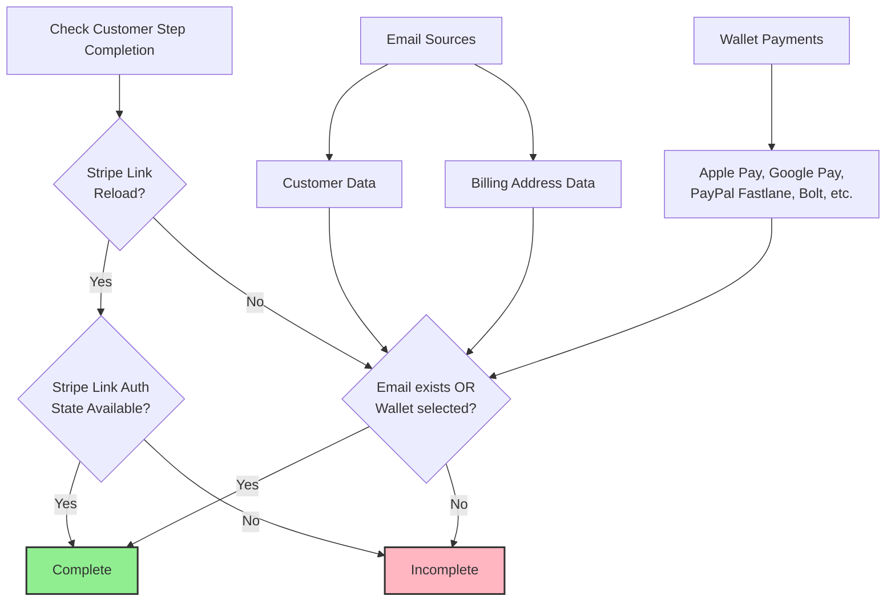
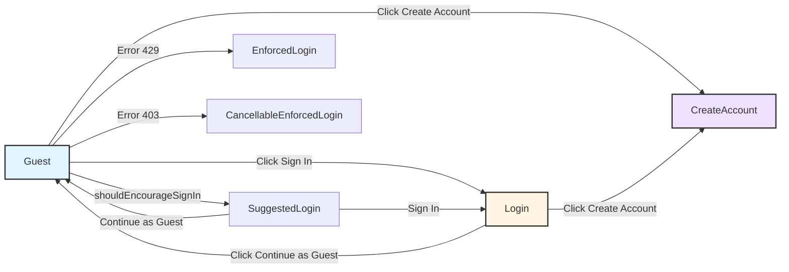
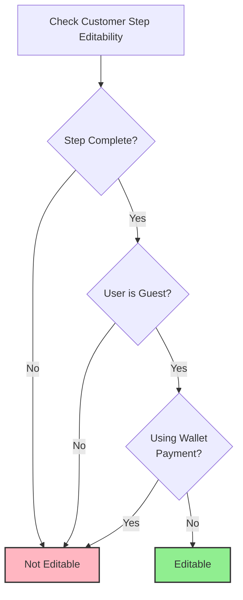
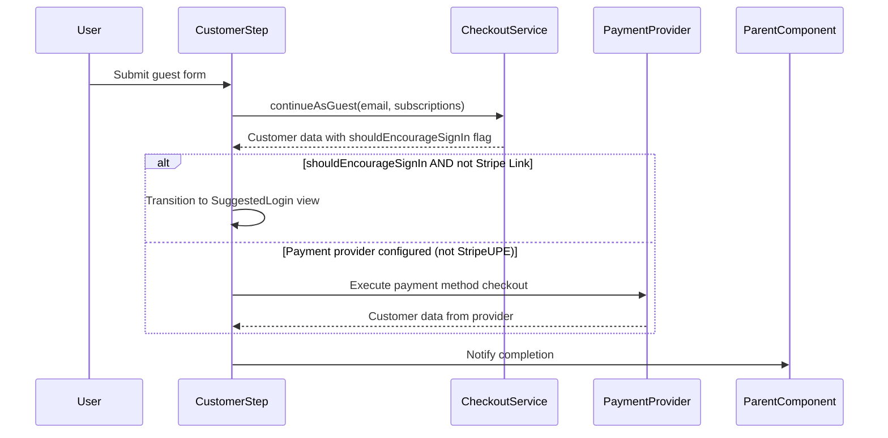
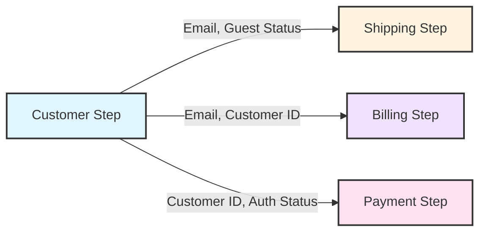

# The Customer Step: Business Rules and Logic

This document provides a deep dive into the Customer step's business rules and logic. While `02a-the-step-progression-rules.md` explains the general pattern for all steps, this document details the specific rules and behavior of the Customer step.

## 1. Customer Step Overview

The Customer step is the **first step** in the checkout flow for guest users and is responsible for customer identification. It is **always required** and serves as a prerequisite for all other steps.

**Primary responsibilities:**
- Collect customer email address (for guest checkout)
- Authenticate existing customers (login)
- Create new customer accounts
- Integrate with wallet payments for accelerated checkout
- Manage customer view type transitions (Guest, Login, CreateAccount, SuggestedLogin, EnforcedLogin, CancellableEnforcedLogin)
- Initialize and manage customer strategies for wallet payment providers

**Role in checkout flow:**
- Guest users: Must complete before proceeding
- Authenticated users: Skipped (already identified)
- Wallet payments: Auto-complete without email

## 2. Completion Logic

The Customer step is considered complete when **either** of these conditions is met:

1. **Email exists:** Email address is present in customer data or billing address data

2. **Wallet payment selected:** A wallet payment method is selected (includes Apple Pay, Google Pay variants, PayPal Commerce, Braintree PayPal, Amazon Pay, Bolt, Stripe Link, and others from the supported methods list)

**Special case - Stripe Link reload:**
When the checkout page is reloaded and Stripe Link is being used (under specific conditions: not using wallet, StripeUPE provider, has email, guest user, meets minimum amount), completion is determined by Stripe Link authentication state being available, rather than email or wallet payment status.

## 3. View Types

The Customer step can display different views based on user context and actions:

- **Guest:** For users checking out without creating an account. Shows guest form to collect email and optional information.
- **Login:** For existing customers to sign in with email and password.
- **SuggestedLogin:** Prompts user to log in but allows continuing as guest.
- **EnforcedLogin:** Requires user to log in (cannot continue as guest).
- **CancellableEnforcedLogin:** Requires login but can be cancelled in certain conditions.
- **CreateAccount:** For new customers to create an account during checkout.

**View type determination:**
- Initial view: Based on authentication status and guest checkout configuration
- User-initiated transitions: Triggered by user actions (clicking "Sign in", "Create account", "Continue as guest")
- Business rule transitions: 
  - **SuggestedLogin:** Triggered when customer has `shouldEncourageSignIn` flag set after continuing as guest (unless Stripe Link is authenticated)
  - **EnforcedLogin:** Triggered by error status 429 (rate limiting) when continuing as guest
  - **CancellableEnforcedLogin:** Triggered by error status 403 (forbidden) when continuing as guest
- View transitions: Triggered by business rules, error conditions, and user choices

## 4. Wallet Payment Integration

Wallet payments (including Apple Pay, Google Pay variants, PayPal Commerce, Braintree PayPal, Amazon Pay, Bolt, Stripe Link, and other supported methods) have special integration with the Customer step:

**Auto-completion:**
- When a wallet payment is selected, the Customer step automatically becomes complete
- No email address is required when using wallet payments
- Wallet payments provide customer information directly from the payment provider

**Editability:**
- When wallet payment is used, the Customer step becomes **non-editable**
- Editability logic: Editable only if step is complete AND user is guest AND not using wallet payment

**Wallet button visibility:**
- Wallet buttons are only displayed when all of these conditions are met:
  - Payment data is required for checkout
  - Customer is a guest user (not authenticated)
  - Supported wallet payment methods are available
- If any condition is not met, wallet buttons are not rendered

**Wallet button placement:**
- Wallet buttons can appear at the top or bottom of the Customer step
- Placement is configurable
- Wallet buttons trigger customer strategy initialization when clicked

## 5. Customer Strategies

Customer strategies are payment-provider-specific integrations that can automatically provide customer data:

**Supported strategies:**
- Stripe Link V2 (StripeUPE)
- Stripe UPE Customer Strategy
- Bolt
- BigCommerce Payments Fastlane
- Braintree Fastlane
- PayPal Commerce Fastlane

**Strategy initialization:**
- Strategies are initialized when a payment provider with custom checkout is configured
- Initialization happens when the Customer step is displayed
- **Exception:** StripeUPE provider is handled separately and does not trigger standard strategy initialization
- Strategies can provide customer data automatically, affecting step completion

**Payment method checkout execution:**
- When continuing as guest, if a payment provider with custom checkout is configured (except StripeUPE), the system executes payment method checkout before proceeding
- This allows wallet payments to complete customer identification during the guest flow
- StripeUPE follows a different flow and does not execute payment method checkout at this stage

**Stripe Link special handling:**
- When Stripe Link is used and checkout page is reloaded, completion logic changes
- Completion depends on Stripe Link authentication state rather than email

## 6. Editability Rules

The Customer step is editable only when **all** of these conditions are met:

1. **Step is complete:** The step has sufficient data (email or wallet payment)
2. **User is guest:** The customer is a guest user (not authenticated)
3. **Not using wallet:** No wallet payment method is selected

**Editability logic:**
Editable only if: step is complete AND user is guest AND not using wallet payment

## 7. Step Lifecycle and Actions

**Initialization (on mount):**
- Initializes customer strategies if payment provider with custom checkout is configured (except StripeUPE)
- Supported strategies: BigCommerce Payments Fastlane, Braintree Fastlane, PayPal Commerce Fastlane, Bolt, Stripe UPE Customer Strategy, Stripe Link V2
- Sets step ready state and notifies parent component
- Initializes draft email from existing customer email

**Cleanup (on unmount):**
- Deinitializes customer strategies to clean up payment provider integrations

**User actions the step performs:**
- **Sign in:** Authenticates existing customer with credentials, clears draft email, notifies parent component
- **Continue as guest:** Submits guest credentials with email and subscription preferences, handles business rule transitions (SuggestedLogin), executes payment method checkout if configured, notifies parent component
- **Create account:** Creates new customer account from form values, notifies parent component
- **Send login email:** Sends password reset/login email to user
- **Email entry:** Tracks email entry for analytics
- **View type changes:** Manages transitions between Guest, Login, CreateAccount views based on user actions

**Continue as Guest Flow:**

**Business rule actions:**
- **SuggestedLogin transition:** Triggers when `shouldEncourageSignIn` flag is set after continuing as guest (unless Stripe Link is authenticated)
- **EnforcedLogin transition:** Triggers on error 429 (rate limiting)
- **CancellableEnforcedLogin transition:** Triggers on error 403 (forbidden)
- **Payment method checkout execution:** Executes payment method checkout when continuing as guest if provider with custom checkout is configured (except StripeUPE)

**Error handling:**
- **Empty cart error:** Notifies parent component of error
- **Update subscriptions error:** Allows continuing as guest despite error
- **Payment method client invalid error:** Allows continuing as guest despite error
- **Rate limiting (429):** Transitions to EnforcedLogin view type
- **Forbidden (403):** Transitions to CancellableEnforcedLogin view type
- **Other errors:** Delegates to parent component error handler

## 8. Data Dependencies and Outputs

**Data the step reads (from checkout state):**
- **Customer object:** Customer identity, authentication status, email, guest status, firstName
- **Billing address:** Email address (as fallback source), billing address ID
- **Checkout object:** Payment methods, checkout configuration, customer message
- **Configuration:** Guest checkout settings, payment provider configuration, form field requirements, subscription settings, privacy policy URLs
- **Cart:** Cart contents (for minimum amount checks for Stripe Link)
- **Payment provider customer:** Stripe Link authentication state
- **Sign-in email:** Email login state and errors
- **Errors:** Sign-in errors, sign-in email errors, create account errors

**Data the step writes (via checkout service actions):**
- **Customer data:** Email address, subscription preferences (newsletter, abandoned cart emails)
- **Authentication:** Customer credentials
- **Account creation:** New customer account data
- **Login email:** Password reset/login email
- **Payment provider customer:** Customer strategy initialization/deinitialization
- **Payment method checkout:** Executes payment method checkout

**Data flow:**
- Step reads from authoritative checkout state
- Step writes customer data via checkout service actions
- Step manages local state for UI (draft email, email login form state, ready state)

## 9. Prerequisites

**No prerequisites:**
- Customer step is the first step in the checkout flow
- No previous steps must be completed
- Step can be displayed immediately when checkout loads

**Initialization requirements:**
- Checkout data must be loaded (checkout, config, cart, customer)
- Configuration must be available
- Customer object must be available (even if guest)

## 10. Integration Boundaries

**External systems integrated:**
- **Wallet payment providers:** Apple Pay, Google Pay, PayPal Fastlane, Braintree Fastlane, BigCommerce Payments Fastlane, Bolt, Stripe Link
- **Customer strategies:** Payment-provider-specific customer data providers (initialized/deinitialized by step)
- **Authentication service:** Customer sign-in and account creation (via checkout service)
- **Analytics service:** Customer action tracking (email entry, payment method execution)

**Integration patterns:**
- **Customer strategies:** Step initializes/deinitializes strategies on mount/unmount when payment provider with custom checkout is configured
- **Wallet payments:** Step executes payment method checkout when continuing as guest, allowing wallet payments to provide customer data automatically
- **Stripe Link:** Special handling for page reload scenarios with authentication state preservation (step reads this state)

## 11. Architectural Decisions and Trade-offs

### Decision: View Type State Machine Pattern

**Why:** The Customer step uses a state machine pattern (Guest → Login → CreateAccount → SuggestedLogin → EnforcedLogin → CancellableEnforcedLogin) rather than separate components for each view.

**Trade-offs:**
- **Pros:** Single component reduces code duplication, shared state management, easier to maintain transitions
- **Cons:** Component complexity increases, harder to test individual views in isolation, view logic is coupled

**Alternative Considered:** Separate components for each view type
- **Rejected because:** Would require prop drilling for shared state (email, draft values), harder to coordinate transitions, more boilerplate

**Design Constraint:** View transitions must be reversible (user can go back), which favors state machine over component mounting/unmounting.

### Decision: Customer Strategy Pattern

**Why:** Payment providers (Stripe Link, Bolt, PayPal Fastlane) can provide customer data automatically, but each has different initialization requirements and data structures.

**Trade-offs:**
- **Pros:** Extensible - new payment providers can be added without modifying core Customer step logic, provider-specific logic is isolated
- **Cons:** Initialization complexity, requires cleanup on unmount, provider-specific edge cases (e.g., StripeUPE exception)

**Alternative Considered:** Hard-coded provider checks in Customer component
- **Rejected because:** Would require Customer component changes for every new provider, violates Open/Closed Principle

**Design Constraint:** Strategies must initialize/deinitialize cleanly to prevent memory leaks and payment provider state conflicts.

### Decision: Wallet Payment Auto-Completion

**Why:** Wallet payments (Apple Pay, Google Pay, etc.) provide customer email and billing information, so manual email entry becomes redundant.

**Trade-offs:**
- **Pros:** Faster checkout, better UX, reduces friction
- **Cons:** Step becomes non-editable after wallet selection (data comes from provider), creates special completion path

**Alternative Considered:** Require email even with wallet payments
- **Rejected because:** Would add unnecessary friction, wallet payments already provide verified customer data

**Design Constraint:** Once wallet payment provides data, step must prevent editing to maintain data integrity with payment provider.

### Decision: Stripe Link Special Handling

**Why:** Stripe Link authentication state persists across page reloads, but email might not be immediately available. Completion logic must check authentication state first.

**Trade-offs:**
- **Pros:** Preserves user session across reloads, better UX
- **Cons:** Adds complexity to completion logic, creates special case in otherwise simple OR logic

**Alternative Considered:** Always require email, ignore Stripe Link state
- **Rejected because:** Would break user experience on page reload, lose authentication state

**Design Constraint:** Completion logic must handle both "email OR wallet" and "Stripe Link auth state" paths without conflicts.

### Decision: Error-Driven View Transitions

**Why:** Rate limiting (429) and forbidden (403) errors trigger enforced login views, but these are business rules, not just error handling.

**Trade-offs:**
- **Pros:** Security and rate limiting enforced at step level, clear user feedback
- **Cons:** Error handling logic mixed with view state management, harder to test

**Alternative Considered:** Handle errors at orchestrator level, show generic error
- **Rejected because:** User needs specific guidance (must log in), generic errors don't help

**Design Constraint:** Error codes must map to specific view transitions, requiring tight coupling between error handling and view state.

## 12. Evolution and Extension Points

**Adding New View Types:**
- Add new state to CustomerViewType enum
- Add transition logic in Customer component
- Update view type diagram
- **Risk:** View type transitions become complex, state machine grows

**Adding New Customer Strategies:**
- Implement strategy interface (initialize/deinitialize)
- Add to strategy list in Customer component initialization
- Handle provider-specific edge cases
- **Risk:** Strategy initialization order matters, cleanup must be reliable

**Adding New Wallet Payments:**
- Add to supported methods list
- Ensure wallet provides customer data
- Update completion logic if needed
- **Risk:** Each wallet has different data structures, may require custom handling

**Changing Completion Logic:**
- Currently: Email OR wallet OR Stripe Link auth
- **Extension point:** Add new completion conditions (e.g., phone number, social login)
- **Risk:** Completion logic becomes complex, harder to reason about

## 13. Cross-Step Interactions

**Impact on Subsequent Steps:**
- **Shipping step:** Requires customer email from Customer step completion
- **Billing step:** May use customer email as fallback for billing address email
- **Payment step:** Customer authentication status affects payment method availability

**Dependencies from Previous Steps:**
- None - Customer step is the first step

**Data Flow Between Steps:**

**Shared State:**
- Customer object (email, guest status, authentication) - read by all subsequent steps
- Payment provider customer data - may affect Payment step payment method filtering

---

**Architectural Principle:** The Customer step's business rules are isolated from other steps. Changes to Customer step logic (completion, editability, view types) do not affect Shipping, Billing, or Payment steps, enabling independent evolution and reducing regression risk.

