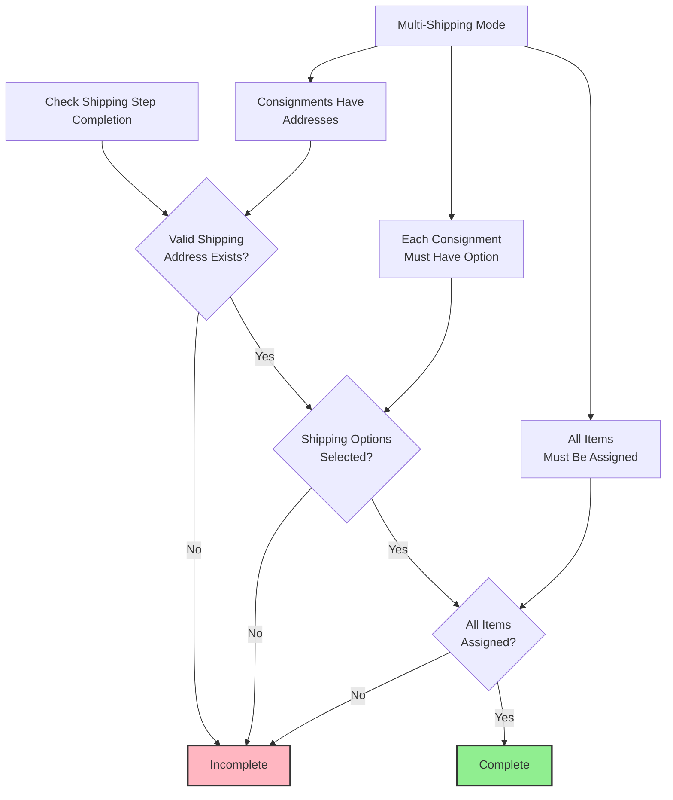
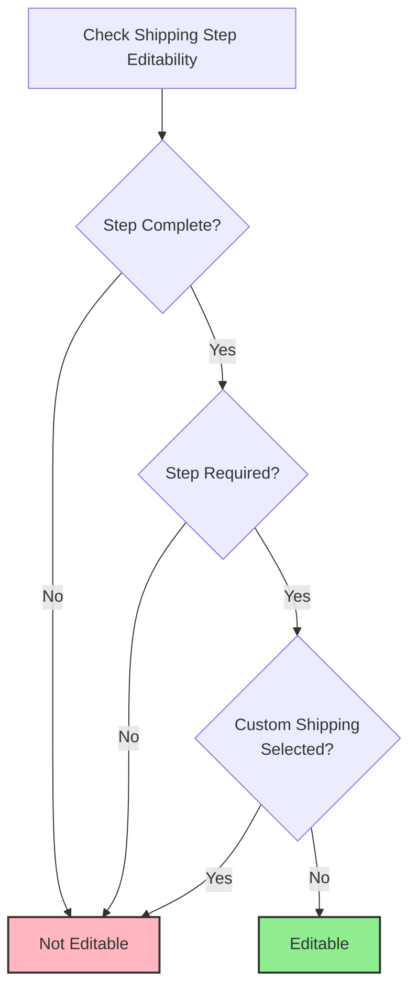
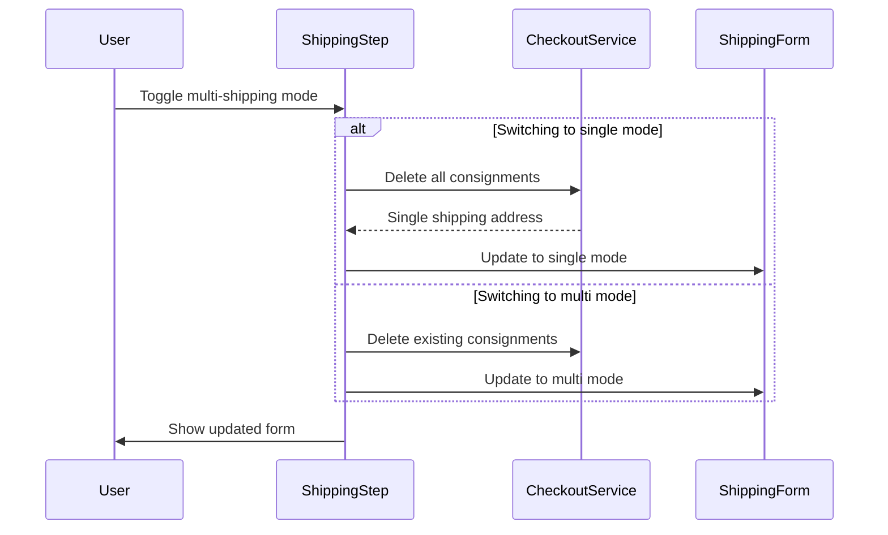
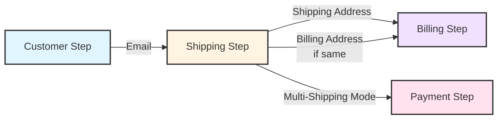

# The Shipping Step: Business Rules and Logic

This document provides a deep dive into the Shipping step's business rules and logic. While `02a-the-step-progression-rules.md` explains the general pattern for all steps, this document details the specific rules and behavior of the Shipping step.

## 1. Shipping Step Overview

The Shipping step occurs **after** the Customer step and is responsible for collecting shipping destination addresses and shipping method selections. It is **conditionally required**—only needed when the cart contains physical goods that need shipping.

**Primary responsibilities:**
- Collect shipping destination address(es)
- Select shipping method(s) for each consignment
- Assign cart items to shipping consignments
- Support both single-address and multi-address shipping

**Role in checkout flow:**
- Physical goods: Required and must be completed
- Digital goods only: Skipped
- Multi-shipping: Allows different items to ship to different addresses

## 2. Completion Logic

The Shipping step is considered complete when **all** of these conditions are met:

1. **Valid shipping address exists:** A complete and valid shipping address is present
2. **Shipping options selected:** Shipping methods are selected for all consignments
3. **All items assigned:** Every cart item is assigned to a consignment (no unassigned items)

## 3. Requirement Logic

The Shipping step is **conditionally required** based on cart composition:

**Required when:**
- Cart contains items that require shipping:
  - Physical items with `isShippingRequired` flag set to true
  - Custom items (if any custom items exist in cart)
- Determined by cart items and store configuration

**Not required when:**
- Cart contains only digital goods (no shipping needed)
- All items are non-shippable (no physical items requiring shipping and no custom items)

## 4. Multi-Shipping Mode

Multi-shipping mode allows users to assign different cart items to different shipping addresses:

**How it works:**
- User can create multiple consignments (shipping groups)
- Each consignment has its own shipping address
- Each consignment requires a shipping option selection
- All cart items must be assigned to exactly one consignment

**Completion in multi-shipping:**
- Same completion criteria apply: address AND options AND all items assigned
- Shipping options check applies to ALL consignments (each must have an option selected)
- Item assignment check ensures all items are assigned across all consignments
- Address validation works at the consignment level (each consignment has its own address)

**Multi-shipping visibility:**
- Multi-shipping option is shown when ALL of these conditions are met:
  - Multi-shipping feature is enabled in configuration
  - No payment method with custom checkout is configured
  - Cart has more than one shippable item (promotional items are excluded from count)

**Multi-shipping detection:**
- System detects multi-shipping mode when:
  - More than one consignment exists, OR
  - Consignments have items assigned AND there are unassigned items

**Multi-shipping restrictions:**
- Promotional items conflict with multi-shipping mode (see Promotional Items Conflict section)
- Requires multi-shipping feature to be enabled in configuration

## 5. Promotional Items Conflict

Promotional items conflict with multi-shipping mode:

**Conflict detection:**
- When promotional items exist in the cart AND multi-shipping mode is active, a conflict is detected
- Promotional items are items added by promotion (not purchased directly)

**Conflict resolution:**
- System shows a modal indicating multi-shipping is unavailable
- Forces automatic switch to single shipping mode
- Prevents user from proceeding with multi-shipping when promotional items are present
- User must acknowledge the switch before continuing

**Why this restriction:**
- Promotional items have special handling that conflicts with multi-address shipping
- This business rule maintains promotional item benefits and prevents order processing conflicts
- Promotional items are also excluded from item assignment requirements (they don't need to be assigned to consignments)

## 6. Custom Shipping Options

Custom shipping options are special shipping methods that require manual processing:

**What they are:**
- Shipping methods marked as "custom" type
- Typically used for manual order processing or special handling
- Determined by feature flag and shipping option configuration

**Impact on editability:**
- When custom shipping is selected: Shipping step becomes **non-editable**

**Custom shipping detection:**
- System checks if any selected shipping option has type "custom"
- If custom shipping is detected, editability is disabled

## 7. Editability Rules

The Shipping step is editable only when **all** of these conditions are met:

1. **Step is complete:** The step has sufficient data (address, options, all items assigned)
2. **Step is required:** The step is required for this checkout (cart has physical goods)
3. **Not custom shipping:** No custom shipping option is selected

**Editability logic:**
Editable only if: step is complete AND step is required AND custom shipping NOT selected

## 8. Step Lifecycle and Actions

**Initialization (on mount):**
- Loads shipping address fields (country-specific)
- Loads shipping options
- Loads billing address fields (for "billing same as shipping" feature)
- Detects promotional items conflict with multi-shipping mode and shows modal if needed
- Sets step ready state and notifies parent component

**User actions the step performs:**
- **Single shipping submit:** Updates shipping address (if changed), updates billing address (if "billing same as shipping" selected and no remote billing), updates customer message (if changed), navigates to next step
- **Multi shipping submit:** Updates customer message (if changed), navigates to next step
- **Multi-shipping mode switch:** Switches between single and multi-shipping modes, deletes consignments when switching to single mode, updates shipping address when switching to multi mode
- **Promotional items conflict resolution:** Forces switch to single shipping mode when conflict detected, shows confirmation modal

**Multi-Shipping Mode Switch Flow:**

**Special rendering:**
- Renders Stripe shipping form if StripeUPE provider is configured and customer has no email and countries are loaded
- Otherwise renders standard shipping form (single or multi-shipping based on mode)

**Error handling:**
- All errors are delegated to parent component error handler

## 9. Data Dependencies and Outputs

**Data the step reads (from checkout state):**
- **Shipping address:** Current shipping destination address
- **Consignments:** Shipping groups with addresses and shipping options
- **Cart:** Cart contents (for item assignment validation, promotional items detection, shippable items count)
- **Shipping address fields:** Country-specific field requirements for validation
- **Billing address:** Current billing address (for comparison and "billing same as shipping" feature)
- **Configuration:** Multi-shipping settings, custom shipping feature flags, order comments settings
- **Customer:** Customer object (for email check, guest status)
- **Customer message:** Order comments from checkout
- **Countries:** Available shipping countries
- **Payment method:** Active payment method ID (for remote billing detection, multi-shipping visibility)

**Data the step writes (via checkout service actions):**
- **Shipping address:** Updated shipping destination address
- **Consignments:** Created, updated, or deleted (managed by shipping form components)
- **Billing address:** Updated billing address (if "billing same as shipping" selected and no remote billing)
- **Customer message:** Order comments
- **Item assignments:** Cart items assigned to consignments

**Data flow:**
- Step reads from authoritative checkout state
- Step writes shipping data via checkout service actions
- Step manages local state for UI (initialization state, multi-shipping unavailable modal state)

## 10. Prerequisites

**Required prerequisites:**
- **Customer step must be complete:** Customer identification is required before shipping address collection
- Customer email must exist (from Customer step completion)

**Initialization requirements:**
- Shipping address fields must be loaded (country-specific)
- Shipping options must be loaded
- Billing address fields must be loaded (for "billing same as shipping" feature)

## 11. Integration Boundaries

**External systems integrated:**
- **Shipping providers:** Shipping option providers and rate calculators (loaded on initialization)
- **Address validation services:** Address validation and field requirements (loaded on initialization)
- **Payment providers:** Remote billing detection (Amazon Pay) - determines if billing address can be updated
- **Stripe integration:** StripeUPE shipping form rendering (when StripeUPE provider is configured)

**Integration patterns:**
- **Shipping options:** Step loads shipping options on mount, options are provided by shipping providers based on address
- **Address validation:** Step loads country-specific field requirements on mount
- **Multi-shipping:** Step manages consignment creation/update/deletion through shipping form components
- **Stripe integration:** Step conditionally renders Stripe shipping form instead of standard form when StripeUPE is configured

## 12. Architectural Decisions and Trade-offs

### Decision: Multi-Shipping as Mode, Not Separate Component

**Why:** Multi-shipping and single-shipping share most logic (address validation, shipping options), but differ in data structure (single address vs. consignments).

**Trade-offs:**
- **Pros:** Code reuse, shared validation logic, single component to maintain
- **Cons:** Component complexity, mode switching logic, conditional rendering

**Alternative Considered:** Separate MultiShipping and SingleShipping components
- **Rejected because:** Would duplicate validation, address handling, shipping option logic

**Design Constraint:** Mode switch must preserve data (convert consignments to single address or vice versa) without data loss.

### Decision: Promotional Items Conflict Resolution

**Why:** Promotional items have special handling that conflicts with multi-address shipping. System must prevent this invalid state.

**Trade-offs:**
- **Pros:** Prevents invalid orders, clear user feedback via modal
- **Cons:** Forces mode switch, user loses multi-shipping configuration

**Alternative Considered:** Allow multi-shipping, handle promotional items specially
- **Rejected because:** Promotional items can't be assigned to consignments, would break order processing

**Design Constraint:** Conflict detection must happen early (on mount) to prevent user from configuring invalid state.

### Decision: Custom Shipping Locks Editability

**Why:** Custom shipping options require manual processing. Once selected, shipping information must not change to prevent processing conflicts.

**Trade-offs:**
- **Pros:** Prevents order processing errors, maintains data integrity
- **Cons:** User cannot correct mistakes, must contact support

**Alternative Considered:** Allow editing, show warning
- **Rejected because:** Manual processing may have started, changes would cause inconsistencies

**Design Constraint:** Custom shipping detection must be reliable (check option type), editability must be enforced consistently.

### Decision: Billing Address Update from Shipping

**Why:** "Billing same as shipping" is common UX pattern, but billing address update must respect payment method constraints (e.g., Amazon Pay remote billing).

**Trade-offs:**
- **Pros:** Better UX, reduces data entry
- **Cons:** Shipping step must know about billing constraints, creates coupling

**Alternative Considered:** Always update billing, let Billing step handle conflicts
- **Rejected because:** Would cause unnecessary API calls, user sees errors after fact

**Design Constraint:** Shipping step must detect remote billing payment methods to prevent invalid updates.

### Decision: Consignment-Based Multi-Shipping

**Why:** Multi-shipping uses consignments (shipping groups) rather than separate checkout objects or order lines.

**Trade-offs:**
- **Pros:** Consignments are part of checkout object, single source of truth, easier to validate
- **Cons:** Consignment management adds complexity, item assignment logic

**Alternative Considered:** Separate checkout objects per address
- **Rejected because:** Would require multiple checkout objects, complex synchronization

**Design Constraint:** All items must be assigned to exactly one consignment, promotional items excluded.

## 13. Evolution and Extension Points

**Adding New Shipping Modes:**
- Currently: Single and multi-shipping
- **Extension point:** Add new mode (e.g., pickup points, locker delivery)
- **Risk:** Mode switching logic becomes complex, validation rules multiply

**Changing Item Assignment Rules:**
- Currently: All physical items must be assigned, promotional items excluded
- **Extension point:** Add item-specific assignment rules (e.g., fragile items separate)
- **Risk:** Assignment validation becomes complex, user confusion

**Custom Shipping Options:**
- Currently: Custom shipping locks editability
- **Extension point:** Add custom shipping subtypes with different rules
- **Risk:** Editability rules become complex, harder to reason about

**Shipping Option Validation:**
- Currently: All consignments must have selected options, custom options always valid
- **Extension point:** Add option-specific validation (e.g., address restrictions)
- **Risk:** Validation logic scattered, harder to maintain

## 14. Cross-Step Interactions

**Impact on Subsequent Steps:**
- **Billing step:** Shipping step can update billing address if "billing same as shipping" is selected (creates coupling)
- **Payment step:** Multi-shipping mode affects payment method availability (some payment methods incompatible with multi-shipping)

**Dependencies from Previous Steps:**
- **Customer step:** Requires customer email for shipping address collection

**Data Flow Between Steps:**

**Shared State:**
- Shipping address - may be used as billing address template
- Multi-shipping mode flag - affects Payment step payment method filtering
- Consignments - required for order processing

**Coupling Points:**
- **Billing address update:** Shipping step updates billing address, creating coupling with Billing step
- **Payment method filtering:** Multi-shipping mode affects which payment methods are available in Payment step

---

**Architectural Principle:** The Shipping step's business rules are isolated from other steps. Changes to Shipping step logic (completion, requirement, editability) do not affect Customer, Billing, or Payment steps, enabling independent evolution and reducing regression risk. However, Shipping step has coupling points: billing address updates and multi-shipping mode affecting payment method availability.

