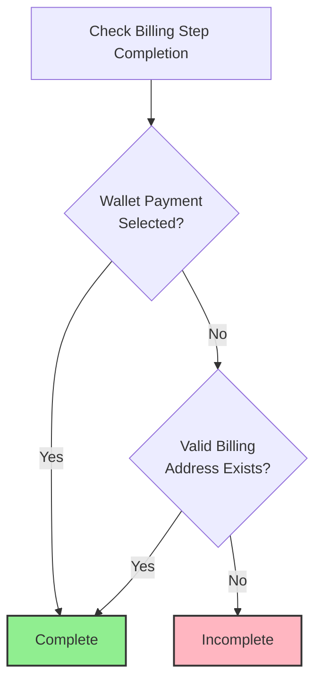
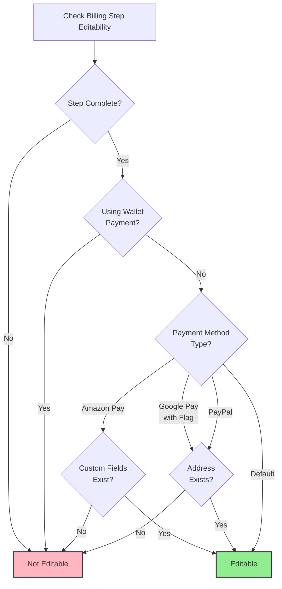
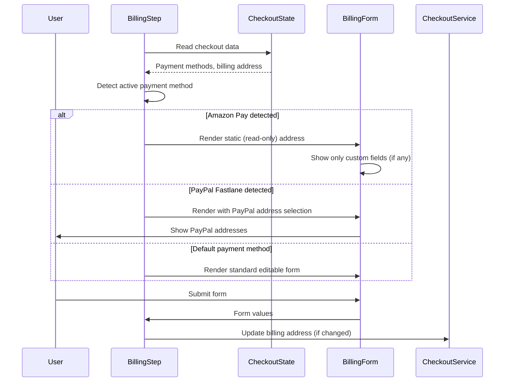
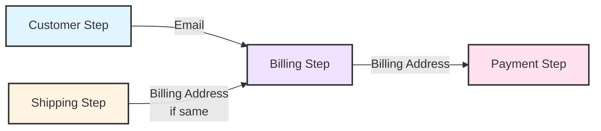

# The Billing Step: Business Rules and Logic

This document provides a deep dive into the Billing step's business rules and logic. While `02a-the-step-progression-rules.md` explains the general pattern for all steps, this document details the specific rules and behavior of the Billing step.

## 1. Billing Step Overview

The Billing step occurs **after** the Shipping step (or Customer step if Shipping is not required) and is responsible for collecting billing address information. It is **always required**, but completion can be satisfied by wallet payment selection instead of manual address entry.

**Primary responsibilities:**
- Collect billing address information
- Support wallet payments that provide billing information automatically
- Handle payment method-specific variations in completion and editability

**Role in checkout flow:**
- Always required: Always present
- Wallet payments: Auto-complete without address entry
- Manual entry: Users enter billing address for non-wallet payments

## 2. Completion Logic

The Billing step is considered complete when **either** of these conditions is met:

1. **Valid billing address exists:** A complete and valid billing address is present
2. **Wallet payment selected:** A wallet payment method is selected (wallet payments provide billing information automatically)

**Special cases:**
- **Amazon Pay:** Uses separate completion logic based on custom fields (see Payment Method Variations section)
- **Google Pay (with feature flag):** Uses address-only completion (does not check wallet payments)
- **PayPal:** Uses address-only completion (does not check wallet payments)

## 3. Requirement Logic

The Billing step is **always required**:

**Required when:**
- Always required for all checkout flows
- Cannot be skipped or filtered out

## 4. Payment Method Variations

Different payment methods have different completion and editability rules:

### Wallet Payments

Wallet payments (Apple Pay, Google Pay, PayPal Fastlane, Stripe Link, etc.) provide billing information automatically:

**How they work:**
- Wallet payment selection provides billing information from the payment provider
- Billing step is complete without manual address entry
- Billing data comes from the payment provider, not user input

**Completion:**
- Complete when wallet payment is selected
- No manual address entry required

**Editability:**
- NOT editable when using wallet payments
- Billing data comes from payment provider and cannot be modified

### Amazon Pay

Amazon Pay has special handling for custom billing address fields and uses its own completion logic (does not follow the general address OR wallet payment rule):

**Completion:**
- If custom fields exist AND billing address exists: Complete if billing address is valid for custom fields
- If no custom fields exist OR no billing address: Always complete (no validation needed)
- Note: Amazon Pay completion does not check wallet payment status (uses separate logic)

**Editability:**
- Editable only if: step is complete AND custom fields exist
- If no custom fields exist: Not editable (no fields to edit)

**Address rendering:**
- When Amazon Pay is selected, billing address is rendered as static (read-only)
- Only custom fields (if present) are editable

### Google Pay (with Feature Flag)

When the feature flag `STRIPE-546.allow_billing_address_editing_for_all_Google_Pay_providers` is enabled, Google Pay uses its own completion logic (does not follow the general address OR wallet payment rule):

**Completion:**
- Complete if: valid billing address exists
- Note: Google Pay completion does not check wallet payment status (uses address-only logic)
- Applies to all Google Pay providers (provider IDs starting with 'googlepay')

**Editability:**
- Editable if: address exists
- Feature flag controls whether this payment method-specific path is used

### PayPal

PayPal payment methods (Braintree PayPal, Braintree PayPal Credit, Braintree Venmo, PayPal Commerce, PayPal Commerce Credit, PayPal Commerce Venmo) use their own completion logic (does not follow the general address OR wallet payment rule):

**Completion:**
- Complete if: valid billing address exists
- Note: PayPal completion does not check wallet payment status (uses address-only logic)
- Applies to all listed PayPal provider variants

**Editability:**
- Editable if: address exists
- Allows users to modify billing address after completion

### Default (Non-Wallet Payments)

For standard payment methods that don't use wallet payments:

**Completion:**
- Complete if: valid billing address exists

**Editability:**
- Editable if: step is complete AND not using wallet payment
- Standard editability rule applies

## 5. Editability Rules

The Billing step's editability varies by payment method:

**General rule:**
- Editable only if: step is complete AND not using wallet payment
- Payment method-specific overrides may apply

**Editability by payment method:**
- **Wallet payments:** NOT editable (billing data comes from payment provider)
- **Amazon Pay:** Editable if complete AND has custom fields
- **Google Pay (with flag):** Editable if address exists
- **PayPal:** Editable if address exists
- **Default:** Editable if complete AND not using wallet payment

## 6. Step Lifecycle and Actions

**Initialization (on mount):**
- Loads billing address fields (country-specific)
- Sets step ready state and notifies parent component

**User actions the step performs:**
- **Form submit:** Updates billing address (if changed), updates customer message (if changed), navigates to next step
- Address comparison: Only updates billing address if form values differ from current billing address
- Customer message comparison: Only updates customer message if form value differs from current customer message

**Payment Method Detection and Form Rendering Flow:**

**Error handling:**
- All errors are delegated to parent component error handler

## 7. Data Dependencies and Outputs

**Data the step reads (from checkout state):**
- **Checkout object:** Payment methods, customer message
- **Billing address:** Current billing destination address
- **Billing address fields:** Country-specific field requirements for validation
- **Configuration:** Payment method configuration, feature flags
- **Customer:** Customer addresses (for address selection), guest status
- **Cart:** Cart contents (required for checkout state access)

**Data the step writes (via checkout service actions):**
- **Billing address:** Updated billing destination address
- **Customer message:** Order comments

**Data flow:**
- Step reads from authoritative checkout state
- Step writes billing data via checkout service actions
- Step manages local state for UI (initialization state)

## 8. Prerequisites

**Required prerequisites:**
- **Customer step must be complete:** Customer identification is required before billing address collection
- **Shipping step must be complete (if required):** Shipping address is typically collected before billing address

**Initialization requirements:**
- Billing address fields must be loaded (country-specific)
- Customer addresses must be available (for authenticated users)
- Payment methods must be loaded (for payment method detection)

## 9. Integration Boundaries

**External systems integrated:**
- **Payment providers:** Wallet payment providers (Apple Pay, Google Pay, PayPal Fastlane, etc.) - billing data provided automatically
- **Address validation services:** Address validation and field requirements (loaded on initialization)
- **PayPal Fastlane:** Guest user address selection from PayPal Fastlane addresses

**Integration patterns:**
- **Wallet payments:** Billing data is provided automatically by payment providers, step reads this data from checkout state
- **Payment method detection:** Step determines active payment method, which affects form rendering (Amazon Pay static address, PayPal Fastlane address selection)
- **Address validation:** Step loads country-specific field requirements on mount

## 10. Architectural Decisions and Trade-offs

### Decision: Payment Method-Specific Completion Logic

**Why:** Different payment methods (Amazon Pay, Google Pay, PayPal) have different requirements for billing address completion. One-size-fits-all logic doesn't work.

**Trade-offs:**
- **Pros:** Handles payment method variations correctly, supports provider-specific requirements
- **Cons:** Completion logic becomes complex, multiple code paths, harder to test

**Alternative Considered:** Single completion rule for all payment methods
- **Rejected because:** Amazon Pay has custom fields, Google Pay/PayPal have different rules, would break provider requirements

**Design Constraint:** Payment method detection must be reliable (check provider ID), completion logic must handle all variants.

### Decision: Wallet Payment Bypass

**Why:** Wallet payments provide billing information automatically, so manual address entry is redundant.

**Trade-offs:**
- **Pros:** Faster checkout, better UX, reduces friction
- **Cons:** Step becomes non-editable, creates special completion path

**Alternative Considered:** Require address even with wallet payments
- **Rejected because:** Would add unnecessary friction, wallet payments already provide verified billing data

**Design Constraint:** Once wallet payment provides data, step must prevent editing to maintain data integrity.

### Decision: Amazon Pay Static Address Rendering

**Why:** Amazon Pay provides billing address that cannot be edited directly. Only custom fields (if present) are editable.

**Trade-offs:**
- **Pros:** Respects Amazon Pay requirements, prevents invalid address changes
- **Cons:** User cannot correct Amazon Pay address errors, must use Amazon Pay interface

**Alternative Considered:** Allow editing Amazon Pay address
- **Rejected because:** Would break Amazon Pay integration, address must match Amazon Pay account

**Design Constraint:** Address rendering must detect Amazon Pay and switch to read-only mode, custom fields must remain editable.

### Decision: Feature Flag for Google Pay Editability

**Why:** Google Pay editability behavior changed over time. Feature flag allows gradual rollout and A/B testing.

**Trade-offs:**
- **Pros:** Can test new behavior, rollback if issues, gradual migration
- **Cons:** Two code paths to maintain, flag must be managed, adds complexity

**Alternative Considered:** Hard-code new behavior, break old behavior
- **Rejected because:** Would break existing integrations, no rollback path

**Design Constraint:** Feature flag must be checked reliably, both code paths must be tested.

### Decision: PayPal Address-Only Completion

**Why:** PayPal payment methods (multiple variants) use address-only completion, ignoring wallet payment status.

**Trade-offs:**
- **Pros:** Consistent behavior across PayPal variants, simpler logic
- **Cons:** PayPal variants must be detected, special case in completion logic

**Alternative Considered:** Each PayPal variant has own logic
- **Rejected because:** All PayPal variants have same requirements, would duplicate code

**Design Constraint:** PayPal provider detection must catch all variants (Braintree PayPal, PayPal Commerce, etc.).

## 11. Evolution and Extension Points

**Adding New Payment Method Variations:**
- Currently: Amazon Pay, Google Pay, PayPal, default
- **Extension point:** Add new payment method with custom completion/editability rules
- **Risk:** Completion logic becomes complex, payment method detection grows

**Changing Editability Rules:**
- Currently: Varies by payment method
- **Extension point:** Add payment method-specific editability conditions
- **Risk:** Editability logic becomes hard to reason about, testing complexity

**Feature Flag Management:**
- Currently: Google Pay has feature flag
- **Extension point:** Add more feature flags for other payment methods
- **Risk:** Flag combinations explode, harder to test all paths

**Address Validation:**
- Currently: Country-specific field requirements
- **Extension point:** Add payment method-specific validation rules
- **Risk:** Validation logic scattered, harder to maintain

## 12. Cross-Step Interactions

**Impact on Subsequent Steps:**
- **Payment step:** Billing address is required for order submission, payment method selection may depend on billing address country

**Dependencies from Previous Steps:**
- **Customer step:** Requires customer email (may be used as billing address email fallback)
- **Shipping step:** May receive billing address update from Shipping step if "billing same as shipping" was selected

**Data Flow Between Steps:**

**Shared State:**
- Billing address - required for order submission in Payment step
- Payment method selection - affects which billing form rendering path is used

**Coupling Points:**
- **Shipping step billing update:** Billing step receives address updates from Shipping step, must handle conflicts (e.g., Amazon Pay remote billing)

---

**Architectural Principle:** The Billing step's business rules are isolated from other steps. Changes to Billing step logic (completion, editability, payment method variations) do not affect Customer, Shipping, or Payment steps, enabling independent evolution and reducing regression risk. However, Billing step receives data from Shipping step, creating a coupling point.

