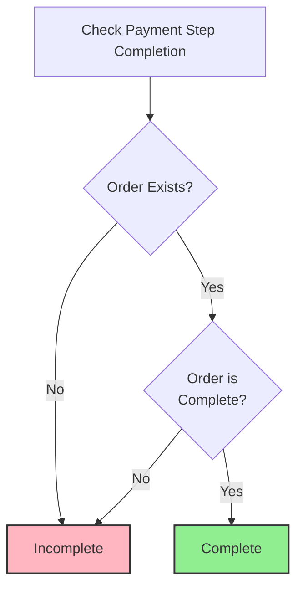
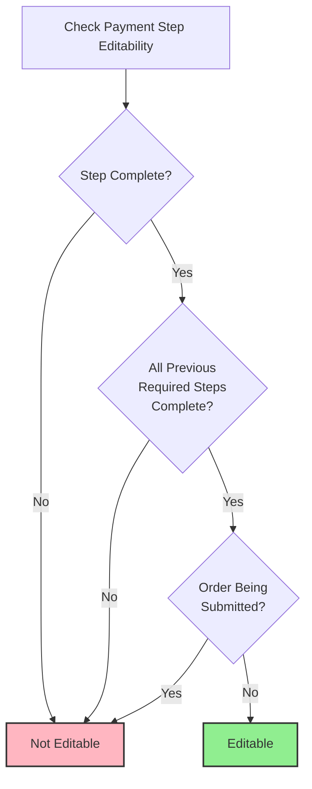
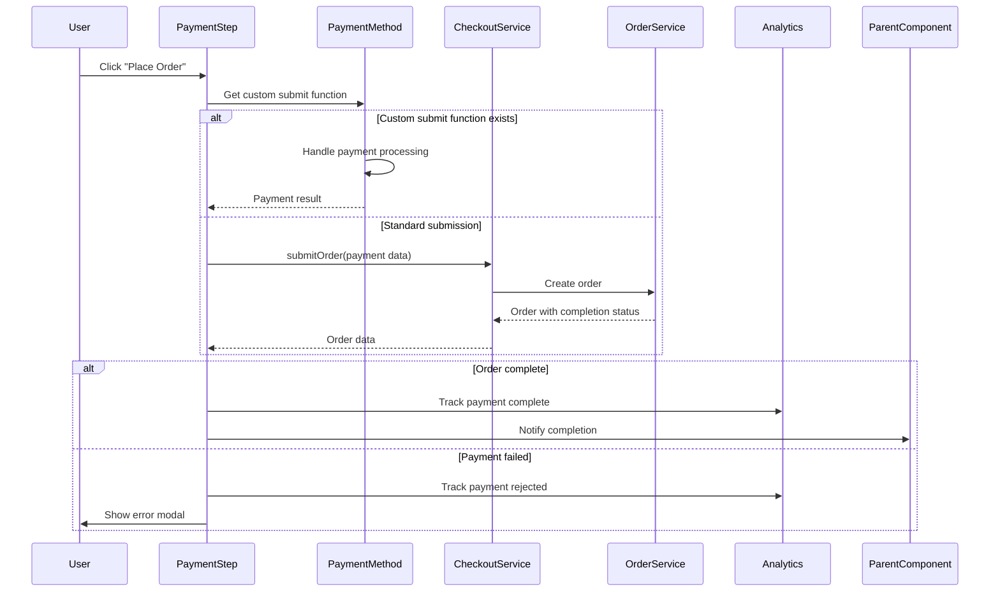
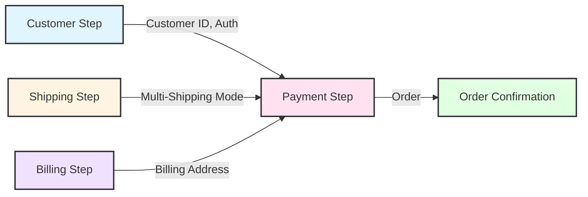

# The Payment Step: Business Rules and Logic

This document provides a deep dive into the Payment step's business rules and logic. While `02a-the-step-progression-rules.md` explains the general pattern for all steps, this document details the specific rules and behavior of the Payment step.

## 1. Payment Step Overview

The Payment step occurs **after** the Billing step and is responsible for payment method selection and order submission. It is **always required** and represents the final step in the checkout flow before order confirmation.

**Primary responsibilities:**
- Payment method selection
- Payment processing initiation
- Order submission coordination
- Final checkout validation

**Role in checkout flow:**
- Always required: Always present
- Final step: Last step before order confirmation
- Order completion: Completion based on order completion status

## 2. Completion Logic

The Payment step is considered complete when the **order is complete**:

## 3. Requirement Logic

The Payment step is **always required**:

**Required when:**
- Always required for all checkout flows
- Cannot be skipped or filtered out

## 4. Editability Rules

The Payment step is editable only when **all** of these conditions are met:

1. **Step is complete:** The order is complete
2. **All previous required steps are complete:** Customer, Shipping (if required), and Billing steps must be complete
3. **Order is not being submitted:** The order submission process is not in progress

**Editability logic:**
- Step-level editability: Payment step itself is editable if order is complete
- Final editability: Editable only if: step is complete AND all previous required steps are complete AND order not being submitted
- The step-level editability is combined with global constraints at the checkout orchestration level

**Global constraints:**
- Order submission process: When order submission is in progress, all steps become non-editable
- Step dependencies: Payment step editability depends on completion of all previous required steps (or steps must not be required)
- These constraints are enforced at the checkout level, combining step-level editability with global rules
- Global constraints apply to all steps uniformly, ensuring consistent behavior across the checkout flow

## 5. Step Lifecycle and Actions

**Initialization (on mount):**
- Applies store credit if available (if usable store credit > 0)
- Loads payment methods
- Finalizes order if needed
- Subscribes to cart total changes (reloads payment methods when cart total changes)
- Sets up beforeunload handler to warn user if leaving during order submission
- Sets step ready state and notifies parent component
- Checks embedded support for payment methods

**Cleanup (on unmount):**
- Unsubscribes from cart total changes
- Removes beforeunload event listener

**User actions the step performs:**
- **Payment method selection:** Tracks selected payment method, initializes payment method-specific components, tracks analytics
- **Order submission:** Submits order with payment data, handles custom payment method submit functions, tracks analytics (payment complete/rejected)
- **Store credit toggle:** Applies or removes store credit
- **Error modal interaction:** Handles error modal close, performs recovery actions (reload checkout, redirect to cart, etc.)

**Order Submission Flow:**

**Payment method management:**
- **Submit functions:** Manages payment method-specific submit functions (registered by payment method components)
- **Validation schemas:** Manages payment method-specific validation schemas (registered by payment method components)
- **Submit button state:** Manages payment method-specific submit button disabled/hidden states (controlled by payment method components)

**Error handling:**
- **Payment method invalid error:** Reloads payment methods
- **Cart changed error:** Notifies parent component of cart change
- **Order submission errors:** Displays error modal with localized error messages
- **Finalization errors:** Displays error modal (except for "order_finalization_not_required" error)
- **Spam protection errors:** Reloads checkout to reset spam protection state
- **Provider errors:** Handles redirects and fatal errors
- **Other errors:** Delegates to parent component error handler

## 6. Data Dependencies and Outputs

**Data the step reads (from checkout state):**
- **Order object:** Order completion status (primary completion determinant)
- **Checkout object:** Payment methods, checkout configuration, customer message, grand total, outstanding balance, shouldExecuteSpamCheck flag
- **Customer:** Customer data for payment processing, store credit amount
- **Cart:** Cart contents for order submission
- **Payment methods:** Available payment methods for selection
- **Consignments:** Shipping consignments (for multi-shipping incompatible payment method filtering)
- **Payment provider customer:** Stripe Link authentication state (for payment method filtering)
- **Errors:** Submit order errors, finalize order errors

**Data the step writes (via checkout service actions):**
- **Order:** Order submission creates the order object
- **Store credit:** Applies or removes store credit
- **Payment method selection:** Payment method selection state (managed locally, affects form rendering)
- **Order finalization:** Finalizes order if needed
- **Checkout reload:** Reloads checkout data (for error recovery)

**Data flow:**
- Step reads from authoritative checkout state
- Step writes order data via checkout service actions
- Step manages local state for UI (selected payment method, submit functions, validation schemas, submit button states, ready state, spam limit state)
- Step subscribes to cart total changes and reloads payment methods when total changes

## 7. Prerequisites

**Required prerequisites:**
- **Customer step must be complete:** Customer identification is required
- **Shipping step must be complete (if required):** Shipping address and options must be selected
- **Billing step must be complete:** Billing address must be provided (or wallet payment selected)
- **Order must not be complete:** Step does not render if order is already complete

**Initialization requirements:**
- Payment methods must be loaded
- Order submission service must be available
- All previous required steps must be complete

## 8. Integration Boundaries

**External systems integrated:**
- **Payment processors:** Payment gateway integrations for payment processing (via payment method components)
- **Order service:** Order creation and submission service
- **Payment method providers:** Various payment method integrations (credit cards, wallets, BNPL, etc.) - components register submit functions and validation schemas with step
- **Analytics service:** Payment and order submission tracking (payment method selection, pay button click, payment complete/rejected)
- **Store credit service:** Store credit application/removal

**Integration patterns:**
- **Payment method selection:** User selects payment method, payment method components register submit functions and validation schemas with step via PaymentContext
- **Order submission:** Step coordinates payment processing and order creation, calls custom submit functions for payment methods that provide them
- **Payment processing:** Payment data is sent to payment processors via payment method components, step coordinates the flow
- **Order completion:** Order service creates order, step completion is based on order status
- **Cart total monitoring:** Step subscribes to cart total changes and reloads payment methods when total changes

## 9. Architectural Decisions and Trade-offs

### Decision: Order Completion as Step Completion

**Why:** Payment step completion is determined by order completion status, not payment method selection or form submission.

**Trade-offs:**
- **Pros:** Single source of truth (order object), clear completion state, works for all payment methods
- **Cons:** Step completion depends on external system (order service), completion happens asynchronously

**Alternative Considered:** Complete step when payment method selected
- **Rejected because:** Payment might fail, order might not be created, would show false completion

**Design Constraint:** Order object must be reliable, completion status must be accurate, step must handle order creation failures.

### Decision: Payment Method Registration Pattern

**Why:** Payment method components register submit functions and validation schemas with Payment step via PaymentContext, rather than Payment step knowing about all payment methods.

**Trade-offs:**
- **Pros:** Extensible - new payment methods can be added without modifying Payment step, payment method logic is isolated
- **Cons:** Registration must happen correctly, submit functions must be reliable, harder to debug

**Alternative Considered:** Payment step has hard-coded payment method handling
- **Rejected because:** Would require Payment step changes for every new payment method, violates Open/Closed Principle

**Design Constraint:** Payment method components must register before user can submit, registration must be reliable.

### Decision: Cart Total Change Subscription

**Why:** Payment methods may change when cart total changes (e.g., minimum amount requirements). Step must reload payment methods.

**Trade-offs:**
- **Pros:** Payment methods stay accurate, user sees correct options
- **Cons:** Subscription adds complexity, might reload unnecessarily, performance impact

**Alternative Considered:** Reload payment methods only on explicit user action
- **Rejected because:** User might see invalid payment methods, would cause errors at submission

**Design Constraint:** Subscription must be cleaned up on unmount, reload must be debounced if needed.

### Decision: Store Credit Auto-Application

**Why:** If usable store credit exists, it's automatically applied on mount to maximize discount.

**Trade-offs:**
- **Pros:** Better UX, user gets maximum discount automatically
- **Cons:** User might not want store credit applied, no explicit consent

**Alternative Considered:** Require user to opt-in to store credit
- **Rejected because:** Most users want maximum discount, opt-in adds friction

**Design Constraint:** Store credit application must be reliable, must handle failures gracefully.

### Decision: Global Editability Constraints

**Why:** Payment step editability depends on previous steps completion and order submission status, not just step-level completion.

**Trade-offs:**
- **Pros:** Prevents editing during invalid states, maintains data integrity
- **Cons:** Editability logic is split between step and orchestrator, harder to reason about

**Alternative Considered:** Step determines its own editability
- **Rejected because:** Would allow editing during order submission, could cause data corruption

**Design Constraint:** Global constraints must be enforced consistently, step-level and global rules must be combined correctly.

### Decision: Error Recovery via Checkout Reload

**Why:** Many errors (spam protection, cart changed) require reloading checkout object to get fresh state.

**Trade-offs:**
- **Pros:** Recovers from transient errors, gets latest state
- **Cons:** Reload is expensive, might lose user-entered data, performance impact

**Alternative Considered:** Retry without reload
- **Rejected because:** State might be stale, errors would persist

**Design Constraint:** Reload must preserve user state when possible, must handle reload failures.

## 10. Evolution and Extension Points

**Adding New Payment Methods:**
- Currently: Payment methods register submit functions
- **Extension point:** Add new payment method, register submit function
- **Risk:** Registration must be reliable, submit functions must handle all cases

**Changing Order Submission Flow:**
- Currently: Submit order, wait for completion
- **Extension point:** Add multi-step payment flows (e.g., 3D Secure)
- **Risk:** Completion detection becomes complex, error handling multiplies

**Payment Method Validation:**
- Currently: Payment methods register validation schemas
- **Extension point:** Add payment method-specific validation rules
- **Risk:** Validation logic scattered, harder to maintain

**Error Recovery Strategies:**
- Currently: Reload checkout for many errors
- **Extension point:** Add error-specific recovery strategies
- **Risk:** Error handling becomes complex, recovery strategies multiply

## 11. Cross-Step Interactions

**Impact on Subsequent Steps:**
- None - Payment step is the final step before order confirmation

**Dependencies from Previous Steps:**
- **Customer step:** Requires customer identification and authentication status
- **Shipping step:** Requires shipping address and options (if shipping required), multi-shipping mode affects payment method filtering
- **Billing step:** Requires billing address (or wallet payment providing billing data)

**Data Flow Between Steps:**

**Shared State:**
- Order object - created by Payment step, used for completion detection
- Payment method selection - may filter based on previous step data (multi-shipping, customer auth status)

**Coupling Points:**
- **Multi-shipping payment filtering:** Payment step filters payment methods based on Shipping step's multi-shipping mode
- **Global editability constraints:** Payment step editability depends on all previous steps completion status

---

**Architectural Principle:** The Payment step's business rules are isolated from other steps. Changes to Payment step logic (completion, editability) do not affect Customer, Shipping, or Billing steps, enabling independent evolution and reducing regression risk. However, Payment step editability is constrained by global checkout-level rules (previous steps completion and order submission status), and payment method availability is affected by Shipping step's multi-shipping mode.

