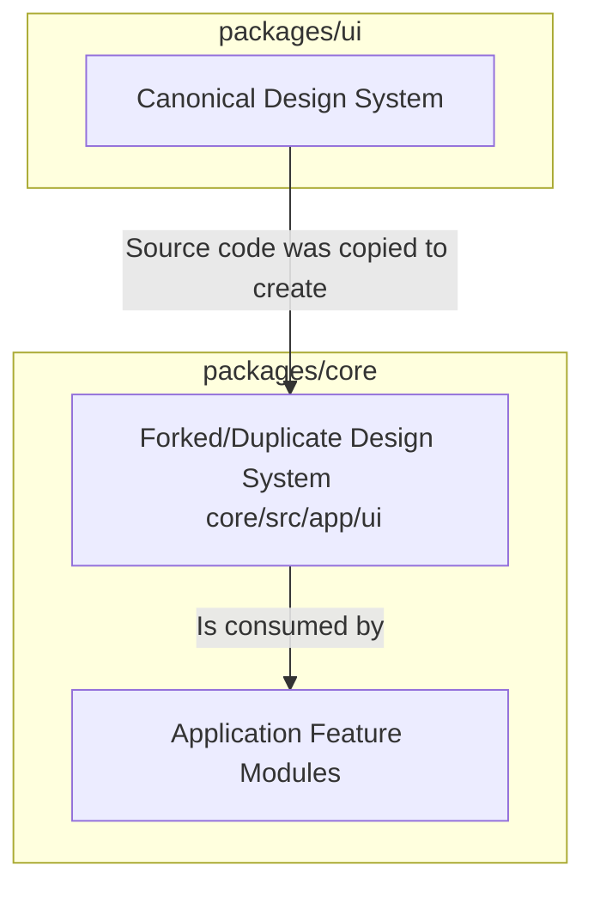

# The Design System: The UI & Component Slice

This document provides the high-level architectural guide to the application's **Design System**, which is the concrete implementation of the **UI & Component Slice**.

The Design System is intended to be the single source of truth for the application's visual and interactive language. It is a dedicated library of reusable, presentation-only components that ensures consistency, accelerates development, and enforces accessibility standards across the entire user interface.

However, an evidence-based analysis of the codebase reveals a significant architectural inconsistency where this principle has been violated.

## 1. The Intended Architecture: A Centralized Design System

The `packages/ui` monorepo package is the intended **canonical Design System**. It is a standalone library of fully styled, self-contained, and reusable React components that form the basis of the application's visual language.

**Architectural Principles:**

*   **Consistency:** The existence of this centralized library demonstrates a clear architectural goal of creating a predictable and cohesive user experience from a single source of truth.
*   **Encapsulation:** Components within `packages/ui` are strictly presentational. They contain their own styling logic but no business logic or application-specific knowledge, ensuring they are decoupled and reusable.
*   **Accessibility:** The `packages/ui` codebase shows a consistent use of accessibility best practices, such as `htmlFor` attributes on labels and WAI-ARIA roles, indicating a clear intent to make the components accessible.

## 2. The True Architecture: A Forked Design System

While `packages/ui` represents the intended architecture, the `core` application does not consume it directly. Instead, the `core` application maintains its own, parallel design system located at `packages/core/src/app/ui`.

This is the true, de facto architecture of the UI layer:



**This is a significant architectural inconsistency and a source of technical debt.** The `core/src/app/ui` directory contains components that are, in some cases, near-identical, copy-pasted versions of the components in `packages/ui`. This violates the "single source of truth" principle and creates an unnecessary maintenance burden.

## 3. The Styling Architecture

The application's styling is orchestrated from a central SCSS directory located at `packages/core/src/scss`. The `App.scss` file in this directory is the root of the styling system. It is responsible for:

1.  Importing and configuring the foundational styles from the company-wide `@bigcommerce/citadel` design system.
2.  Importing hundreds of specific `.scss` files that provide the layout and theming for the checkout application's structure and feature modules.

Crucially, this system does **not** provide the base styles for the components in `packages/ui` or `core/src/app/ui`. Those components are self-contained and manage their own styles internally via BEM-style CSS classes.

## 4. Practical Usage Pattern & The Architectural Anomaly

The standard usage pattern within the `core` application is for feature modules to import components from the **local, forked design system**, not the canonical one.

For example, the `GuestForm` component imports `Button` and `Form` from its local `../ui/` directory, which resolves to `packages/core/src/app/ui`:

```typescript
import { Button, ButtonVariant } from '../ui/button';
import { Fieldset, Form, Legend } from '../ui/form';

// ... component implementation ...

return (
    <Form>
        <Fieldset>
            // ...
            <Button
                isLoading={isLoading}
                variant={ButtonVariant.Primary}
            >
                <TranslatedString id={continueAsGuestButtonLabelId} />
            </Button>
            // ...
        </Fieldset>
    </Form>
);
```

This pattern is consistent throughout the `core` application. It is the concrete evidence of the architectural inconsistency. Any refactoring or new component development should prioritize the removal of the forked `core/src/app/ui` directory and the direct consumption of the canonical `packages/ui` library.
