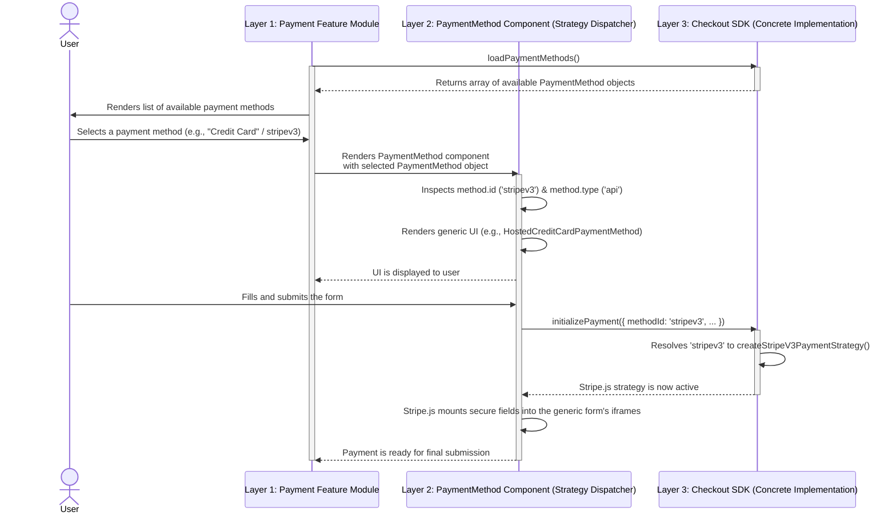

# The Integration Architecture: The Extensibility Slice

This document provides the high-level architectural guide to the application's **Integration & Extensibility Slice**.

The core of this slice is a sophisticated, multi-layered architecture that uses a **Strategy Pattern** to decouple the core application from the specific implementations of dozens of payment providers. This is one of the most critical and powerful architectural patterns in the codebase.

## 1. Architectural Philosophy & Pattern

The integration architecture is governed by a single, powerful principle: **the core application knows *that* payment methods exist, but it does not know *how* any specific payment method works.**

This creates a highly extensible system where a single, complex component can act as a "dispatcher," routing control to the correct generic UI component based on the properties of a `PaymentMethod` object.

## 2. The Payment Flow: A Step-by-Step Trace

To understand the architecture, it is best to trace the flow of a real payment. The following `sequenceDiagram` illustrates the true, evidence-based three-layer process.

## 3. A Breakdown of the Flow

### Phase 1: Data Loading & Selection (Layer 1: Host)
The flow begins not with a user action, but with data loading. The `Payment` feature module (the "Host") first calls `loadPaymentMethods()` from the Checkout SDK to fetch the list of payment methods configured for the store. Only after this data is returned does the Host render the list of options to the user, making selection possible.

### Phase 2: Strategy & Generic UI (Layer 2: Strategy Dispatcher)
Once the user selects a method, the Host renders the `PaymentMethod` component. This component is the heart of the Strategy Pattern. It contains a large conditional block that inspects the properties of the `PaymentMethod` object and decides which generic UI component to render (e.g., `HostedCreditCardPaymentMethod` for credit cards, `HostedPaymentMethod` for offsite redirects). This component is responsible for rendering a standardized UI for an entire category of payment methods and then calling `initializePayment`, passing the `methodId` to the Checkout SDK.

### Phase 3: Concrete Implementation (Layer 3: SDK)
The final layer is inside the Checkout SDK. When `initializePayment` is called, the SDK uses the `methodId` (e.g., `'stripev3'`) to look up and execute the provider-specific code (e.g., `createStripeV3PaymentStrategy`). This is the first moment any Stripe-specific logic is invoked. This concrete strategy then takes over, using the provider's SDK (like Stripe.js) to manage the final, secure UI.

## 4. The Role of Package Aliases (e.g., `@bigcommerce/checkout/stripe-integration`)

Our analysis has revealed that the TypeScript path aliases for the integration packages are **not used by this default checkout flow.**

Instead, they serve as a **stable, public API for developers who are customizing the checkout**. By providing a clean import path, the system allows a customizer to bypass this entire multi-layer system and directly import and use a specific integration component, giving them a powerful extension point for advanced customization.
