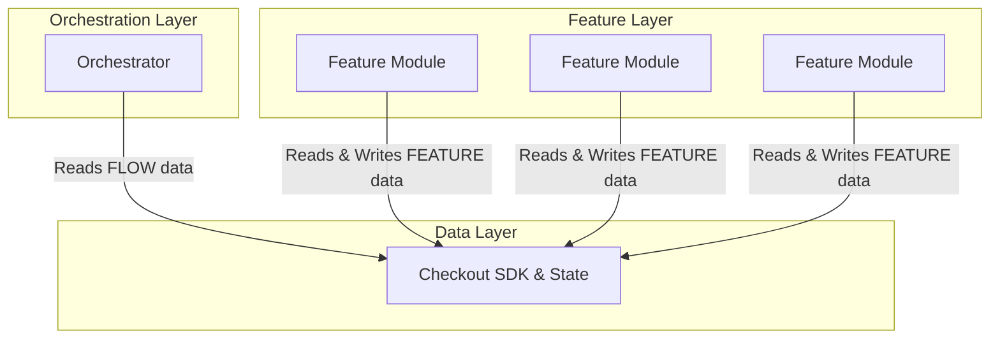
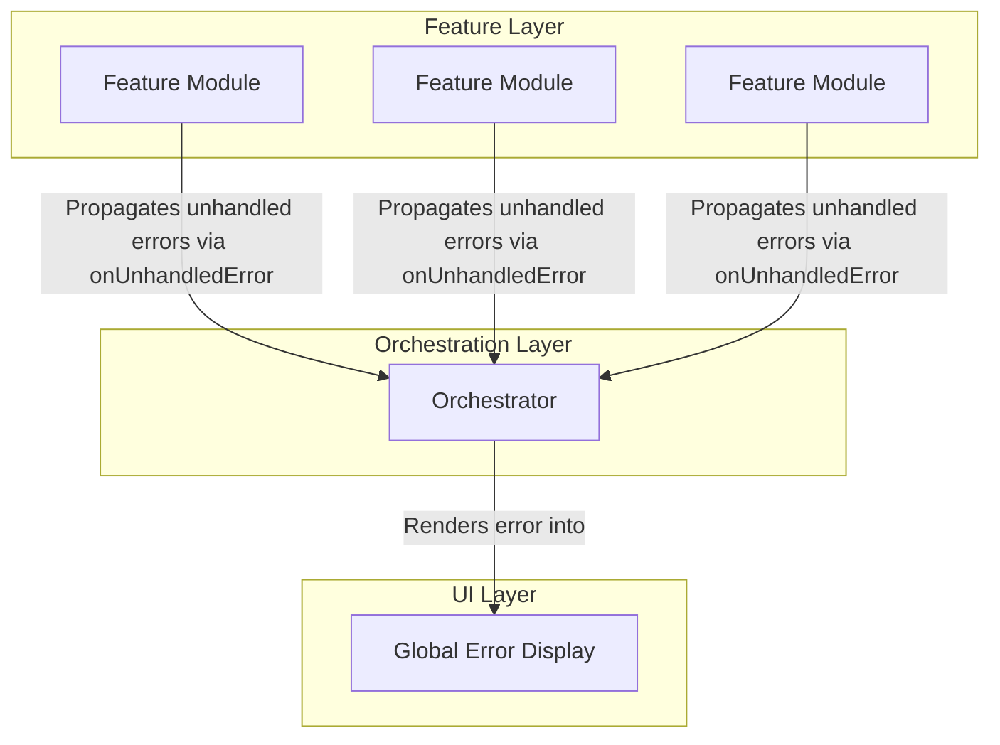

---
**Title:** The Data Flow Architecture
**Purpose:** To provide a high-level architectural blueprint of the application's end-to-end, hybrid data flow.
**Audience:** All Developers, Architects
**Maintenance:** Update only if the fundamental principles of the data flow change.
---

# The Data Flow Architecture: A Hybrid, Four-Pattern System

This document details the end-to-end data flow architecture of the BigCommerce Checkout application. It is a sophisticated, hybrid system built upon four distinct but interconnected architectural patterns. This model was derived from a rigorous, evidence-based analysis of the production codebase.

## 1. The Overarching Model: Hybrid Data Flow with Smart Feature Modules

The application rejects a simple, top-down, "pure" container pattern. Instead, it employs a hybrid data flow model where different layers of the application connect to the central Data Layer for different purposes.

**Responsibilities:**

*   **Data Layer:** The single source of truth for all application state, powered by the BigCommerce Checkout SDK. It exposes the application's state and a service object for dispatching actions.
*   **Orchestration Layer:** Responsible for controlling the high-level *flow* of the checkout process. It reads only the data necessary to make flow-control decisions (e.g., `isGuest`, `isComplete`, which step is next). It does **not** read or manage the detailed data required by the individual feature modules.
*   **Feature Layer:** Composed of "Smart" Feature Modules (`Shipping`, `Billing`, `Payment`, etc.). Each module is responsible for its own concerns and establishes its own, independent connection to the Data Layer to read the data it needs and to dispatch actions.

---

## 2. The Error Handling Model: A Delegation Pattern

Error handling is architected as a distinct, parallel data flow based on the **Error Delegation** pattern. Feature Modules are responsible for catching their own errors but delegate the handling of those errors to a centralized authority.

**Responsibilities:**

*   **Feature Module:** Each module implements its own `try/catch` blocks for its asynchronous operations. It is responsible for *catching* errors. If an error is unrecoverable within the module's own context, it calls the `onUnhandledError()` callback, delegating the error upwards.
*   **Orchestrator:** Receives unhandled errors from all Feature Modules. It is responsible for the centralized *handling* of these errors, such as displaying a global error modal or logging the error to a remote service.

---

## 3. The Feature Composition Model: Container/Presentational Pattern

While the Feature Modules themselves are "smart" (data-aware), they are internally composed using the classic **Container/Presentational Pattern**.

*   **Smart "Container" Component:** This is the root component of the Feature Module (e.g., `Shipping.tsx`, `Billing.tsx`). It connects to the Data Layer and manages all the logic and state for that feature.
*   **"Dumb" Presentational Sub-Components:** The smart container then passes data and callbacks down as simple props to its children (e.g., `ShippingForm.tsx`, `BillingForm.tsx`). These sub-components have no direct connection to the Data Layer and are responsible only for rendering UI.

---

## 4. The Data Access Model: A Transitionary Dual-Access Layer

The architecture is in a state of transition and supports two distinct, parallel patterns for connecting a component to the Data Layer. Crucially, both patterns connect to the exact same underlying React Context, ensuring a single source of truth.

*   **The State Decorator Pattern (Legacy):** Used by older, class-based components. This pattern uses a Higher-Order Component (HOC), `withCheckout()`, to wrap the component and inject state and dispatch functions as props.
*   **The Direct Connection Pattern (Modern):** Used by modern, functional components. This pattern uses the `useCheckout()` hook to connect directly to the Data Layer from within the component. This is the simpler, preferred modern approach.
