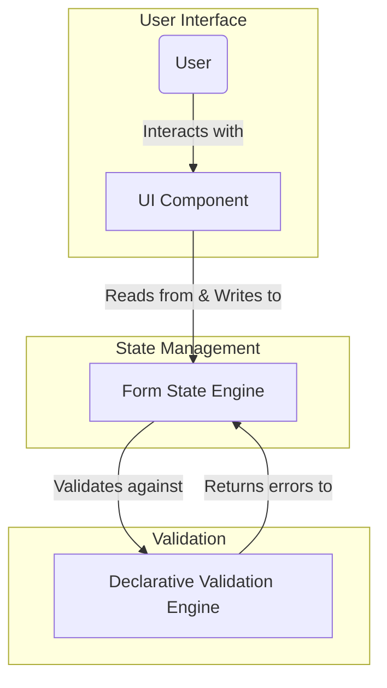

---
**Title:** The Forms & Validation Architecture
**Purpose:** To provide a high-level guide to the application's unified approach to form state management and validation.
**Audience:** All Developers, Architects
**Maintenance:** Update when the core form management or validation patterns change.
---

# The Forms & Validation Architecture

This document provides the high-level architectural guide to the **Forms & Validation Slice**. It details the standardized architectural patterns used to create a consistent, reliable, and maintainable system for user input across all feature modules.

## 1. The Core Architectural Pattern

The application follows a unified architectural pattern for all user input, built on a clear separation of concerns between UI, state management, and validation logic.

The core technologies of this stack are:
*   A dedicated **Form State Engine** for managing the complex state of forms.
*   A **Declarative Validation Engine** for defining the rules and constraints for the form's data.

## 2. The Data Flow Within a Form

The following diagram illustrates the data flow and architectural relationships between the key components of this slice.

## 3. A Breakdown of Architectural Responsibilities

The architecture is a multi-layered system that separates UI, state injection, the UI/state bridge, the state engine itself, and the validation rulebook.

*   **1. UI Component (The View):** The component's responsibility is purely **presentational**. It is a "dumb" component that renders the form fields and knows nothing about the global state.

*   **2. State Injection Layer (The Injector):** This layer's responsibility is to **provide** the state management context to the component tree. It is typically implemented as a Higher-Order Component that wraps the "dumb" UI component.

*   **3. UI/State Bridge (The Connector):** This is the architectural **bridge** that connects an individual form input to the state provided by the Injector. Its responsibility is to find the state management context, access the state for a specific field, and pass the required props (`value`, `onChange`, etc.) to the UI component it renders.

*   **4. Form State Engine (The Source of Truth):** This engine's responsibility is to be the **single source of truth for the form's state**. It tracks all user input, manages validation errors, and handles the submission process.

*   **5. Declarative Validation Engine (The Rulebook):** This engine's responsibility is to provide a **declarative rulebook** for the form's data. It defines the shape of the data and the validation rules in a pure, stateless way that is completely decoupled from the UI.

This multi-layered pattern creates a clean, robust, and maintainable separation of concerns for all user input throughout the application.
