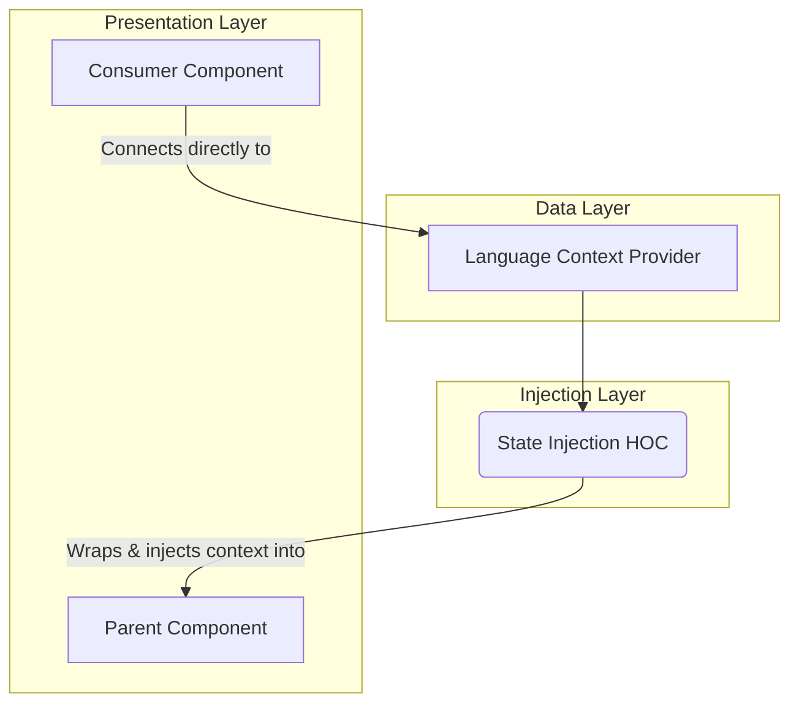

---
**Title:** The Internationalization (I18n) Architecture
**Purpose:** To provide a high-level guide to the application's architectural patterns for multi-language support.
**Audience:** All Developers, Architects
---

# The Internationalization (I18n) Architecture

This document provides the high-level architectural guide to the **Internationalization (I18n) Slice**. It details the standardized architectural patterns used to provide translated content throughout the application, ensuring a consistent and maintainable approach to multi-language support.

## 1. The Core Architectural Pattern

The I18n architecture is built on a classic **Provider/Consumer** pattern. This pattern decouples the components that need translated text from the source and mechanics of the translation itself.

The core of the pattern is:
*   A centralized **Language Context Provider** that holds all translation data and functions.
*   A **State Injection Layer** that makes this context available to the component tree.
*   Dedicated **Consumer Components** that are responsible for rendering translated strings.

## 2. The I18n Data Flow

The following diagram illustrates the data flow and architectural relationships between the key components of this slice. It shows a **direct connection** pattern where the consumer component bypasses its parent and connects directly to the data provider.

## 3. A Breakdown of Responsibilities

*   **Language Context Provider:** This component's responsibility is to be the **single source of truth for all I18n-related data**. It holds the current locale, the dictionary of translation strings, and the translation functions. It is rendered once at the top of the application tree.

*   **State Injection Layer (HOC):** This layer's responsibility is to make the language context available to **class components or other legacy components** that cannot use hooks. It is implemented as a Higher-Order Component that wraps a component and injects the language context as props.

*   **Direct Connection (Hook):** The primary architectural pattern for consuming the language context is a **direct connection** from a functional component via a hook. This allows the component to be completely decoupled from its parent.

*   **Consumer Component:** The consumer's responsibility is purely **presentational**. It is a "dumb" functional component that uses the direct connection hook to access the `translate` function and render the correct, translated string for a given language key.
