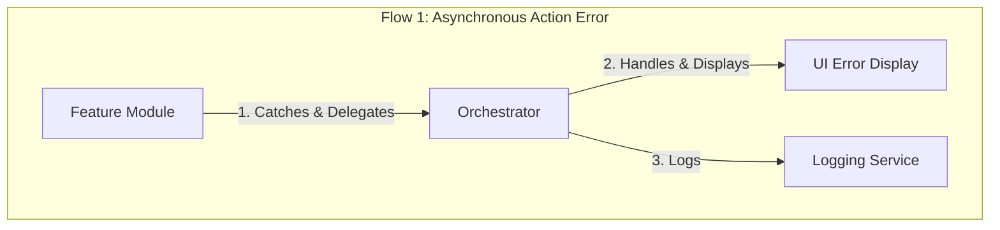
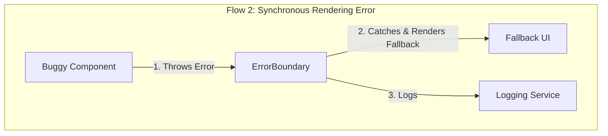

# The Architecture of Error Handling: A Dual-Flow Model

This document provides a high-level architectural overview of the **Error Handling & Logging Slice**. It describes the two distinct, parallel patterns that work together to create a robust system for catching and handling both asynchronous and synchronous errors.

## 1. The Two Flows of Error Handling

The application's error handling architecture is not a single system, but a dual-flow model designed to handle two fundamentally different classes of errors:

*   **Asynchronous Action Errors:** These are predictable errors that occur during asynchronous operations, such as API calls. They are handled by the **Error Delegation Model**, where feature modules catch errors and delegate them upwards to a centralized handler.

*   **Synchronous Rendering Errors:** These are unpredictable errors that occur during the React rendering cycle (e.g., a bug in a component's render method). They are handled by a top-level **Error Boundary Model**, which acts as a safety net to prevent the entire application from crashing.

## 2. The End-to-End Error Flow

The following diagram illustrates the two parallel flows. They operate independently but share a common logging service.

## 3. A Breakdown of Responsibilities

*   **Feature Module (The Asynchronous Catcher):** The Feature Module's responsibility is to **catch** predictable exceptions during its asynchronous operations (`try/catch`) and **delegate** them to the Orchestrator.

*   **Orchestrator (The Asynchronous Handler):** The Orchestrator's responsibility is to be the **centralized handler** for delegated asynchronous errors. It processes the error and is responsible for both displaying it to the user and logging it.

*   **ErrorBoundary (The Synchronous Catcher):** The ErrorBoundary's responsibility is to **catch** unpredictable exceptions that occur anywhere in the component tree during rendering. It acts as a safety net, preventing a "white screen of death."

*   **UI Components (The Displayers):** The responsibility for displaying errors is split. The **UI Error Display** is a component used by the Orchestrator to show asynchronous errors in a controlled way (e.g., a modal). The **Fallback UI** is a generic, static view rendered by the ErrorBoundary when a critical rendering error occurs.

*   **Logging Service (The Logger):** This is a shared service whose sole responsibility is to **log** error details for developers. It is called by both the Orchestrator and the ErrorBoundary, ensuring all errors, regardless of type, are recorded.
