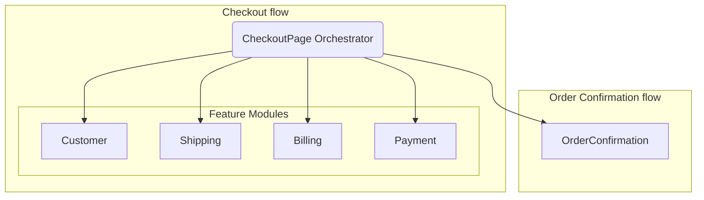

---
**Title:** The Checkout Orchestrator Architecture
**Purpose:** To define the role of the central `CheckoutPage` orchestrator, its relationship with the feature modules it controls, and the overall structural flow of the checkout application.
**Audience:** All Developers, Architects
**Maintenance:** Update only if a major feature module is added, removed, or the orchestration logic fundamentally changes.
---

# The Checkout Orchestrator Architecture

The core of the `checkout-js` application is the **Orchestrator Pattern**. This document details the central component, the `CheckoutPage` orchestrator, and defines its architectural responsibility and its relationship with the primary feature modules ("Steps") that it manages.

## 1. The `CheckoutPage` Orchestrator

The `CheckoutPage` component is the central orchestrator for the entire checkout flow. Its sole responsibility is to manage the sequence and state of the checkout journey.

*   **Flow Control:** The orchestrator determines which feature module (e.g., `Shipping`, `Payment`) is presented to the user at any given time. It does so based on state computed elsewhere in the application, such as whether shipping is required for the items in the cart.
*   **Hybrid Responsibilities:** While the primary sequencing logic (i.e., the order of the steps) is delegated to the state management layer, the orchestrator itself contains significant, domain-specific business logic. For example, it contains the logic for detecting when a user's selected shipping options have expired and is responsible for forcibly navigating the user back to the shipping step. This separation of concerns—high-level sequencing in the state layer, specific event handling in the orchestrator—is the key to the architecture's maintainability.

## 2. The Orchestrated Modules ("Steps")

The orchestrator manages the following primary feature modules, which are separated into two distinct flows.

### Checkout Flow Modules

| Module / "Step"     | Architectural Responsibility                                     |
| ------------------- | ---------------------------------------------------------------- |
| `Customer`          | Handles guest/login forms and customer information capture.      |
| `Shipping`          | Manages shipping address form and shipping option selection.     |
| `Billing`           | Manages the billing address form.                                |
| `Payment`           | Manages payment method selection and final submission logic.     |

### Order Confirmation Flow Module

| Module / "Step"     | Architectural Responsibility                                     |
| ------------------- | ---------------------------------------------------------------- |
| `OrderConfirmation` | Displays the final order summary after a successful checkout.    |

## 3. The Orchestrated Flow Diagram

The following diagram illustrates the architectural structure. It shows how the central `CheckoutPage` orchestrator individually manages and presents each of the primary feature modules.

