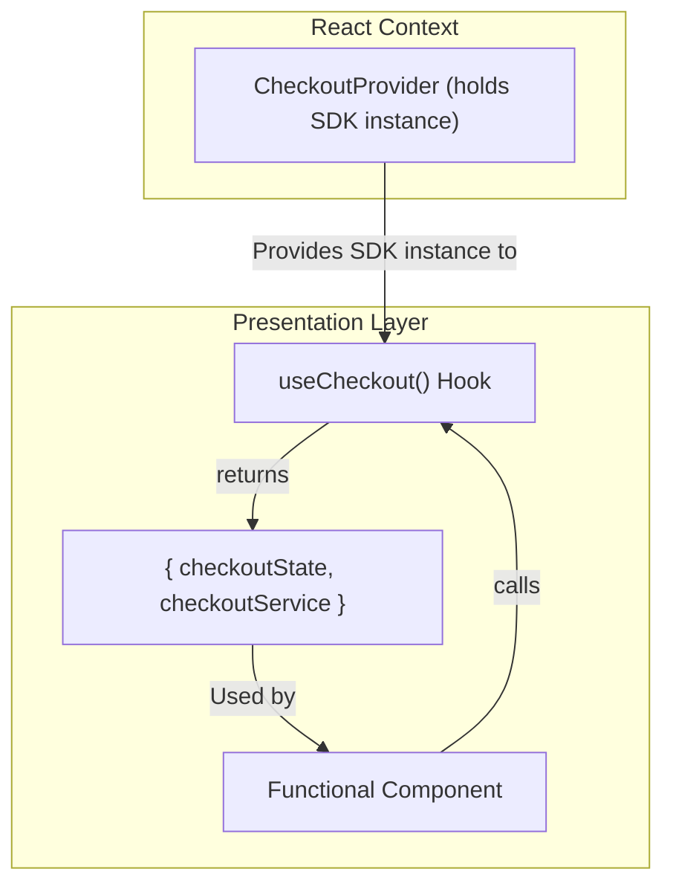
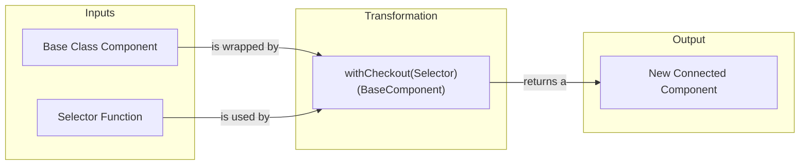

# The State Management Architecture: Hooks & HOCs

This document provides the authoritative guide to the `checkout-js` application's state management architecture.

## 1. The Core Thesis: A Modern, Functional Codebase

The `checkout-js` project is a modern, **functional React application**. The vast majority of components are functional and leverage hooks for their logic and side effects.

As a result, the project's state management architecture is also primarily hook-based. However, because some core legacy components (like the main `CheckoutPage` orchestrator) are still React Class Components, the codebase supports two distinct patterns for connecting to the `Checkout SDK`.

1.  **The Modern Pattern:** The `useCheckout()` hook.
2.  **The Legacy Pattern:** The `withCheckout()` Higher-Order Component (HOC).

## 2. The Modern Pattern: The `useCheckout()` Hook

**This is the standard and required pattern for all new development.**

The `useCheckout()` hook provides a **direct connection** between a functional component and the `Checkout SDK`. This is the primary, modern pattern for accessing the data layer from the presentation layer.

### The `useCheckout` Flow
The component directly calls the hook, which returns a reference to the necessary state and services from the `CheckoutProvider`'s context.

### Architectural Responsibilities
*   **The Component's Role:** The functional component is responsible for declaring its dependency on the checkout system by calling the `useCheckout()` hook.
*   **The Hook's Role:** The hook's responsibility is to provide the component with direct, read-only access to the current `checkoutState` and a reference to the `checkoutService` for dispatching actions.
*   **The Interaction:** The component reads data directly from the state object and calls methods directly on the service object. The coupling is explicit and contained within the component itself.

## 3. The Legacy Pattern: The `withCheckout` HOC

**This is a legacy pattern used only to support the remaining React Class Components.** It should **not** be used for any new components.

The `withCheckout` HOC is an implementation of the **Decorator Pattern**. It serves as a compatibility layer that wraps a class component, decouples it from the state management system, and injects state as props.

### The HOC Flow
The HOC is a factory function. It takes a selector and a base component as inputs and returns a new, "connected" component that has been wrapped with state-management logic.

### Architectural Responsibilities
*   **The Component's Role:** The class component is a pure, presentational component. It has no knowledge of the state management system and is only responsible for rendering UI based on the `props` it receives.
*   **The HOC's Role:** The Higher-Order Component's responsibility is to subscribe to the `Checkout SDK`, manage the subscription, and render the base component, passing in the necessary data.
*   **The Selector's Role:** A `mapToCheckoutProps` function is used by the HOC to define which specific slices of the global state are required by the component. Its responsibility is to extract and transform the data, preventing the component from being over-exposed to the global state.
*   **The Interaction:** The HOC acts as an intermediary, shielding the component from the state management logic. The component is entirely passive; it is rendered by the HOC and receives the selected state as its props.

## 4. Authoritative Architectural Guidance

The architectural direction of the project is clear. To ensure consistency and maintainability, all developers must adhere to the following rules:

*   **For all new components:** You **MUST** use functional components and the `useCheckout()` hook.
*   **When modifying existing components:** You **SHOULD** use the pattern that the component already uses. Do not introduce the `withCheckout` HOC into a functional component or attempt to refactor a class component to a functional one without team consensus.
