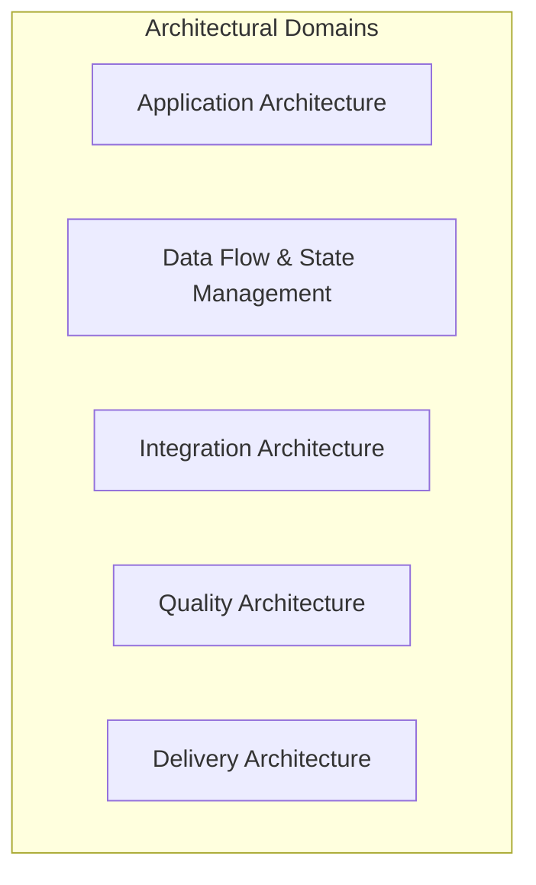
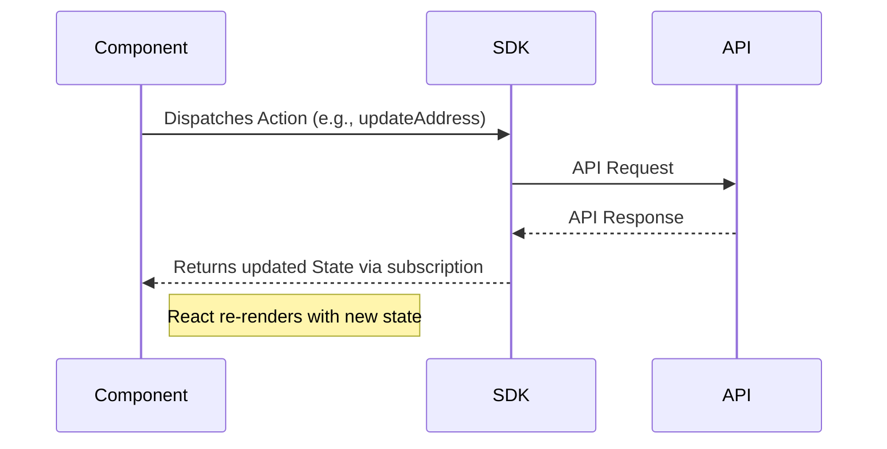
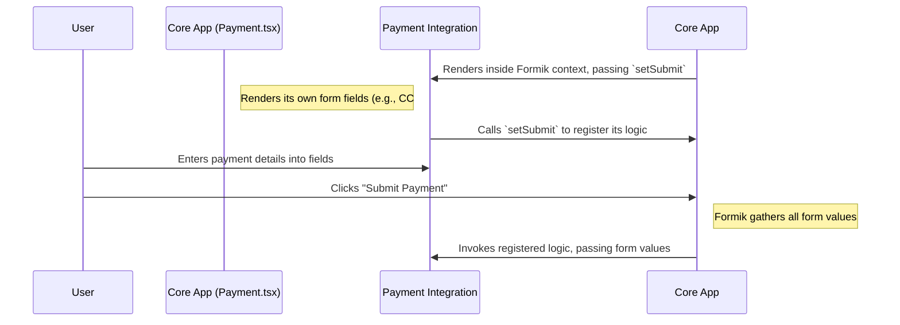

---
**Title:** Architectural Overview
**Purpose:** The high-level summary of the system, its purpose, and a guide to the other documentation domains.
**Audience:** All Developers
**Maintenance:** Review quarterly, or on major architectural change.
---

# **1. Architectural Overview**

## High-Level Summary

This project is a browser-based, single-page application that provides a seamless and customizable user interface for the BigCommerce checkout experience. Its primary purpose is to deliver a robust, extensible, and performant checkout flow for merchants and shoppers.

## Core Technologies & Dependencies

This project is built on a modern frontend stack. The key technologies and their roles are:

*   **React:** The core UI library for building the component-based user interface.
*   **TypeScript:** Used for all application code to ensure type safety and improve developer experience.
*   **SCSS:** The CSS preprocessor used for all styling, enabling a consistent and themeable design system.
*   **BigCommerce Checkout SDK:** The primary tool for state management, providing all necessary data and actions related to the checkout process.
*   **Formik & Yup:** The libraries used for managing all form state and schema-based validation.
*   **Jest & React Testing Library:** The framework and utilities for all unit and component testing.

## The Five Architectural Domains (The Architect's View)

While the slices provide a concrete, "bottom-up" developer's view of the system's components, the architecture is also governed by five high-level **Architectural Domains**. These domains provide a "top-down" architect's view, grouping the slices into strategic areas of concern. Understanding both perspectives is key to mastering this codebase.

<b>Mapping Slices to Domains</b>

*   **1. Application Architecture Domain:** Governs the internal structure of the UI and its logic.
    *   `UI & Component System Slice`
    *   `Forms & Validation Slice`
    *   `Step-Based View Management Slice`
    *   `Styling & Theming Slice`
    *   `Internationalization (I18n) Slice`
*   **2. Data Flow & State Management Domain:** Governs the lifecycle of data and state.
    *   `State Management Slice`
    *   `Context & Dependency Injection Slice`
*   **3. Integration Architecture Domain:** Governs communication with the outside world.
    *   `Integration & Extensibility Slice`
    *   `Analytics Slice`
    *   `Embedded Checkout Slice`
*   **4. Quality Architecture Domain:** Governs the resilience, performance, and security of the system.
    *   `Error Handling Slice`
    *   `Testing Slice`
    *   `Asynchronous Loading & Code-Splitting Slice` (Performance)
*   **5. Delivery Architecture Domain:** Governs how the application is built and deployed.
    *   `Monorepo & Tooling Slice`
    *   `Build & Bundling Slice`

## Architectural Philosophy

This documentation is architected as a **"Living System of Knowledge"** built on two core principles:

1.  **Hierarchical Abstraction:** The system is a structured hierarchy that allows you to "dive deeper" from a high level into more granular detail. This document is the **"Level 1" high-level overview**.
2.  **Domain-Driven Organization:** The "Level 2" deep-dive guides are organized into distinct architectural domains. This document serves as the primary map to those domains.

## Architectural Pillars (The Slices)

The application is composed of several cross-cutting architectural subsystems, or "slices." The most important of these are:

*   **Monorepo & Tooling Slice:** A monorepo managed by Nx, governing code organization and builds.
*   **Build & Bundling Slice:** A sophisticated Webpack configuration for bundling, code-splitting, and asset management.
*   **Context & Dependency Injection Slice:** A system of React Context Providers for injecting shared services.
*   **State Management Slice:** A centralized service for managing all checkout state.
*   **UI & Component Slice:** A hierarchical system of React components, including a shared UI library.
*   **Forms & Validation Slice:** A standardized system for handling all user input.
*   **Integration & Extensibility Slice:** A "plugin" architecture for extensibility, primarily for payment methods.
*   **Step-Based View Management Slice:** A state-driven system that controls the user's journey through the checkout flow.
*   **Styling & Theming Slice:** A layered system of global and component-specific styles.
*   **Asynchronous Loading & Code-Splitting Slice:** A performance optimization system that lazy-loads components.
*   **Error Handling Slice:** A centralized system for catching, logging, and displaying errors.
*   **Internationalization (I18n) Slice:** A system for managing language translations and localization.
*   **Analytics Slice:** A discrete subsystem for tracking analytics events.
*   **Testing Slice:** A sophisticated, shared testing infrastructure with custom fixtures and mocks.
*   **Embedded Checkout Slice:** A dedicated subsystem for adapting the checkout's behavior when embedded in another application.

## Architectural Patterns & Dynamics

### Core Patterns

*   **Feature-Based Monorepo:** The codebase is a monorepo, with the core application and its various payment integrations organized into self-contained packages.
*   **Functional Components:** The standard for UI components in this project is to use **Functional Components** with hooks.
*   **Inter-Package Communication:** The monorepo uses TypeScript path aliases to manage dependencies between packages, allowing for clean, package-based imports (e.g., `@bigcommerce/checkout/ui`).
*   **Co-location:** Within each feature folder, files are co-located by component, meaning the component logic (`.tsx`), styles (`.scss`), and tests (`.test.tsx`) all live together.

### Application Lifecycle & Data Flow

The application's primary function is to guide a user through the checkout process. This lifecycle is driven by a simple, one-way data flow pattern, with the Checkout SDK serving as the single source of truth for all state.

### System Dynamics & Extensibility

The most important architectural pattern is the Inversion of Control (IoC) model used for payment integrations. The core application is decoupled from any specific payment logic, allowing new payment methods to be added as self-contained "plugins" without requiring changes to the core application. For a detailed explanation of this pattern, see the **[External Services Guide](../03-integration-architecture/02-external-services-guide.md)**.

## Folder Structure & Organization

The primary application logic resides in the `packages/core/src/` directory. This structure is designed to be self-explanatory by embracing two core principles:

*   **Feature-Based Organization (`src/app`):** This is the heart of the application. Each feature directory (e.g., `address/`, `cart/`) contains all files related to that specific piece of domain logic.
*   **Global Systems (`src/scss`):** This directory contains the foundational **global styling system**, including design tokens and mixins that are extended by component-specific stylesheets.

## State Management Strategy

The application employs a clear, two-part state management strategy that explicitly **avoids a global library like Redux**.

1.  **Checkout State (BigCommerce Checkout SDK):** All state related to the checkout process is managed exclusively by the SDK. Components access this state via the **`useCheckout()` hook**.
2.  **Form State (Formik):** All local form state, including user input and validation, is managed by Formik.

For a detailed explanation of data flow patterns and how to interact with the state, see the **[State Management Guide](../01-application-architecture/02-state-management-guide.md)**.

## Styling Architecture

The project's styling architecture is a layered system built on SCSS. The key standard for all CSS class names is the **kebab-case** convention (e.g., `.checkout-address`). It includes a foundational global styling system (design tokens, mixins) that is extended by component-specific stylesheets. For a practical guide to using the styling system and its conventions, see the **[Styling Guide](../02-design-system/03-styling-guide.md)**.
