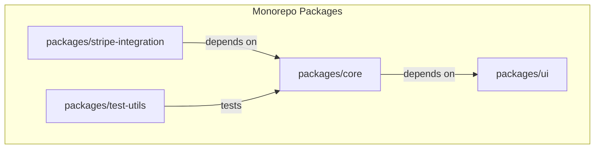

---
**Title:** Module Breakdown
**Purpose:** A detailed inventory and explanation of the application's feature modules.
**Audience:** All Developers
**Maintenance:** Update when new modules are added or existing ones are significantly changed.
---

# Module Breakdown

This document is a practical, "Level 2" deep-dive that teaches the architectural philosophy and the rules for navigating and extending the `checkout-js` monorepo. It provides the structural map of the codebase, explaining not just *what* the pieces are, but *why* they are separated and *how* they fit together.

## 1. Architectural Principles

The codebase's structure is governed by three core philosophies:

*   **Monorepo for Cohesion:** All related packages (the core application, payment integrations, shared utilities) are housed in a single repository. This simplifies dependency management, standardizes tooling, and enables safe, cross-package refactoring.
*   **Feature-Based Organization:** Within the core application, code is organized by domain features (e.g., `address/`, `cart/`) rather than by code type (e.g., a single `components/` folder). This encapsulates domain logic and keeps related files together.
*   **Package-Based Separation of Concerns:** The monorepo is divided into distinct `npm` packages for different architectural concerns (e.g., `@bigcommerce/checkout/ui` for the component library, `@bigcommerce/checkout/test-utils` for testing infrastructure). This enforces clear boundaries, promotes code reuse, and allows for independent testing and versioning.

## 2. Monorepo Package Overview

The monorepo's architecture is a classic "hub and spoke" model. The `core` package is the central application hub. All other packages exist to either serve `core` (like utilities) or to be consumed by it (like integrations).



*   **`core`**: The main checkout application. This is the central "hub."
*   **`payment-integrations`**: 30+ individual packages, each a "spoke" that plugs into the core application to provide a specific payment method.
*   **`utility-packages`**: A collection of shared packages that provide common, reusable functionality to `core` and other packages.
*   **`testing-packages`**: A suite of packages providing shared infrastructure for testing across the entire monorepo.

## 3. Core Application Feature Modules

The primary application logic resides in the `packages/core/src/app` directory, which is organized by domain feature.

| Module | Primary Responsibility | Key Components/Interactions |
| :--- | :--- | :--- |
| **`address`** | Manages shipping and billing address forms and display. | `AddressForm.tsx`, `AddressSelect.tsx` |
| **`billing`** | Orchestrates the billing step of the checkout. | `Billing.tsx`, `BillingForm.tsx` |
| **`cart`** | Displays the cart summary and related details. | `CartSummary.tsx` |
| **`checkout`** | The main application entry point and step orchestrator. | `Checkout.tsx`, `CheckoutPage.tsx` |
| **`customer`** | Handles guest/login forms and customer-related logic. | `Customer.tsx`, `LoginForm.tsx` |
| **`payment`** | Manages payment method selection and form submission. | `Payment.tsx`, `PaymentMethod.tsx` |
| **`shipping`** | Handles shipping address and shipping option selection. | `Shipping.tsx`, `ShippingOptions.tsx` |
| **`order`** | Renders the order confirmation page after a successful checkout. | `OrderConfirmation.tsx` |

## 4. Shared Utility Packages

These packages provide common, reusable functionality to the `core` application and other packages.

*   **`ui`**: The shared React component library. Provides a consistent look-and-feel with components like `<Button>`, `<FormField>`, and `<Modal>`.
*   **`locale`**: The internationalization (I18n) system, including the `withLanguage` HOC and `useLanguage()` hook for accessing translations.
*   **`error-handling-utils`**: Centralized error handling infrastructure, including the `<ErrorBoundary>` and `ErrorLogger` service.
*   **`test-utils`**: Shared utilities for setting up a consistent environment for component tests, such as `<TestWrapper>`.

## 5. Developer's Guide: Practical Rules & Conventions

### The Principle of Co-location
Within a feature module, all files related to a single component are kept together in the same directory. This makes components easier to find, understand, and modify.

**Example:** For an `AddressForm` component, you will find this structure:
```
address/
└── AddressForm/
    ├── AddressForm.tsx       // Component logic
    ├── AddressForm.scss      // Component styles
    └── AddressForm.test.tsx  // Component tests
```

### Inter-Package Communication Rules
To enforce clear architectural boundaries and prevent "spaghetti code," the monorepo uses TypeScript path aliases for all imports between packages. This is a strict rule. **You must never use relative paths (e.g., `../..`) to import across package boundaries.**

This rule is critical because it makes our dependencies explicit and manageable. It allows our build tooling (Nx) to understand the dependency graph, which enables optimizations like build caching and correct build ordering.

The path aliases are defined in the root `tsconfig.base.json` file.

**Correct Way (explicitly declares dependency):**
```typescript
import { Button } from '@bigcommerce/checkout/ui';
```

**Incorrect Way (creates hidden, untraceable dependency):**
```typescript
// DO NOT DO THIS
import { Button } from '../../../../ui/src/button';
```
