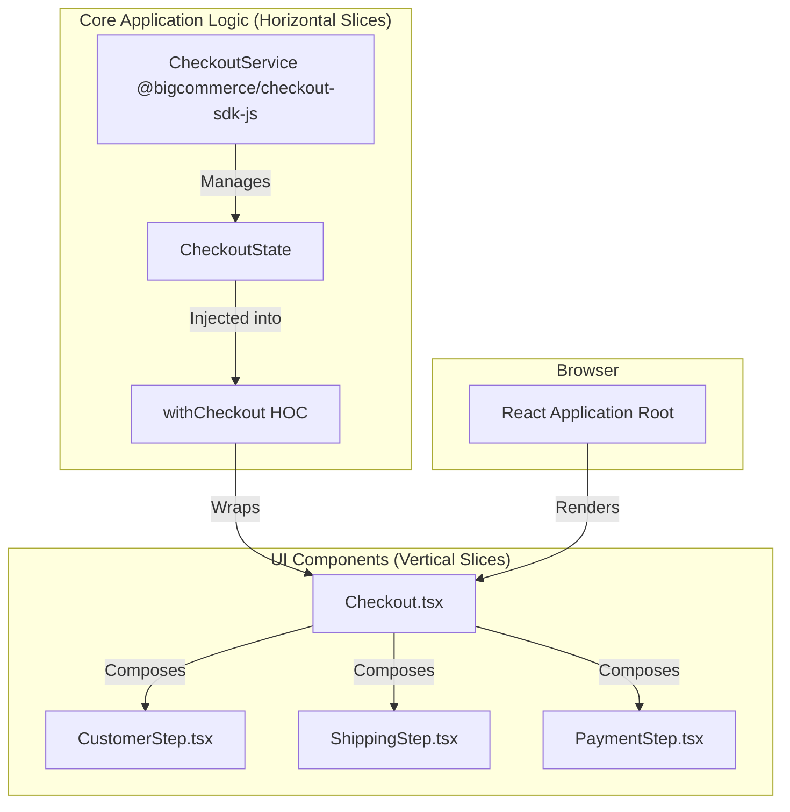

---
**Title:** The Package Architecture Guide (The Horizontal Slices)
**Purpose:** An introductory guide to the monorepo's package architecture, which constitutes the project's governed **horizontal (technical/global) slices**.
**Audience:** All Developers
**Maintenance:** Update when new packages are created or the core communication patterns change.
---

# The Package Architecture Guide (The Horizontal Slices)

This document provides the "macro" view of the `checkout-js` monorepo architecture. It explains how the project is organized into distinct **packages**, which are the **horizontal (technical/global) slices** that provide shared infrastructure and reusable capabilities to the entire application.

This architecture follows a pragmatic **hybrid model**, combining the horizontal slicing of these packages with the **vertical (feature/domain) slicing** of the internal feature modules. This allows us to build both highly reusable infrastructure and highly cohesive business logic.

## 1. Core Principles

The package architecture is governed by a set of core principles that ensure stability and maintainability:

*   **Modularity:** The application is broken down into discrete, independent packages with clear responsibilities.
*   **Decoupling & Reusability:** Packages are designed as downward-facing infrastructure. They must be agnostic of specific business features and must never depend on them. This ensures they are stable, testable, and reusable.
*   **State Management:** All application state is managed by a single, centralized service provided by the `@bigcommerce/checkout-sdk-js` package.
*   **Type Safety:** The entire codebase uses TypeScript, and the package boundaries are enforced by a strict `tsconfig.json` that uses path aliases for inter-package communication.

## 2. High-Level Diagram

The following diagram illustrates the high-level relationship between the core application logic (provided by the horizontal package slices) and the UI components (which are organized into vertical feature slices).



## 3. Monorepo Package Categories

The monorepo contains four main categories of packages, each serving a distinct architectural purpose.

*   **`core`:** The main application package that contains all the feature modules and orchestrates the checkout experience.
*   **`payment-integrations`:** A collection of independent packages, each implementing a specific payment provider (e.g., `stripe-integration`).
*   **`utility-packages`:** A library of shared, reusable infrastructure. For a detailed inventory and developer cookbook, see the [**Utility Packages Reference](./01-package-architecture-guide/01-utility-packages-reference.md)**.
*   **`testing-packages`:** A set of shared utilities and mock objects for testing. For a detailed inventory and developer cookbook, see the [**Testing Packages Reference](./01-package-architecture-guide/02-testing-packages-reference.md)**.

## 4. Key Integration Architectures

The application uses several distinct architectural patterns for integrating with both internal and external systems.

*   **Payment Gateway Integration:** Uses a **Strategy Pattern** to dynamically inject different payment providers. For a detailed explanation, see the [**Payment Integration Architecture Guide](./01-package-architecture-guide/03-payment-integration-architecture.md)**.
*   **SDK Integration:** Uses a **Higher-Order Component (HOC)** pattern to reactively connect UI components to the central state service. For a detailed explanation, see the [**SDK Integration Architecture Guide](./01-package-architecture-guide/04-sdk-integration-architecture.md)**.
*   **Analytics Integration:** Uses a combination of event tracking and performance monitoring hooks. For a detailed explanation, see the [**Analytics Integration Architecture Guide](./01-package-architecture-guide/05-analytics-integration-architecture.md)**.
*   **Embedded Checkout Integration:** Uses a **Messenger** pattern for secure, cross-frame communication with a parent window. For a detailed explanation, see the [**Embedded Checkout Architecture Guide](./01-package-architecture-guide/06-embedded-checkout-architecture.md)**.

## 5. Developer's Guide: Inter-Package Communication

All communication between packages is managed by **TypeScript Path Aliases** defined in the root `tsconfig.json`. This is a critical governance mechanism.

**Rule:** You **must never** use relative paths (`../..`) to import code from another package. You **must always** use the defined path aliases.

*   **Example:** To import the `Button` component from the `ui` utility package into the `core` application, you must use the following import statement:

```typescript
import { Button } from '@bigcommerce/checkout/ui';
```
