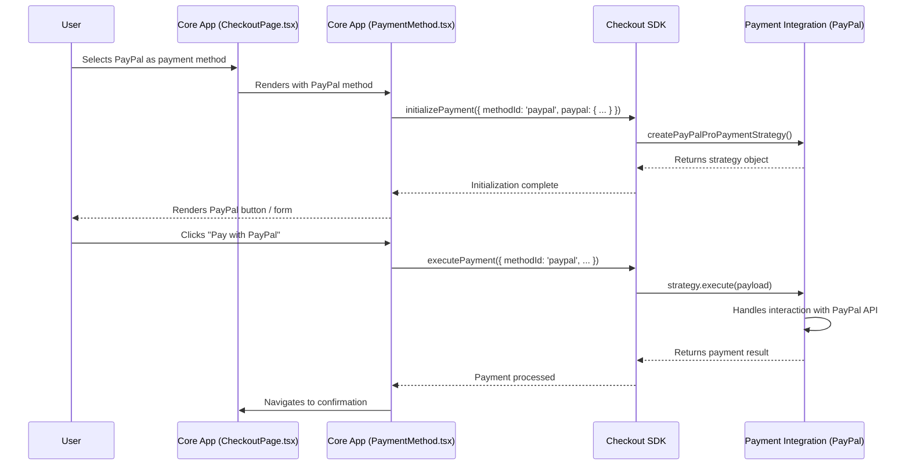

---
**Title:** Payment Integration Architecture
**Purpose:** A comprehensive, Level 3 deep-dive into the "plugin" architecture for payment integrations.
**Audience:** All Developers
**Maintenance:** Update if the core payment strategy pattern changes.
---

# The Payment Integration "Plugin" Architecture

While not a traditional "plugin" system with a single rigid interface, the checkout application uses a sophisticated **Strategy Pattern** to achieve the same goal: allowing different payment methods to be "plugged in" without modifying the core application.

This architecture is composed of three key concepts:

### 1. The Integration Contract (The Strategy Interface)

The "contract" for a payment integration is not a single TypeScript `interface`, but rather a set of high-order functions and props provided by the Checkout SDK's `checkoutService`. Any payment method that wants to integrate with the checkout must interact with this contract. The core methods are:

*   `initializePayment(options)`: Called to set up the payment provider's client, widgets, and event listeners. This is where the specific **payment strategy** (the logic for that payment method) is created and injected.
*   `deinitializePayment(options)`: Called to tear down the payment provider's resources.
*   `executePayment(payload)`: Called when the user submits the payment form.

### 2. The Loading & Registration Mechanism (The Factory)

The `PaymentMethodComponent` (`packages/core/.../PaymentMethod.tsx`) acts as a **Factory**. It is the central piece of logic that registers and loads the correct UI and behavior for a given payment method.

Its process is as follows:
1.  It receives a `method: PaymentMethod` object from the Checkout SDK state.
2.  It inspects the properties of this object (like `method.id` or `method.type`).
3.  Based on these properties, it renders the appropriate specialized component (e.g., `<BraintreeCreditCardPaymentMethod>`, `<HostedPaymentMethod>`).

### 3. Visualizing the Flow

This sequence diagram illustrates how the `core` application uses a specific payment strategy (like PayPal) during the checkout process.



### 4. A Concrete Example (`createPayPalProPaymentStrategy`)

The actual logic for a payment method is contained within its **strategy creation function**. This function is imported from the SDK's integration packages and passed into the `initializePayment` method.

```typescript
// packages/core/src/app/payment/paymentMethod/PaymentMethod.tsx

// ...
import { createPayPalProPaymentStrategy } from '@bigcommerce/checkout-sdk/integrations/paypal-pro';
// ...

function mapToWithCheckoutPaymentMethodProps({ checkoutService }) {
    return {
        // ...
        initializePayment: (options) => {
            return checkoutService.initializePayment({
                ...options,
                integrations: [
                    ...options.integrations ?? [],
                    // The strategy is injected here
                    createPayPalProPaymentStrategy,
                ],
            });
        },
        // ...
    };
}
```

This pattern ensures that the `core` application does not need to know the implementation details of any specific payment method. It only needs to know how to initialize the correct strategy, and the strategy itself handles the rest.
