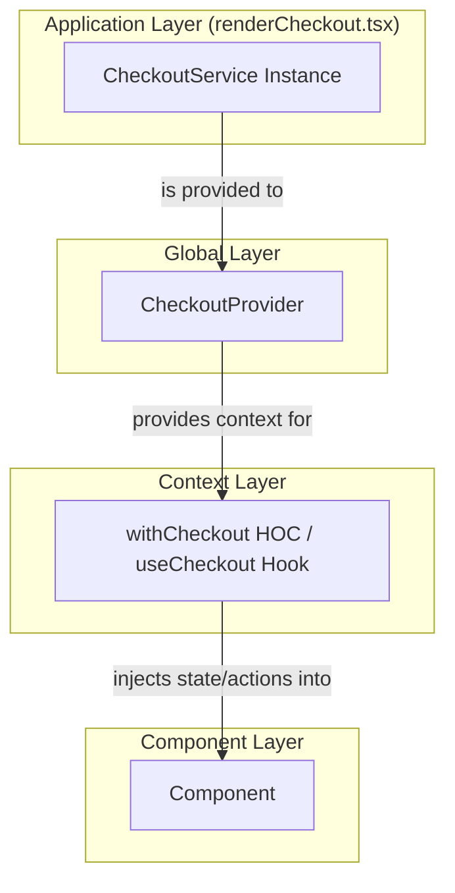
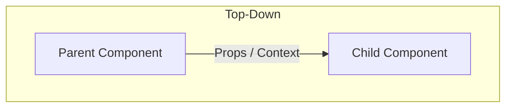
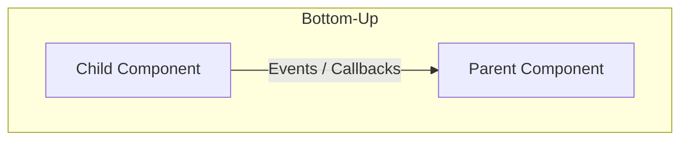
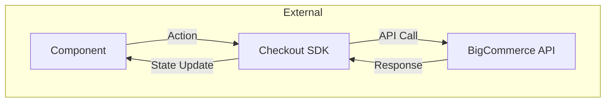
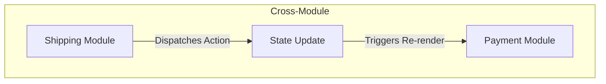

---
**Title:** State Management Guide
**Purpose:** A deep-dive guide to the layered state management strategy and data flow patterns.
**Audience:** All Developers
**Maintenance:** Update when state management patterns or the Checkout SDK integration changes.
---

# State Management Guide

This document is the "Level 2" deep-dive into the state management architecture of the `checkout-js` application. It provides the essential mental models and practical patterns for interacting with state, which is one of the most critical and complex subsystems in the project.

## 1. Guiding Philosophy

The project's state management strategy is governed by two core principles:

*   **Avoid Global State Libraries:** The application explicitly **avoids a global state library like Redux**. This is a deliberate architectural choice to reduce complexity and boilerplate, keeping the state management patterns tightly focused on the domain of the checkout process.
*   **Single Source of Truth:** The **BigCommerce Checkout SDK** is the definitive single source of truth for all data related to the checkout. All server-side state, business logic, and API interactions are managed by the SDK. Components do not fetch data directly; they consume it from the SDK.

## 2. The Five-Layer State Model

The application employs a sophisticated, five-layer model for managing state, which allows for a clear separation of concerns from the global application level down to individual components.



1.  **Application Layer:** The absolute top level, where the `CheckoutService` instance is created and provided to the entire application. This happens in `renderCheckout.tsx`.
2.  **Global Layer:** The `<CheckoutProvider>` component receives the `CheckoutService` instance and makes it available to the React component tree.
3.  **Context Layer:** The `withCheckout` Higher-Order Component (HOC) and the `useCheckout` hook connect to the React context provided by `<CheckoutProvider>` to access the state and actions.
4.  **HOC/Hook Layer:** This is where the majority of components interact with state. The HOC or hook is responsible for subscribing to SDK updates and re-rendering the component when the relevant state changes.
5.  **Component Layer:** The component itself receives the state and action dispatchers as props (from the HOC) or from the hook, keeping the component's own logic clean and decoupled from the global state machinery.

## 3. Accessing State

There are two primary patterns for accessing state, depending on whether you are working in a class-based or functional component.

### Class Components: The `withCheckout` HOC

For class-based components, the standard pattern is to use the `withCheckout` Higher-Order Component. This HOC injects state and actions as props into the component.

*   **`mapToCheckoutProps`:** This function is crucial. It acts as a selector, defining exactly which pieces of state and which actions the component needs from the SDK. This prevents unnecessary re-renders by ensuring the component only subscribes to the data it actually uses.

**Example (`packages/core/src/app/payment/Payment.tsx`):**
```typescript
// 1. Define the props that will be injected by the HOC
export interface WithCheckoutPaymentProps {
    isSubmittingOrder: boolean;
    submitOrder(values: OrderRequestBody): Promise<CheckoutSelectors>;
    // ... other props
}

// 2. Create the mapToCheckoutProps function to select data from the SDK
export function mapToPaymentProps({
    checkoutState,
    checkoutService,
}: CheckoutContextProps): WithCheckoutPaymentProps | null {
    const { data, statuses } = checkoutState;

    return {
        isSubmittingOrder: statuses.isSubmittingOrder(),
        submitOrder: checkoutService.submitOrder,
        // ... other props
    };
}

// 3. Wrap the component with the HOC
export default withCheckout(mapToPaymentProps)(Payment);
```

### Functional Components: The `useCheckout()` Hook

For modern functional components, the `useCheckout()` hook is the preferred method. It provides direct access to the `checkoutState` and `checkoutService` within the component.

**Example (`packages/core/src/app/customer/useCustomer.ts`):**
```typescript
import { useCheckout } from '@bigcommerce/checkout/payment-integration-api';

export const useCustomer = () => {
    const { checkoutState, checkoutService } = useCheckout();

    const data = {
        email: checkoutState.data.getCustomer()?.email,
        // ... other data selectors
    };

    const actions = {
        signIn: (credentials: CustomerCredentials) =>
            checkoutService.signInCustomer(credentials),
        // ... other actions
    };

    return { data, actions };
};
```

## 4. Multi-Directional Data Flow

While the core data flow is a one-way loop (Component -> Action -> SDK -> API -> SDK -> Component), the reality of the application is more complex. Data flows in multiple directions to handle the variety of interactions.






*   **Top-Down:** Standard React pattern. Data flows from parent to child components via props and context.
*   **Bottom-Up:** Standard React pattern. Child components communicate with parents via event handlers and callbacks passed down as props.
*   **External:** The primary application loop. A component dispatches an action to the SDK, which makes an API call. The SDK updates its state upon response, which triggers a re-render in the component.
*   **Cross-Module:** An action dispatched in one feature module (e.g., `Shipping`) can cause a global state change that affects a completely different module (e.g., updating the grand total, which causes the `Payment` module to re-evaluate available payment methods).

## 5. State Synchronization Patterns

A common challenge is synchronizing external state (from the SDK) with local component state (often managed by Formik).

The standard pattern is to use a `useEffect` hook or a component lifecycle method to update local state when the global state from the SDK changes. For form submissions, the pattern is to take the final, validated local state from Formik, map it to the required API request body, and dispatch it to a `checkoutService` action. This ensures that the single source of truth (the SDK) is updated with the user's validated local input.

**Example (Form Submission in `packages/core/src/app/payment/Payment.tsx`):**

The `handleSubmit` function in the `Payment` component demonstrates this pattern perfectly.

1.  It receives the `values` from Formik's `onSubmit` callback. These values represent the complete, validated local state of the payment form.
2.  It passes these `values` to a mapper function, `mapToOrderRequestBody`.
3.  The mapper function transforms the local form state into the precise `OrderRequestBody` shape required by the SDK.
4.  The resulting object is then passed to the `submitOrder` action, synchronizing the local state with the backend.

```typescript
// In Payment.tsx
const handleSubmit = useCallback(async (values: PaymentFormValues) => {
    // ...
    try {
        // The `values` object is the local Formik state.
        // It is mapped and then sent to the SDK action.
        const state = await submitOrder(mapToOrderRequestBody(values, isPaymentDataRequired()));
        // ...
    } catch (error) {
        // ...
    }
}, [
    // ...
]);
```
