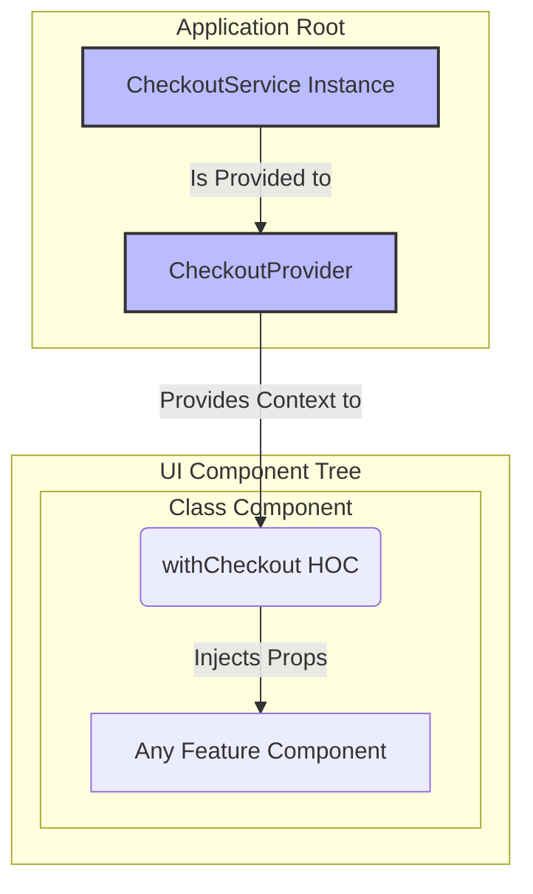
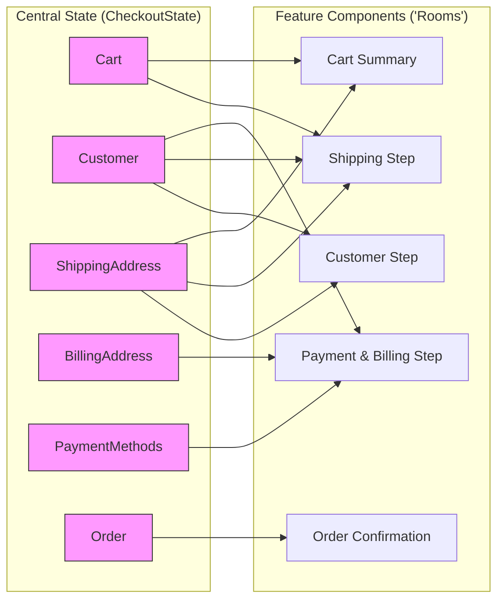
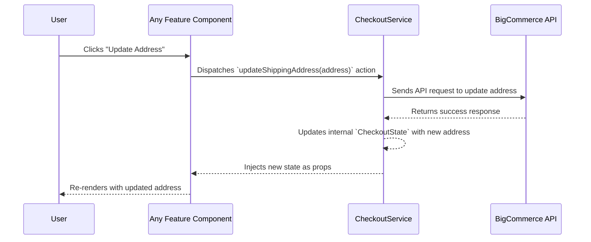

---
**Title:** The State Management Guide (The "Wiring Diagram")
**Purpose:** The definitive "Single Source of Truth" and "wiring diagram" for the State Management Cross-Cutting Concern (CCC).
**Audience:** All Developers
**Maintenance:** Update if the core state management patterns or the Checkout SDK integration changes.
---

# The State Management Guide (The "Wiring Diagram")

This document is the definitive "wiring diagram" for the State Management slice, which is the most critical **Cross-Cutting Concern (CCC)** in the application. It serves as the central nervous system, providing a single, predictable source of truth for all shared application data.

## 1. Architectural Principles

The State Management slice is a **governed horizontal slice** that is architected according to two core principles:

*   **Centralized State Machine:** The slice is governed by a "Centralized State Machine" pattern. All state is held in a single object (`CheckoutState`), and all mutations to that state are managed exclusively by a single service (`CheckoutService`). This ensures a predictable, one-way data flow.
*   **Compositional Decoupling:** The slice is implemented using a compositional pattern (a top-level `<CheckoutProvider>` and a `withCheckout` Higher-Order Component) that **decouples** the state logic from the feature components that consume it. Components do not know *how* state is managed; they are simply consumers of the state that is injected into them.

## 2. The State Injection Pattern

The following diagram illustrates the static, structural relationships between the key components of the slice. It shows *how* the core services are instantiated at the root of the application and provided to the entire component tree via a Higher-Order Component.



## 3. The Data Flow Schematic

While the diagram above shows the injection *pattern*, this schematic shows the data *flow*. It is the principal "wiring diagram" for the application, mapping the core domains of the `CheckoutState` to the primary feature components (the "rooms") that consume them.



## 4. A Common Use Case: The System-Wide Reaction

The following sequence diagram illustrates the dynamic, end-to-end flow of a common state change operation, such as a user clicking a button to update their address.



## 5. A Breakdown of the Patterns

The interaction with the state management slice can be broken down into two primary patterns: Action Dispatch and State Access.

### Action Dispatch (Writing Data)

All state mutations are initiated by calling an action method on the `CheckoutService`. This is typically done within an event handler in a component.

```typescript
// In any component connected via `withCheckout`...
const handleUpdateAddress = async (address: Address) => {
    try {
        // The component dispatches an action to the SDK.
        // It does not know how the state is updated, only that it needs to.
        await props.checkoutService.updateShippingAddress(address);
    } catch (error) {
        // Handle error...
    }
};
```

### State Access (Reading Data)

Components access the state through the props that are injected by the `withCheckout` HOC.

```typescript
// In any component connected via `withCheckout`...
const { checkoutState } = props;
const { data, errors, statuses } = checkoutState;

const customer = data.getCustomer();
const cart = data.getCart();
const isShippingLoading = statuses.isUpdatingShippingAddress();
```

## 6. Key Components & Implementation Patterns

### The `withCheckout` Higher-Order Component (HOC)

This is the primary mechanism for connecting feature components to the State Management slice.

**Cookbook: Connecting a Component**

To connect a component to the checkout state, wrap it with the `withCheckout` HOC and define the `mapToCheckoutProps` function. This function acts as a selector, giving you precise control over which parts of the global state and which SDK actions your component needs access to.

```typescript
import { withCheckout, CheckoutContextProps } from '@bigcommerce/checkout/checkout-sdk';

// 1. Define the props your component needs from the state.
interface MyComponentProps {
    customerEmail?: string;
    updateShippingAddress(address: Address): Promise<void>;
}

// 2. Create the component. It receives the state props.
const MyComponent: FunctionComponent<MyComponentProps> = ({ customerEmail, updateShippingAddress }) => {
    // ... component logic ...
};

// 3. Define the mapToCheckoutProps function.
// This function receives the full checkout context and returns only the props your component needs.
const mapToCheckoutProps = (context: CheckoutContextProps) => {
    const { checkoutState, checkoutService } = context;
    const customer = checkoutState.data.getCustomer();

    return {
        customerEmail: customer?.email,
        updateShippingAddress: checkoutService.updateShippingAddress,
    };
};

// 4. Export the connected component.
export default withCheckout(mapToCheckoutProps)(MyComponent);
```
