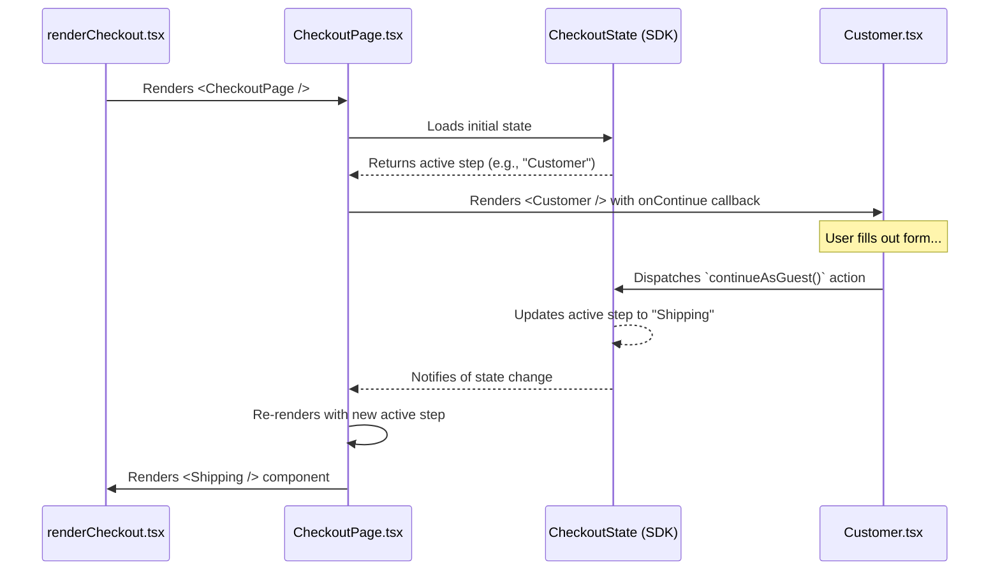

---
**Title:** The View Management Guide (The "Orchestration Slice")
**Purpose:** The "wiring diagram" for the View Management slice, a hybrid Cross-Cutting Concern that orchestrates the user's journey.
**Audience:** All Developers
**Maintenance:** Update if the core navigation or step-rendering logic changes.
---

# The View Management Guide (The "Orchestration Slice")

This document is the "wiring diagram" for the **View Management slice**. This is a specialized, hybrid **Cross-Cutting Concern** that is responsible for orchestrating the user's linear journey through the checkout.

## 1. Architectural Principles

This slice is governed by two core principles:

*   **Orchestration:** The primary role of this slice is to **orchestrate** the user's journey, rendering the correct **vertical feature slice** (e.g., the `Customer` module, the `Shipping` module) at the correct time.
*   **State-Driven Control:** The user's position in the flow is not managed by the view components themselves. It is controlled exclusively by the global `CheckoutState`. This decouples the feature components from the overall application flow, allowing them to focus on their specific responsibilities.

## 2. The Full Lifecycle of a View

The following diagram illustrates the complete, end-to-end "wiring diagram" for a single view transition. It shows the full lifecycle, from the initial rendering of a step to the user completing it and triggering a re-render with the next step in the sequence.



## 3. The Central Controller Pattern

The entire View Management slice is orchestrated by a central controller, the **`CheckoutPage.tsx`** component. This component is responsible for subscribing to the global state, determining the active step, and rendering the appropriate view component.

To manage navigation, it uses a **Controller-View Callback Pattern**.

### The Contract: Passing the Callback

The Controller (`CheckoutPage.tsx`) renders the active View component (`<Customer />`) and passes a reference to its own internal navigation method (`this.navigateToNextIncompleteStep`) as a prop.

```typescript
// In CheckoutPage.tsx (The Controller)

private renderCustomerStep(step: CheckoutStepStatus): ReactNode {
    return (
        <Customer
            // ... other props
            onContinueAsGuest={ this.navigateToNextIncompleteStep } // The callback is passed as a prop.
        />
    );
}
```

### The Interaction: Invoking the Callback

After the View (`Customer.tsx`) completes its primary responsibility (in this case, calling the `continueAsGuest` action on the SDK), it invokes the callback prop (`onContinueAsGuest()`) to signal to the Controller that it is finished.

```typescript
// In Customer.tsx (The View)

// This is called after the user submits the guest form.
private handleContinueAsGuest: (data: CustomerCredentials) => Promise<void> = async (data) => {
    const { onContinueAsGuest } = this.props;

    // The View completes its internal work...
    await customerData.actions.continueAsGuest({ email });

    // ...then invokes the callback to notify the Controller.
    if (onContinueAsGuest) {
        onContinueAsGuest();
    }
};
```

## 4. The Navigation Mechanism

The final piece of the loop is the navigation callback itself. When the View invokes the callback, the `navigateToNextIncompleteStep` method inside the Controller is executed. This method determines the next logical step in the checkout flow and dispatches the action to update the global state, which causes the Controller to re-render with the new, correct view.

```typescript
// In CheckoutPage.tsx (The Controller)

private navigateToNextIncompleteStep: () => void = () => {
    const { steps } = this.props;
    const nextIncompleteStep = find(steps, { isComplete: false });

    if (nextIncompleteStep) {
        // This dispatches the action that updates the global state,
        // which triggers the re-render with the next view.
        this.props.goToStep(nextIncompleteStep.type);
    }
};
```
