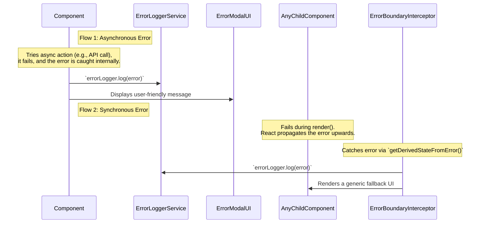

---
**Title:** The Error Handling Guide
**Purpose:** The "wiring diagram" for the Error Handling & Logging Cross-Cutting Concern (CCC), a governed, horizontal architectural slice.
**Audience:** All Developers
**Maintenance:** Update if the core error handling patterns or custom error types change.
---

# The Error Handling Guide

This document is the "wiring diagram" for the **Error Handling & Logging slice**. This is a **governed horizontal slice** responsible for managing both synchronous (rendering) and asynchronous (network) errors in a consistent, decoupled, and centralized way.

## 1. Architectural Principles

This slice is architected according to two core principles for managing Cross-Cutting Concerns (CCCs):

*   **Decoupling:** The primary goal is to decouple error handling logic from core business logic to prevent **tangling**, where error management code obscures the primary purpose of a feature component.
*   **Centralization:** The slice is implemented as a governed, horizontal system that avoids the **scattering** of error handling logic. It favors **global interceptors** (`<ErrorBoundary>`) and **centralized services** (`ErrorLogger`) over repeated, inconsistent `try...catch` blocks.

## 2. The Two Primary Error Flows

The application has two distinct flows for handling errors, which are visualized in the diagram below.



### Flow 1: Asynchronous Errors (e.g., API Failures)

For asynchronous operations (like API calls), the standard pattern is a `try...catch` block within the component or hook that initiates the operation. This is the most common and immediate line of defense.
*   **Action:** Logs the error via the `ErrorLogger` and typically displays a user-friendly `<ErrorModal>` with a specific, helpful message.

### Flow 2: Synchronous Errors (e.g., Rendering)

For synchronous errors that happen during a React render cycle, the application is protected by a single, top-level `<ErrorBoundary>`.
*   **Action:** Logs the error via the `ErrorLogger` and renders a generic, fallback UI so the user can still attempt to recover (e.g., by reloading the page).

## 3. Key Components of the Slice

The Error Handling slice is composed of two key components that work together as a cohesive, decoupled system:

*   **`<ErrorBoundary>` (`packages/error-handling-utils`):** This top-level React component acts as a **global interceptor** for any rendering errors that occur in the component tree below it. It prevents the entire application from crashing due to a UI error.

*   **`ErrorLogger` (`packages/error-handling-utils`):** This is the **centralized service** for reporting errors to external monitoring systems (like Sentry). Both the `<ErrorBoundary>` and component-level `catch` blocks use this service. This ensures that all errors, regardless of where they are caught, are logged consistently.

## 4. Developer Cookbook: Handling Asynchronous Errors

The following recipe shows the standard "golden path" for handling errors within an asynchronous function, such as a form submission handler.

```typescript
import { useErrorLogger, useErrorModal } from '@bigcommerce/checkout/error-handling-utils'; // Assuming hooks exist for ease of use

const MyComponent = () => {
    const errorLogger = useErrorLogger();
    const { showError } = useErrorModal();

    const handleSubmit = async (values) => {
        try {
            // 1. Attempt the asynchronous action.
            await props.checkoutService.updateShippingAddress(values.address);

        } catch (error) {
            // 2. Report the error to the centralized service.
            errorLogger.log(error);

            // 3. Display a user-friendly message.
            showError(error);
        }
    };

    // ... component render logic ...
};
```

## 5. Custom Error Types

To enable more specific and intelligent error handling, the application uses several custom error classes. This allows `catch` blocks to change their behavior based on the *type* of error that occurred.

*   **`RequestError`:** The most common type, thrown when an API request fails. It contains the server response details.
*   **`CartChangedError`:** A special error thrown if the user's cart is modified in another browser tab, causing the current checkout state to be stale. This error typically triggers an automatic page reload to recover.
