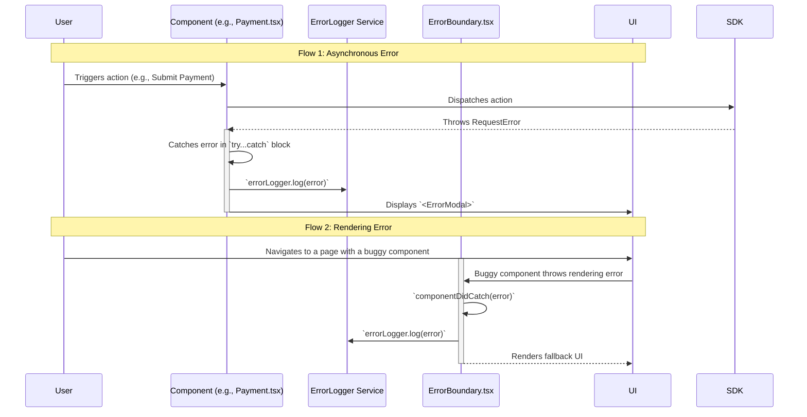

---
**Title:** Error Handling Guide
**Purpose:** A guide to the application's centralized error handling and logging system.
**Audience:** All Developers
**Maintenance:** Update when error handling patterns or components change.
---

# Error Handling Guide

This document is the "Level 2" deep-dive into the Error Handling slice. It provides the complete "wiring diagram" for the application's centralized, multi-layered strategy for catching, logging, displaying, and recovering from errors.

## 1. The Architectural Philosophy: Defense in Depth

The error handling strategy is built on the principle of "Defense in Depth." No single mechanism is responsible for all errors. Instead, a series of layers work together to ensure that different types of errors are caught and handled at the appropriate level, providing a resilient and user-friendly experience.

## 2. The Full Lifecycle: The "Wiring Diagram"

The following diagram illustrates the two primary error handling flows: one for asynchronous errors (like API failures) caught within a component, and one for synchronous rendering errors caught by a top-level boundary.



## 3. The Error Handling Stack

### 3.1. Layer 1: The `<ErrorBoundary>`

The `<ErrorBoundary>` (`packages/error-handling-utils`) is the highest level of defense. It is a React component that wraps the entire application and is responsible for catching any synchronous rendering errors that occur in its child component tree.

*   **Responsibility:** Prevents a white screen of death by catching critical UI errors.
*   **Action:** Logs the error via the `ErrorLogger` and renders a generic, fallback UI so the user can still attempt to recover (e.g., by reloading the page).

**Implementation (`CheckoutApp.tsx`):**
```typescript
// In CheckoutApp.tsx
<ErrorBoundary
    errorLogger={this.errorLogger}
    fallbackComponent={ErrorFallback}
>
    <CheckoutProvider checkoutService={this.checkoutService}>
        {/* ... rest of the application ... */}
    </CheckoutProvider>
</ErrorBoundary>
```

### 3.2. Layer 2: Component-Level `try...catch`

For asynchronous operations (like API calls), the standard pattern is a `try...catch` block within the component or hook that initiates the operation. This is the most common and immediate line of defense.

*   **Responsibility:** Catches predictable failures from external interactions.
*   **Action:** Logs the error via the `ErrorLogger` and typically displays a user-friendly `<ErrorModal>` with a specific, helpful message.

**Implementation (`Payment.tsx`):**
```typescript
// In Payment.tsx
const handleSubmit = useCallback(async (values: PaymentFormValues) => {
    try {
        await submitOrder(mapToOrderRequestBody(values, isPaymentDataRequired()));
        // ...
    } catch (error) {
        // Log the error for developers
        errorLogger.log(error);

        // Display a modal for the user
        setSubmissionError(error);
    }
}, [/*...*/]);
```

### 3.3. The `ErrorLogger` Service

The `ErrorLogger` (`packages/error-handling-utils`) is the centralized service for reporting errors to external monitoring systems (like Sentry). Both the `<ErrorBoundary>` and component-level `catch` blocks use this service.

### 3.4. The `<ErrorModal>` Component

The `<ErrorModal>` (`packages/core`) is a standardized UI component for presenting a user-friendly error message in a modal dialog.

## 4. Custom Error Types

To allow for specific handling of different failure scenarios, the application uses a set of custom error classes. This allows `catch` blocks to inspect the error type and trigger different recovery logic.

*   **`RequestError`:** The most common type, thrown when an API request fails. It contains the server response details.
*   **`CartChangedError`:** A specialized error thrown when an action fails because the cart has been modified on the server (e.g., an item is now out of stock).

## 5. Error Recovery

Error recovery is the process of returning the application to a stable state. The primary automated recovery mechanism is for `CartChangedError`.

When this error is caught, it typically triggers a forced reload of the checkout data from the SDK. This re-syncs the client's state with the server's state, allowing the user to see the updated cart and proceed. Other errors may require a full page reload or simply instruct the user to try again.
