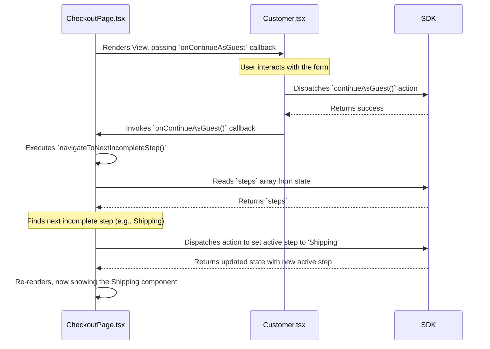

---
**Title:** View Management Guide
**Purpose:** An explanation of the state-driven system that controls the user's journey through the checkout flow.
**Audience:** All Developers
**Maintenance:** Update when the checkout step flow or navigation logic changes.
---

# View Management Guide

This document is the "Level 2" deep-dive into the View Management slice. It provides the complete, end-to-end "wiring diagram" for the state-driven system that controls the user's journey through the checkout.

## 1. The Architectural Pattern: A State-Driven Controller

View management in this application does **not use a traditional router**. Instead, it is governed by a centralized, state-driven controller pattern.

*   **The Controller:** The `CheckoutPage.tsx` component is the single controller for the entire checkout flow.
*   **The View:** The individual step components (e.g., `Customer.tsx`, `Shipping.tsx`) are the Views.
*   **The State:** The user's current position (the "active step") is held in the global state, managed by the BigCommerce Checkout SDK.
*   **The Mechanism:** The Controller renders the active View. When the View is complete, it signals the Controller via a callback, and the Controller dispatches an action to update the state, which triggers the rendering of the next View.

## 2. The Full Lifecycle: The "Wiring Diagram"

The following diagram illustrates the complete, end-to-end sequence of a single step transition. This is the core logical loop of the View Management slice.



## 3. The Controller-View Communication Contract

The sections below break down the key parts of the lifecycle diagram with their corresponding code.

### 3.1. The Controller Passes the Callback

The Controller (`CheckoutPage.tsx`) renders the active View component (`<Customer />`) and passes a reference to its own internal navigation method (`this.navigateToNextIncompleteStep`) as a prop.

```typescript
// In CheckoutPage.tsx
private renderCustomerStep(step: CheckoutStepStatus): ReactNode {
    return (
        <CheckoutStep {...step}>
            <LazyContainer>
                <Customer
                    onContinueAsGuest={this.navigateToNextIncompleteStep}
                    // ... other props
                />
            </LazyContainer>
        </CheckoutStep>
    );
}
```

### 3.2. The View Invokes the Callback

After the View (`Customer.tsx`) completes its primary responsibility (in this case, calling the `continueAsGuest` action on the SDK), it invokes the callback prop (`onContinueAsGuest()`) to signal to the Controller that it is finished.

```typescript
// In Customer.tsx
const handleContinueAsGuest = useCallback(async (formValues: GuestFormValues) => {
    try {
        await customerData.actions.continueAsGuest({ email });
        
        // Signal completion to the Controller
        onContinueAsGuest();
    } catch (error) {
        // ...
    }
}, [/*...*/]);
```

## 4. The Navigation Mechanism

The final piece of the system is the navigation logic inside the Controller. When the callback is invoked, the Controller executes its navigation method to determine the next step and trigger the state change.

```typescript
// In CheckoutPage.tsx
private navigateToNextIncompleteStep: (options?: { isDefault?: boolean }) => void = (
    options,
) => {
    const { steps } = this.props;
    // 1. Find the next incomplete step in the `steps` array from the state.
    const nextIncompleteStep = find(steps, { isComplete: false });

    if (nextIncompleteStep) {
        // 2. Update the state to make the next step active.
        this.navigateToStep(nextIncompleteStep.type, options);
    }
};
```
