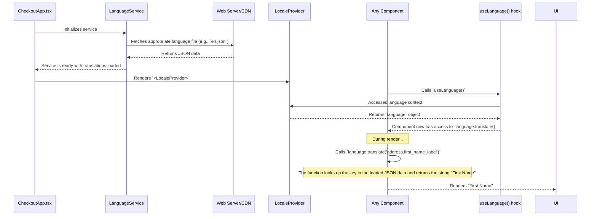

---
**Title:** Internationalization (I18n) Guide
**Purpose:** A guide to the system for managing language translations and localization.
**Audience:** All Developers
**Maintenance:** Update when I18n patterns or the locale package changes.
---

# Internationalization (I18n) Guide

This document is the "Level 2" deep-dive into the Internationalization (I18n) slice. It provides the complete "wiring diagram" for the system that loads, provides, and consumes language translations, ensuring the checkout experience can be localized for a global audience.

## 1. The Architectural Pattern: A Provider-Based System

The I18n system is a classic provider-based architecture. A central service is responsible for loading the correct translation data, which is then made available to the entire component tree via a top-level React Context Provider. Components then consume the translations through a dedicated HOC or hook.

## 2. The Full Lifecycle: The "Wiring Diagram"

The following diagram illustrates the complete, end-to-end sequence of how a translated string gets from a JSON file to the user's screen.



## 3. The I18n System

### 3.1. The `LanguageService`

The `LanguageService` (`packages/locale`) is a low-level service responsible for the core logic of fetching and parsing the translation files. It determines the correct language to load based on the checkout's configuration and the user's locale.

### 3.2. The `<LocaleProvider>`

The `<LocaleProvider>` (`packages/locale`) is the React Context provider that wraps the entire application. It holds the initialized `LanguageService` instance and makes the translation data and `translate` function available to all child components.

**Implementation (`CheckoutApp.tsx`):**
```typescript
// In CheckoutApp.tsx
<LocaleProvider language={this.languageService}>
    <CheckoutProvider checkoutService={this.checkoutService}>
        {/* ... rest of the application ... */}
    </CheckoutProvider>
</LocaleProvider>
```

## 4. Consuming Translations

There are two patterns for accessing translations in a component. The `useLanguage` hook is the modern, preferred method for functional components.

### 4.1. The `useLanguage()` Hook (Preferred)

The `useLanguage()` hook (`packages/locale`) is the simplest way to access the `language` object, which contains the `translate()` method.

**Implementation (`AddressForm.tsx`):**
```typescript
import { useLanguage } from '@bigcommerce/checkout/locale';

const MyComponent = () => {
    const { language } = useLanguage();

    return (
        <label>
            {language.translate('address.first_name_label')}
        </label>
    );
};
```

### 4.2. The `withLanguage` HOC

For class-based components, the `withLanguage` Higher-Order Component (`packages/locale`) can be used to inject the `language` object as a prop.

## 5. Translation Files

All translation strings are stored in simple JSON files, organized by language code.

*   **Location:** `packages/core/src/app/locale/translations/`
*   **Format:** A flat key-value object. Keys can be nested using dot notation for organization.

**Example (`en.json`):**
```json
{
    "address": {
        "first_name_label": "First Name",
        "last_name_label": "Last Name",
        "first_name_required_error": "First name is required."
    },
    "common": {
        "error_heading": "An Unexpected Error Occurred"
    }
}
```
