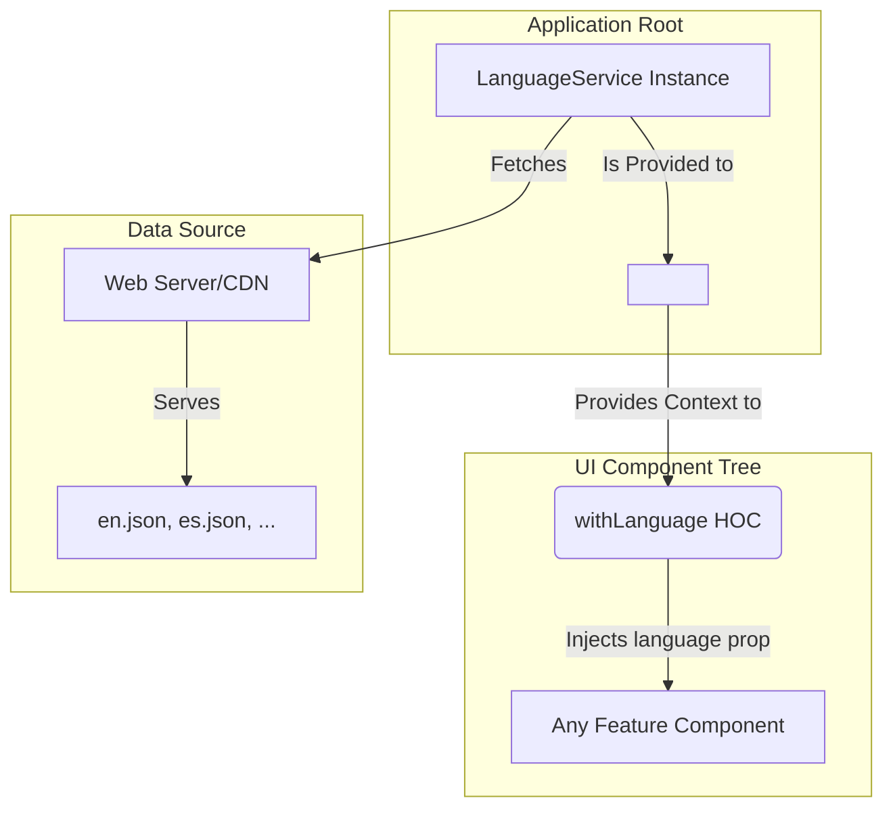

---
**Title:** The Internationalization (I18n) Guide
**Purpose:** A guide to the Internationalization (I18n) Cross-Cutting Concern (CCC), a governed, horizontal architectural slice.
**Audience:** All Developers
**Maintenance:** Update if the core I18n patterns or the structure of translation files change.
---

# The Internationalization (I18n) Guide

This document is the guide for the **Internationalization (I18n) slice**. This is a **governed horizontal slice** responsible for providing a centralized system for managing and consuming translated content, ensuring the application can be displayed in multiple languages.

## 1. Architectural Principles

This slice is architected according to two core principles for managing Cross-Cutting Concerns (CCCs):

*   **Centralization:** The I18n system is a horizontal slice that provides a single, consistent mechanism for handling all user-facing text.
*   **Decoupling:** The slice uses a compositional pattern (`<LocaleProvider>` and a `withLanguage` HOC / `useLanguage` hook) to **decouple** user-facing strings from the component code. This prevents the **tangling** of content with presentation logic, which is critical for maintainability and for allowing translators to work on content without needing to modify the codebase.

## 2. The I18n System

The I18n slice is composed of a set of core components from the `packages/locale` package. They work together to form a cohesive, decoupled system.



*   **`<LocaleProvider>`**: This is the top-level React provider that bootstraps the entire I18n system. It is placed at the root of the application and is responsible for instantiating the `LanguageService`.
*   **`LanguageService`**: This is the core service that handles the logic of fetching the correct language file (e.g., `en.json`) from the server and making the translation key-value pairs available to the application.

## 3. Consuming Translations in a Component

The primary pattern for accessing translated content is to connect a component to the I18n slice using the `withLanguage` Higher-Order Component (HOC). This injects a `language` prop into the component, which contains the `translate()` method.

**Cookbook: Displaying a Translated String**

```typescript
import { withLanguage, WithLanguageProps } from '@bigcommerce/checkout/locale';

// 1. Define the props that will be injected by the HOC.
// In this case, it's the `language` object.
type MyComponentProps = WithLanguageProps;

const MyComponent: FunctionComponent<MyComponentProps> = ({ language }) => {
    // 2. Use the language.translate() method with a translation key.
    return (
        <h1>
            { language.translate('customer.sign_in_action') }
        </h1>
    );
};

// 3. Export the connected component.
export default withLanguage(MyComponent);
```
*(Note: A modern `useLanguage()` hook likely also exists for functional components, following the same pattern as the State Management slice.)*

## 4. Translation Files

All user-facing strings are stored in simple JSON files, which are fetched by the `LanguageService`.

*   **Location:** The translation files are conventionally located at `packages/core/src/app/locale/translations/`.
*   **Structure:** There is a separate file for each supported language, named with its two-letter ISO code (e.g., `en.json`, `es.json`).
*   **Format:** The files are simple key-value pairs. The keys use a dot-notation convention to group related translations (e.g., `customer.`, `cart.`).

**Example: `en.json`**
```json
{
    "customer": {
        "sign_in_action": "Sign In",
        "returning_customer_text": "Returning Customer"
    },
    "cart": {
        "cart_summary_text": "Cart Summary"
    }
}
```
