# Package Dependencies - System Architecture

## Architecture Overview

**Purpose**: Documents the complete dependency graph and relationships between all packages in the BigCommerce checkout system.

**Architecture**: System-level documentation of package dependencies, integration patterns, and build relationships based on actual Nx workspace configuration.

**Source Code References**:
- Root Dependencies: `package.json`
- Workspace Configuration: `workspace.json`
- Nx Configuration: `nx.json`
- Project Configurations: `packages/*/project.json`

## Package Organization

### Total Package Count: 52 Packages
- **Core Package**: 1 package (`core`)
- **Payment Integrations**: 30 packages
- **Utility Packages**: 6 packages  
- **Test Packages**: 3 packages
- **Extension Packages**: 1 package
- **API Packages**: 1 package
- **Workspace Tools**: 1 package

## Core Package Dependencies

### Core Package (`packages/core/`)
**Direct Dependencies (from package.json):**
- **BigCommerce SDK**: `@bigcommerce/checkout-sdk@^1.751.1` - Core checkout functionality
- **React**: `react@^18.3.1` - React framework
- **React DOM**: `react-dom@^18.3.1` - React DOM rendering
- **Formik**: `formik@^2.4.6` - Form management
- **Yup**: `yup@0.30.0` - Form validation
- **Lodash**: `lodash@^4.17.21` - Utility functions
- **Classnames**: `classnames@^2.3.2` - CSS class management
- **Reselect**: `reselect@^4.1.7` - State selection
- **DOMPurify**: `dompurify@^3.2.4` - XSS prevention
- **Card Validator**: `card-validator@^6.1.0` - Credit card validation
- **Credit Card Type**: `credit-card-type@^8.0.0` - Card type detection
- **Sentry**: `@sentry/browser@^7.11.1` - Error monitoring

**Internal Package Dependencies:**
- **Analytics Package**: `@bigcommerce/checkout/analytics` - User behavior tracking
- **Extension Package**: `@bigcommerce/checkout/checkout-extension` - Third-party extensions
- **Error Handling Package**: `@bigcommerce/checkout/error-handling-utils` - Error management
- **Locale Package**: `@bigcommerce/checkout/locale` - Internationalization
- **UI Package**: `@bigcommerce/checkout/ui` - Shared UI components
- **Utility Package**: `@bigcommerce/checkout/utility` - Common utilities

**Dependents:**
- All 30 payment integration packages depend on core
- All 6 utility packages are used by core
- All 3 test packages test core functionality

## System Architecture Diagram

```mermaid
graph TB
    subgraph "Core Package (1)"
        Core[Core Package]
        Checkout[Checkout Component]
        BillingAndPayment[Billing and Payment]
        Customer[Customer Component]
        Shipping[Shipping Component]
        Order[Order Confirmation]
    end
    
    subgraph "Payment Integrations (30)"
        Stripe[Stripe Integration]
        PayPalCommerce[PayPal Commerce]
        PayPalExpress[PayPal Express]
        PayPalFastlane[PayPal Fastlane]
        Braintree[Braintree Integration]
        AmazonPay[Amazon Pay V2]
        ApplePay[Apple Pay]
        GooglePay[Google Pay]
        BigCommercePayments[BigCommerce Payments]
        Adyen[Adyen Integration]
        Klarna[Klarna Integration]
        ...
    end
    
        
    subgraph "External Dependencies"
        BigCommerceSDK[BigCommerce SDK v1.751.1]
        React[React v18.3.1]
        Formik[Formik v2.4.6]
        Yup[Yup v0.30.0]
        Lodash[Lodash v4.17.21]
        Sentry[Sentry v7.11.1]
    end
    
    %% Core internal relationships
    Core --> Checkout
    Checkout --> BillingAndPayment
    Checkout --> Customer
    Checkout --> Shipping
    Checkout --> Order
        
    %% Payment integrations depend on core
    BillingAndPayment --> Stripe
    BillingAndPayment --> PayPalCommerce
    BillingAndPayment --> PayPalExpress
    BillingAndPayment --> PayPalFastlane
    BillingAndPayment --> Braintree
    BillingAndPayment --> AmazonPay
    BillingAndPayment --> ApplePay
    BillingAndPayment --> GooglePay
    ...
    
    %% External dependencies
    Core --> BigCommerceSDK
    Core --> React
    Core --> Formik
    Core --> Yup
    Core --> Lodash
    Core --> Sentry
    
    %% Payment integrations use external SDKs
    Stripe --> BigCommerceSDK
    PayPalCommerce --> BigCommerceSDK
    Braintree --> BigCommerceSDK
    AmazonPay --> BigCommerceSDK
    ApplePay --> BigCommerceSDK
    
```



## Payment Integration Dependencies

### Payment Integration Packages (30 packages)
**Common Dependencies:**
- **Core Package**: All payment integrations depend on core
- **Payment Integration API**: `@bigcommerce/checkout/payment-integration-api` - Payment integration framework
- **BigCommerce SDK**: `@bigcommerce/checkout-sdk@^1.751.1` - Checkout SDK integration
- **UI Package**: `@bigcommerce/checkout/ui` - UI components
- **React**: `react@^18.3.1` - React framework
- **TypeScript**: TypeScript support

**Specific External Dependencies:**
- **Stripe Integration**: Stripe SDK, Stripe Elements, Stripe Payment Request API
- **PayPal Commerce**: PayPal SDK, PayPal Smart Buttons, PayPal Payment Request API
- **PayPal Express**: PayPal Express SDK, PayPal Express API
- **PayPal Fastlane**: PayPal Fastlane SDK, PayPal Fastlane API
- **Braintree Integration**: Braintree SDK, Braintree Components, Braintree Payment Request API
- **Amazon Pay V2**: Amazon Pay SDK, Amazon Pay Components, Amazon Pay Payment Request API
- **Apple Pay**: Apple Pay JS, Apple Pay Payment Request API
- **Google Pay**: Google Pay API, Google Pay Payment Request API
- **Adyen Integration**: Adyen SDK, Adyen Payment Request API
- **Klarna Integration**: Klarna SDK, Klarna Payment Request API
- **Afterpay Integration**: Afterpay SDK, Afterpay Payment Request API
- **Affirm Integration**: Affirm SDK, Affirm Payment Request API
- **Bolt Integration**: Bolt SDK, Bolt Payment Request API
- **Checkout.com Integration**: Checkout.com SDK, Checkout.com Payment Request API
- **Clearpay Integration**: Clearpay SDK, Clearpay Payment Request API
- **Mollie Integration**: Mollie SDK, Mollie Payment Request API
- **Moneris Integration**: Moneris SDK, Moneris Payment Request API
- **Square V2 Integration**: Square SDK, Square Payment Request API
- **Worldpay Access Integration**: Worldpay SDK, Worldpay Payment Request API
- **Barclay Integration**: Barclay SDK, Barclay Payment Request API
- **BlueSnap Direct Integration**: BlueSnap SDK, BlueSnap Payment Request API
- **BigCommerce Payments**: BigCommerce Payments SDK, BigCommerce Payments API
- **Credit Card Integration**: Credit card processing, Payment Request API
- **Hosted Credit Card**: Hosted payment forms, Payment Request API
- **Hosted Drop-in**: Hosted drop-in forms, Payment Request API
- **Hosted Field**: Hosted payment fields, Payment Request API
- **Hosted Payment**: Hosted payment forms, Payment Request API
- **Hosted Widget**: Hosted payment widgets, Payment Request API
- **Wallet Button**: Wallet button integration, Payment Request API
- **Offline Payment**: Offline payment processing, Payment Request API

## Utility Package Dependencies

### Utility Packages (6 packages)
**Common Dependencies:**
- **Core Package**: All utilities are used by core
- **BigCommerce SDK**: `@bigcommerce/checkout-sdk@^1.751.1` - SDK integration for utilities
- **React**: `react@^18.3.1` - React framework for UI utilities
- **TypeScript**: TypeScript support

**Specific Dependencies:**
- **UI Package**: React components, SCSS styles, TypeScript types
- **Analytics Package**: Analytics services, tracking utilities, user behavior tracking
- **Locale Package**: Translation services, locale utilities, internationalization
- **Error Handling Utils**: Error logging, error management, error reporting
- **DOM Utils**: DOM manipulation utilities, browser compatibility
- **Instrument Utils**: Payment instrument utilities, card validation
- **Legacy HOC**: Legacy Higher-Order Components, backward compatibility
- **Utility Package**: Common utility functions, helper functions
- **Workspace Tools**: Nx workspace tools, build utilities

## Test Package Dependencies

### Test Packages (3 packages)
**Common Dependencies:**
- **All Packages**: Test packages test all other packages
- **Jest**: `jest@29.7.0` - Jest testing framework
- **React Testing Library**: `@testing-library/react@^13.4.0` - React Testing Library utilities
- **TypeScript**: TypeScript support for testing
- **Nx**: `nx@19.8.9` - Nx workspace testing integration

**Specific Dependencies:**
- **Test Framework**: Jest configuration, React Testing Library, testing utilities, E2E testing
- **Test Mocks**: Mock implementations for all services, test data generation
- **Test Utils**: Testing utilities and helpers, test setup utilities

**External Testing Dependencies:**
- **Playwright**: `@playwright/test@^1.25.0` - End-to-end testing
- **MSW**: `msw@^1.3.2` - Mock Service Worker for API mocking
- **Polly.js**: `@pollyjs/core@^6.0.5` - HTTP recording and replay

## Build System Dependencies

### Nx Workspace (v19.8.9)
**Workspace Configuration:**
- **Project Dependencies**: Package build dependencies defined in `project.json`
- **Target Dependencies**: Build target dependencies with `dependsOn` configuration
- **Task Dependencies**: Task execution dependencies with parallel execution
- **Output Dependencies**: Build output dependencies with caching

**Nx Features:**
- **Build Caching**: `"cache": true` for all build targets
- **Dependency Graph**: Automatic dependency resolution
- **Parallel Execution**: `"parallel": 5` for test execution
- **Incremental Builds**: `"inputs": ["production", "^production"]`

### Webpack Configuration (v5.94.0)
**Bundle Dependencies:**
- **Entry Points**: Package entry points from `packages/*/src/index.ts`
- **Chunk Dependencies**: Code splitting with dynamic imports
- **Asset Dependencies**: Asset loading with `file-loader@^6.2.0`
- **Plugin Dependencies**: Webpack plugin dependencies

**Key Webpack Plugins:**
- **MiniCssExtractPlugin**: `mini-css-extract-plugin@^2.6.0` - CSS extraction
- **TerserPlugin**: `terser-webpack-plugin@^5.3.3` - JavaScript minification
- **SpeedMeasurePlugin**: `speed-measure-webpack-plugin@^1.5.0` - Build performance
- **SubresourceIntegrityPlugin**: `webpack-subresource-integrity@^5.1.0` - SRI
- **WebpackAssetsManifest**: `webpack-assets-manifest@^5.1.0` - Asset manifest

**Loaders:**
- **TypeScript**: `ts-loader@^9.3.0` - TypeScript compilation
- **Babel**: `babel-loader@^8.0.6` - JavaScript transpilation
- **Sass**: `sass-loader@^13.2.1` - SCSS compilation
- **CSS**: `css-loader@^3.1.0` - CSS processing
- **File**: `file-loader@^6.2.0` - File handling

## Dependency Matrix

### Package Dependency Summary
| Package Type | Count | Dependencies | Dependents |
|--------------|-------|--------------|------------|
| Core Package | 1 | 6 utility packages + external deps | 30 payment + 3 test packages |
| Payment Integrations | 30 | Core + UI + external SDKs | Core package |
| Utility Packages | 6 | Core + external libraries | Core package |
| Test Packages | 3 | All packages | All packages |
| Extension Packages | 1 | Core + external APIs | Core package |
| API Packages | 1 | Core + external APIs | Payment integrations |

### External Dependency Summary
| Dependency | Version | Used By | Purpose |
|------------|---------|---------|---------|
| @bigcommerce/checkout-sdk | ^1.751.1 | All packages | Core checkout functionality |
| react | ^18.3.1 | All packages | React framework |
| react-dom | ^18.3.1 | All packages | React DOM rendering |
| formik | ^2.4.6 | Core package | Form management |
| yup | 0.30.0 | Core package | Form validation |
| lodash | ^4.17.21 | Core package | Utility functions |
| classnames | ^2.3.2 | Core package | CSS class management |
| reselect | ^4.1.7 | Core package | State selection |
| dompurify | ^3.2.4 | Core package | XSS prevention |
| @sentry/browser | ^7.11.1 | Core package | Error monitoring |

## Integration Patterns

### Core Integration Pattern
```
Core Package (packages/core/)
├── Payment Integrations (30 packages)
│   ├── Stripe, PayPal, Braintree, etc.
│   └── All depend on core + external SDKs
├── Utility Packages (6 packages)
│   ├── UI, Analytics, Locale, etc.
│   └── All used by core
├── Test Packages (3 packages)
│   ├── Test Framework, Mocks, Utils
│   └── All test core + integrations
└── External Dependencies
    ├── BigCommerce SDK v1.751.1
    ├── React v18.3.1
    ├── Formik v2.4.6
    └── Other libraries
```

### Payment Integration Pattern
```
Payment Integration Package
├── Core Package (dependency)
├── Payment Integration API (dependency)
├── UI Package (dependency)
├── External SDK (dependency)
│   ├── Stripe SDK, PayPal SDK, etc.
│   └── Payment Request API
└── BigCommerce SDK (dependency)
```

### Utility Package Pattern
```
Utility Package
├── Core Package (used by)
├── Other Utility Packages (peer dependencies)
├── External Libraries (dependencies)
│   ├── React, TypeScript
│   └── Specific utility libraries
└── BigCommerce SDK (dependency)
```

### Test Package Pattern
```
Test Package
├── All Packages (tests)
├── Jest v29.7.0 (testing framework)
├── React Testing Library (testing utilities)
├── Playwright (E2E testing)
├── MSW (API mocking)
└── Polly.js (HTTP recording)
```

## Dependency Management

### Version Management
- **Semantic Versioning**: All packages use semantic versioning
- **Version Constraints**: Caret ranges (^) for minor updates, exact versions for critical dependencies
- **Dependency Updates**: Managed through npm and package-lock.json
- **Breaking Changes**: Managed through version constraints and testing

### Security Management
- **Vulnerability Scanning**: npm audit for security vulnerabilities
- **Dependency Auditing**: Regular dependency security auditing
- **Update Management**: Automated security updates where possible
- **License Compliance**: MIT license for most packages, compliance checking

### Nx Workspace Management
- **Project Dependencies**: Defined in `packages/*/project.json`
- **Build Dependencies**: `"dependsOn": ["^build"]` for build order
- **Task Dependencies**: `"dependsOn": [{"target": "generate"}]` for task order
- **Cache Dependencies**: `"cache": true` for build optimization

## Performance Considerations

### Bundle Size
- **Package Size**: Individual package size optimization with webpack
- **Bundle Splitting**: Code splitting with dynamic imports and webpack chunks
- **Tree Shaking**: Unused code elimination with webpack optimization
- **Compression**: Bundle compression with TerserPlugin

### Build Performance
- **Parallel Building**: Nx parallel execution with `"parallel": 5`
- **Caching**: Build cache optimization with `"cache": true`
- **Incremental Building**: Incremental build optimization with `"inputs": ["production", "^production"]`
- **Dependency Optimization**: Dependency optimization with Nx dependency graph

### Runtime Performance
- **Lazy Loading**: React.lazy() for component lazy loading
- **Memoization**: React.memo() and useMemo() for component optimization
- **Code Splitting**: Dynamic imports for route-based code splitting
- **Bundle Analysis**: Webpack bundle analyzer for size optimization

## Maintenance Notes

### Common Issues
- **Circular Dependencies**: Managing circular dependencies with Nx dependency graph
- **Version Conflicts**: Resolving version conflicts with npm and package-lock.json
- **Build Failures**: Managing build failures with Nx build cache
- **Performance Issues**: Optimizing build performance with SpeedMeasurePlugin

### Dependency Updates
- **Major Updates**: React 18.3.1, BigCommerce SDK 1.751.1
- **Minor Updates**: Regular updates for security and features
- **Patch Updates**: Automated updates for bug fixes
- **Breaking Changes**: Careful testing and migration planning

### Future Considerations
- **New Dependencies**: Adding new package dependencies with proper testing
- **Dependency Updates**: Managing dependency updates with automated testing
- **Architecture Changes**: Evolving package architecture with Nx workspace
- **Performance Optimization**: Continued performance improvements with webpack optimization

### Monitoring and Alerts
- **Dependency Vulnerabilities**: npm audit for security issues
- **Build Performance**: SpeedMeasurePlugin for build time monitoring
- **Bundle Size**: Webpack bundle analyzer for size monitoring
- **Test Coverage**: Jest coverage reports for test quality
